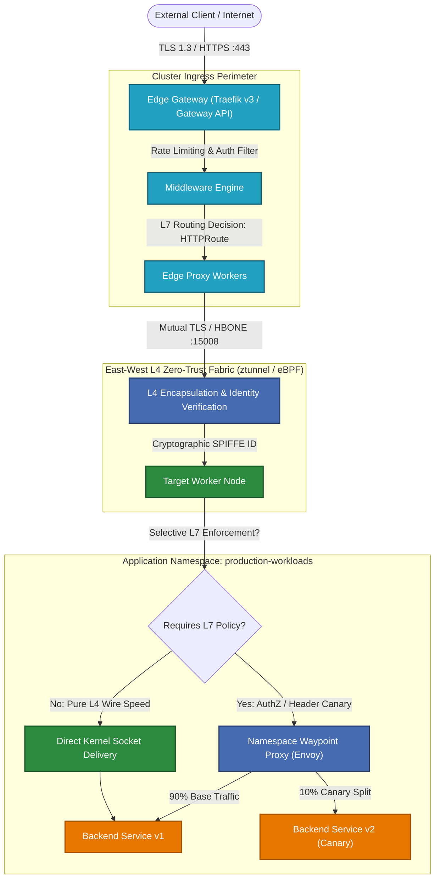
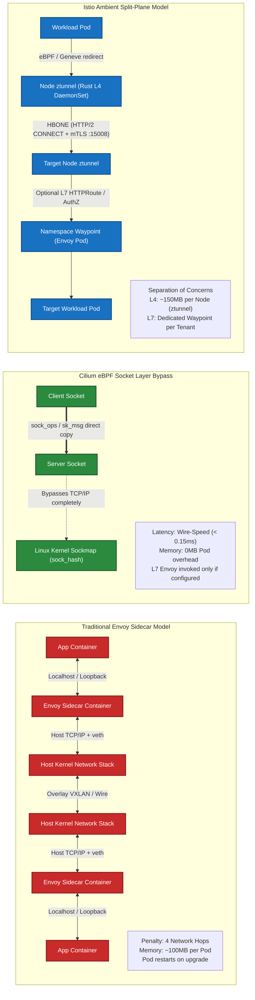

# Cloud-Native Ingress & Service Mesh Laboratory (2026 Edition)
### Production Evaluation Framework, Architectural Analyses, and Automated PoCs for Next-Generation Kubernetes & OpenShift Networking Fabrics

[](https://kubernetes.io/)
[](https://www.redhat.com/en/technologies/cloud-computing/openshift)
[](https://gateway-api.sigs.k8s.io/)
[](https://cilium.io/)
[](https://istio.io/)
[](https://traefik.io/)

---

## 1. Executive Summary & 2026 Landscape Shifts

The Kubernetes networking landscape in 2026 has crossed two definitive architectural inflection points:

1. **The Formal Deprecation and Sunset of `networking.k8s.io/v1 Ingress`**:
   The legacy Ingress resource—defined in 2015 as a rudimentary reverse-proxy abstraction—has been fundamentally superseded by the **Kubernetes Gateway API (`gateway.networking.k8s.io/v1`)**. Legacy Ingress suffered from severe architectural flaws:
   - Monolithic role collision (cluster operators and application developers fighting over a single resource).
   - Proliferation of unstandardized, vendor-locked annotations (e.g., `nginx.ingress.kubernetes.io/*`, `traefik.ingress.kubernetes.io/*`).
   - Incapability of expressing modern routing topologies (weighted canaries, header manipulations, gRPC method-level routing, cross-namespace binding, SNI multiplexing) without out-of-tree Custom Resource Definitions (CRDs).
   The Gateway API introduces a decoupled, role-oriented resource model (`GatewayClass` for Infrastructure Providers, `Gateway` for Platform/Cluster Operators, and `*Route` for Application Developers) with first-class conformance testing across data plane providers.

2. **The Demise of the Sidecar Pattern in Favor of Sidecarless Meshes**:
   Injecting an Envoy sidecar proxy into every application pod (`O(N)` scaling) has proven unsustainable in large-scale enterprise environments:
   - **Resource Overhead (Sidecar Tax)**: 50MB–150MB of RSS memory per sidecar container, multiplied across tens of thousands of pods, leads to multi-gigabyte RAM waste purely for proxy infrastructure.
   - **Latency Penalty**: Every request traverses four network hops across the host TCP/IP stack (`App -> Loopback -> Sidecar -> eth0 -> Node -> eth0 -> Peer Sidecar -> Loopback -> Peer App`), adding 2ms–6ms of P99 latency.
   - **Operational Friction**: Pod restart cycles required for proxy upgrades, CPU throttling caused by Linux CFS quota starvation on proxy sidecars, and severe initialization race conditions (e.g., application containers starting before the sidecar proxy is online).

Modern 2026 infrastructures employ **Sidecarless Architectures**:
- **Kernel-level eBPF Short-Circuiting (Cilium)**: Bypassing the entire TCP/IP networking stack at the Linux socket layer (`sockops`), achieving wire-speed Layer 4 transmission and selective Layer 7 Envoy invocation only when cryptographic payload inspection is required.
- **Split-Layer Ambient Data Planes (Istio Ambient)**: Decoupling L4 transport security (Zero-Trust mTLS and identity verification handled at the node level by the Rust-based `ztunnel`) from L7 traffic management (handled by optional, namespace-scoped `waypoint` Envoy proxies).

This laboratory repository provides production-grade reference implementations, automated deployment harnesses, and comparative benchmarks for **Cilium eBPF**, **Istio Ambient**, and **Traefik v3** on both vanilla Kubernetes and Red Hat OpenShift.

---

## 2. Comprehensive Evaluation Matrix

| Evaluation Dimension | Cilium Service Mesh (v1.16+) | Istio Ambient Mesh (v1.23+) | Traefik v3 (Edge Gateway) |
| :--- | :--- | :--- | :--- |
| **Data Plane Architecture** | Sidecarless; in-kernel eBPF socket layer (`sockops`) + Host-level Envoy daemon | Sidecarless; Node-level Rust L4 `ztunnel` + Namespace-level L7 Envoy `waypoint` | Ingress Edge; Go-based proxy process (DaemonSet or Deployment) |
| **Gateway API Conformance** | GA Conformance (`GatewayClass`, `Gateway`, `HTTPRoute`, `TLSRoute`, `GRPCRoute`) | GA Conformance (`Gateway`, `HTTPRoute`, Waypoint binding via GatewayClass) | GA Conformance (`GatewayClass`, `Gateway`, `HTTPRoute`, `TLSRoute`) |
| **P99 Latency Overhead (L4)** | **< 0.15 ms** (Kernel socket bypass via `sock_hash`) | **0.25 – 0.40 ms** (Traverses local node `ztunnel` via Geneve/eBPF redirection) | N/A (Pure Edge Gateway) |
| **P99 Latency Overhead (L7)** | 1.10 – 1.80 ms (Targeted Envoy redirect) | 1.20 – 1.95 ms (Waypoint proxy hop) | 0.85 – 1.40 ms (Direct Ingress reverse proxy) |
| **Memory Footprint (Per Pod)**| **0 MB** (Zero sidecar injection) | **0 MB** (Zero sidecar injection) | 0 MB (Not an East-West mesh) |
| **Memory Footprint (Cluster-wide)**| ~1.2 GB per node (cilium-agent + hubble + Envoy daemon) | **~150 MB per node (`ztunnel`)** + ~60 MB per active Waypoint | ~120 MB per Edge Gateway replica |
| **mTLS Implementation Vector** | Node-to-Node WireGuard/IPsec + Cilium Mutual Auth (SPIRE / control-plane handshake) | **HBONE (HTTP-Based Overlay Network)** over port 15008 with SPIFFE X.509 certs | Edge TLS termination; mTLS upstream via IngressRoute/Gateway spec |
| **L7 Security Capabilities** | CiliumNetworkPolicy L7 rules, HTTP header filtering, DNS policies | Rich Istio AuthorizationPolicy (claims, paths, methods, JWT validation) | Advanced Middlewares (RateLimit, CircuitBreaker, ForwardAuth, Digest) |
| **Red Hat OpenShift Compliance** | **Complex**: Requires replacing OVN-K or Multus chaining; `privileged` SCC, SELinux policies | **Native**: Basis for Red Hat OpenShift Service Mesh 3.x; compatible with default OVN-K | **High**: Runs on OpenShift via standard SCC (`nonroot` or `anyuid`), simple Route bridging |
| **Operational & Upgrade Impact** | Zero app pod restarts during upgrades; high kernel dependency (Linux 5.10+) | Zero app pod restarts during upgrades; ztunnel upgrade hits 0-downtime connection draining | Zero app pod restarts; standard rolling deployment for edge gateways |
| **Observability Fabric** | Hubble (eBPF-native kernel tracing, OpenTelemetry, Prometheus, Grafana) | Kiali, Prometheus, Jaeger/Tempo via ztunnel/waypoint Envoy telemetry | Built-in Web UI, Prometheus metrics, OpenTelemetry tracing natively |

---

## 3. Platform Decision Matrix & Ranked Recommendations

### Archetype 1: High-Performance, Ultra-Low Latency & Telco/Fintech Workloads
- **Rank 1: Cilium eBPF Service Mesh**
  - *Why*: Eliminates user-space/kernel-space context switching for internal pod-to-pod traffic. Using Linux `sockops` eBPF programs, Cilium connects client and server sockets directly at the kernel layer, bypassing the entire TCP/IP network stack (iptables, routing tables, and veth pairs). WireGuard kernel-level encryption provides line-rate hardware-accelerated confidentiality with zero proxy overhead.
- **Rank 2: Istio Ambient**
- **Rank 3: Traefik v3** (Not applicable for East-West mesh)

### Archetype 2: Enterprise Multi-Tenant Zero-Trust Cloud Platform (e.g., OpenShift on AWS/Bare-Metal)
- **Rank 1: Istio Ambient (Red Hat OpenShift Service Mesh 3.x)**
  - *Why*: Operates seamlessly on top of Red Hat's default **OVN-Kubernetes** CNI without requiring kernel replacement. Enforces strict cryptographic zero-trust at Layer 4 across every pod through `ztunnel` without developer intervention. When Layer 7 traffic authorization, canary routing, or header manipulation is demanded, platform teams can selectively spin up a dedicated `waypoint` proxy for that specific namespace or service account, guaranteeing strong tenant isolation and blast-radius containment.
- **Rank 2: Cilium eBPF** (Heavy SCC and SELinux modification requirements on RHCOS)
- **Rank 3: Traefik v3**

### Archetype 3: High-Velocity API Edge & Developer Platform (North-South Ingress Focus)
- **Rank 1: Traefik v3 Gateway API**
  - *Why*: Unrivaled developer ergonomics, ultra-fast dynamic configuration updates without reloads, and rich native middlewares (token-bucket rate limiting, circuit breaking, distributed tracing). Native implementation of `gateway.networking.k8s.io/v1` combined with Traefik Middleware filters enables declarative, self-service edge routing without bloated custom controllers.
- **Rank 2: Cilium Gateway API** (Excellent if Cilium is already the CNI)
- **Rank 3: Istio Ingress Gateway**

---

## 4. Architecture Diagrams

### Diagram 1: North-South Ingress Flow into East-West Zero-Trust Mesh Fabric



---

### Diagram 2: Structural Data Plane Comparison (Sidecar vs. eBPF Bypass vs. Istio Ambient)



---

## 5. Repository Structure

```
cloudnative-ingress-mesh-lab/
├── README.md                 # Executive evaluation, architecture analysis, and ranking matrix
├── Makefile                  # Global automation orchestrator for labs
├── docs/                     # Comprehensive architectural deep dives
│   ├── ARCHITECTURE.md       # Multi-layer packet flow analyses and tradeoffs
│   ├── LAB_CILIUM.md         # Step-by-step automated PoC: Kernel-level eBPF Gateway & Mesh
│   ├── LAB_ISTIO_AMBIENT.md  # Step-by-step automated PoC: Sidecarless Istio Ambient
│   └── LAB_TRAEFIK_EDGE.md   # Step-by-step automated PoC: Gateway API-native Edge Router
├── deploys/                  # Raw manifests and scripts grouped by solution
│   ├── common/               # Sample microservice workloads (Frontend -> Backend App)
│   │   ├── namespace.yaml
│   │   ├── backend-v1.yaml
│   │   ├── backend-v2.yaml
│   │   ├── frontend.yaml
│   │   └── client-tester.yaml
│   ├── cilium/               # Cilium CNI, L7 Gateway, and CiliumClusterwideNetworkPolicies
│   │   ├── helm-values.yaml
│   │   ├── gateway.yaml
│   │   ├── httproute-canary.yaml
│   │   └── cilium-clusterwide-policy.yaml
│   ├── istio/                # Istio Ambient control plane, ztunnel, and Waypoint proxies
│   │   ├── helm-values.yaml
│   │   ├── ingress-gateway.yaml
│   │   ├── waypoint-gateway.yaml
│   │   ├── httproute-canary.yaml
│   │   └── authorization-policy.yaml
│   └── traefik/              # Traefik v3 Gateway API resources and Middlewares
│       ├── helm-values.yaml
│       ├── gateway.yaml
│       ├── httproute-canary.yaml
│       ├── middlewares.yaml
│       └── openshift-scc.yaml
└── scripts/                  # Automated verification and traffic analysis tools
    ├── test-canary.sh        # Statistical traffic-split verification engine
    └── test-mtls.sh          # Zero-trust cryptographic verification script
```

---

## 6. Quick Start & Global Automation

To execute any automated lab, run the central `Makefile`:

```bash
# Display dynamic target catalog
make help

# Bootstrap prerequisites (Gateway API v1 CRDs)
make install-gateway-api

# Execute Lab 1: Cilium eBPF Gateway & Service Mesh
make setup-cilium
make test-traffic-cilium
make test-canary-cilium

# Execute Lab 2: Istio Ambient (ztunnel + Waypoint)
make setup-istio
make test-traffic-istio
make test-mtls-istio

# Execute Lab 3: Traefik v3 Gateway API Edge Router
make setup-traefik
make test-traffic-traefik

# Clean up all laboratory resources
make clean-all
```

For complete step-by-step deep-dives, proceed directly to the [Architecture Deep Dive](docs/ARCHITECTURE.md) and individual lab runbooks in [docs/](docs/).
