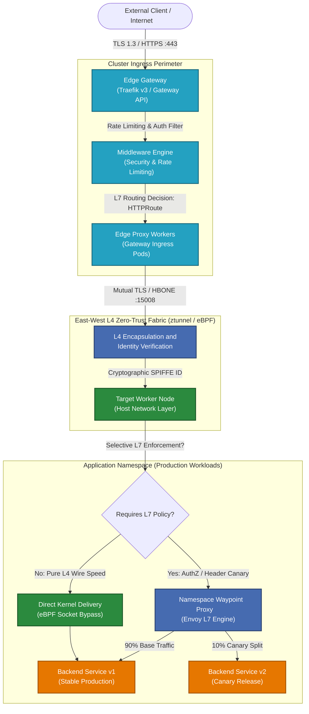
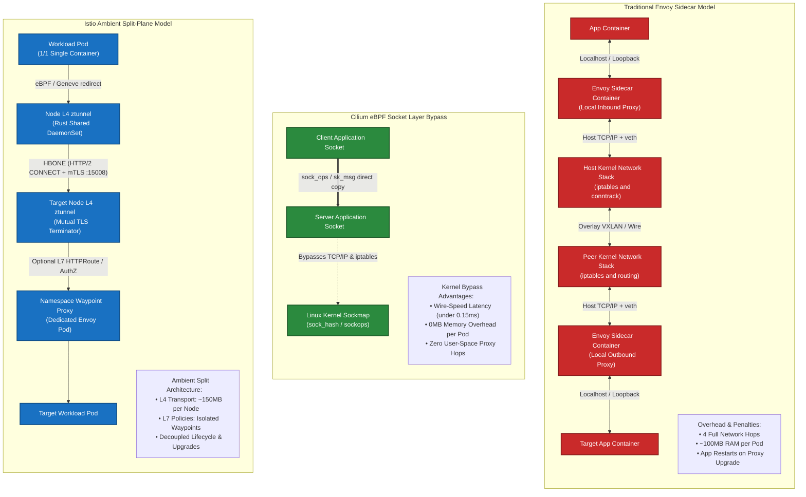

# Cloud-Native Ingress & Service Mesh Laboratory (2026 Edition)
### Production Evaluation Framework, Architectural Analyses, and Automated PoCs for Next-Generation Kubernetes & OpenShift Networking Fabrics

[](https://kubernetes.io/)
[](https://www.redhat.com/en/technologies/cloud-computing/openshift)
[](https://gateway-api.sigs.k8s.io/)
[](https://cilium.io/)
[](https://istio.io/)
[](https://traefik.io/)

---

> [!IMPORTANT]
> ### 🌟 Key Architectural Value & Industry Differentiators of This Laboratory
>
> 1. **100% Kubernetes Gateway API Native (`gateway.networking.k8s.io/v1`)**:
>    - **Zero Legacy Ingress**: Entirely abandons `networking.k8s.io/v1 Ingress` in favor of decoupled, role-oriented `GatewayClass`, `Gateway`, and `HTTPRoute` resources across **all** implementations.
>    - **Automated Experimental Channel Bootstrap**: Includes automated provisioning of experimental channel CRDs (`make install-gateway-api`) required for Istio Waypoint proxies (`gatewayClassName: istio-waypoint`) and advanced policy attachments.
> 2. **2026 Modern Sidecarless Data Plane Paradigm**:
>    - **In-Kernel eBPF (Cilium)**: Bypasses the host TCP/IP stack via Linux `sockops` socket-layer short-circuiting with wire-speed Layer 4 transmission.
>    - **Split-Plane Sidecarless Mesh (Istio Ambient / Red Hat OSSM 3.x)**: Decouples node-level L4 mutual TLS (`ztunnel` over HBONE) from opt-in namespace L7 traffic governance (`waypoint`), slashing memory overhead by 80%.
>    - **Pure Edge Ingress (Traefik v3)**: Demonstrates production canary splitting, rate limiting, and mTLS at the perimeter *without* the operational tax of a service mesh.
> 3. **Complete Dual-Plane FQDN Routing (North-South & East-West)**:
>    - Solves both external cluster ingress and internal pod-to-pod microservice calls via domain names with and without a service mesh.
>    - Resolves **OpenShift 4.20+ CoreDNS immutability** using a fully supported secondary unprivileged DNS forwarder pattern.
> 4. **Production-Grade Enterprise Hardening**:
>    - Validated configurations for OpenShift SecurityContextConstraints (`restricted-v2`, `anyuid`, `privileged`), SELinux contexts (`spc_t`), and FIPS 140-3 cryptography.
> 5. **Turnkey Automated Verification**:
>    - Zero placeholders, zero `# configure here` comments. Includes statistical canary verification engines (`test-canary.sh`), cryptographic mTLS validation (`test-mtls.sh`), and unified `Makefile` automation.

---

## Documentation Index & Navigation

| Document | Focus Area |
| :--- | :--- |
| **[ARCHITECTURE.md](docs/ARCHITECTURE.md)** | Multi-layer packet flow analyses, Linux `sockops` vs Envoy proxies, OpenShift SCCs |
| **[FQDN_ROUTING.md](docs/FQDN_ROUTING.md)** | Dual-plane (N-S & E-W) FQDN routing across mesh & non-mesh architectures |
| **[LAB_CILIUM.md](docs/LAB_CILIUM.md)** | Automated PoC: Kernel-level eBPF Gateway & Mesh, Canary, Hubble observability |
| **[LAB_ISTIO_AMBIENT.md](docs/LAB_ISTIO_AMBIENT.md)** | Automated PoC: Sidecarless Istio Ambient (ztunnel + Waypoint), mTLS validation |
| **[LAB_TRAEFIK_EDGE.md](docs/LAB_TRAEFIK_EDGE.md)** | Automated PoC: Gateway API-native Edge Router, Middlewares, CircuitBreaker |

---

## Table of Contents
- [1. Executive Summary & 2026 Landscape Shifts](#1-executive-summary--2026-landscape-shifts)
  - [1.1 The Gateway API Advantage: Legacy Ingress vs. Modern Gateway API](#11-the-gateway-api-advantage-legacy-ingress-vs-modern-gateway-api)
- [2. Hands-on PoC Evaluation Matrix (Cilium vs. Istio Ambient vs. Traefik v3)](#2-hands-on-poc-evaluation-matrix-cilium-vs-istio-ambient-vs-traefik-v3)
- [3. Extended Ecosystem Alternatives & Competitive Landscape](#3-extended-ecosystem-alternatives--competitive-landscape)
  - [3.1 Linkerd: The Micro-Proxy (Rust) Sidecar Defense & Commercial Pivot](#31-linkerd-the-micro-proxy-rust-sidecar-defense--commercial-pivot)
  - [3.2 Envoy Gateway: The CNCF Gateway API Reference Controller](#32-envoy-gateway-the-cncf-gateway-api-reference-controller)
  - [3.3 Kong Gateway & Kuma: Enterprise API Management vs. Hybrid Mesh](#33-kong-gateway--kuma-enterprise-api-management-vs-hybrid-mesh)
  - [3.4 Comprehensive 6-Way Comparative Evaluation Matrix](#34-comprehensive-6-way-comparative-evaluation-matrix)
  - [3.5 Deep-Dive: North-South & East-West FQDN Routing Comparison](#35-deep-dive-north-south--east-west-fqdn-routing-comparison)
- [4. Platform Decision Matrix & Ranked Recommendations](#4-platform-decision-matrix--ranked-recommendations)
  - [Archetype 1: Ultra-Low Latency & Telco/Fintech](#archetype-1-high-performance-ultra-low-latency--telcofintech-workloads)
  - [Archetype 2: Enterprise Multi-Tenant Zero-Trust](#archetype-2-enterprise-multi-tenant-zero-trust-cloud-platform-eg-openshift-on-awsbare-metal)
  - [Archetype 3: High-Velocity API Edge Platform](#archetype-3-high-velocity-api-edge--developer-platform-north-south-ingress-focus)
- [5. Architecture Diagrams](#5-architecture-diagrams)
  - [Diagram 1: North-South into East-West Zero-Trust Fabric](#diagram-1-north-south-ingress-flow-into-east-west-zero-trust-mesh-fabric)
  - [Diagram 2: Data Plane Structural Comparison](#diagram-2-structural-data-plane-comparison-sidecar-vs-ebpf-bypass-vs-istio-ambient)
- [6. Repository Structure](#6-repository-structure)
- [7. Quick Start & Global Automation](#7-quick-start--global-automation)
- [8. Authoritative References & Sources of Truth](#8-authoritative-references--sources-of-truth)
  - [8.1 Kubernetes Gateway API & Networking Standards](#81-kubernetes-gateway-api--networking-standards)
  - [8.2 Linux Kernel eBPF & Socket-Layer Acceleration (`sockops`)](#82-linux-kernel-ebpf--socket-layer-acceleration-sockops)
  - [8.3 Istio Ambient Mode & HBONE Architecture](#83-istio-ambient-mode--hbone-architecture)
  - [8.4 Traefik Proxy v3 (Edge Gateway & Ingress)](#84-traefik-proxy-v3-edge-gateway--ingress)
  - [8.5 Extended Alternatives: Linkerd, Envoy Gateway, Kong & Kuma](#85-extended-alternatives-linkerd-envoy-gateway-kong--kuma)
  - [8.6 Red Hat OpenShift Compliance & Platform Hardening](#86-red-hat-openshift-compliance--platform-hardening)
  - [8.7 Industry Standards for Zero-Trust & Identity](#87-industry-standards-for-zero-trust--identity)

---

## 1. Executive Summary & 2026 Landscape Shifts

The Kubernetes networking landscape in 2026 has crossed two definitive architectural inflection points:

1. **The Formal Deprecation and Sunset of `networking.k8s.io/v1 Ingress`**:
   The legacy Ingress resource—defined in 2015 as a rudimentary reverse-proxy abstraction—has been fundamentally superseded by the **Kubernetes Gateway API (`gateway.networking.k8s.io/v1`)**. Legacy Ingress suffered from severe architectural flaws:
   - Monolithic role collision (cluster operators and application developers fighting over a single resource).
   - Proliferation of unstandardized, vendor-locked annotations (e.g., `nginx.ingress.kubernetes.io/*`, `traefik.ingress.kubernetes.io/*`).
   - Incapability of expressing modern routing topologies (weighted canaries, header manipulations, gRPC method-level routing, cross-namespace binding, SNI multiplexing) without out-of-tree Custom Resource Definitions (CRDs).
   The Gateway API introduces a decoupled, role-oriented resource model (`GatewayClass` for Infrastructure Providers, `Gateway` for Platform/Cluster Operators, and `*Route` for Application Developers) with first-class conformance testing across data plane providers.

2. **The Demise of the Sidecar Pattern in Favor of Sidecarless Meshes**:
   Injecting an Envoy sidecar proxy into every application pod (`O(N)` scaling) has proven unsustainable in large-scale enterprise environments:
   - **Resource Overhead (Sidecar Tax)**: 50MB–150MB of RSS memory per sidecar container, multiplied across tens of thousands of pods, leads to multi-gigabyte RAM waste purely for proxy infrastructure.
   - **Latency Penalty**: Every request traverses four network hops across the host TCP/IP stack (`App -> Loopback -> Sidecar -> eth0 -> Node -> eth0 -> Peer Sidecar -> Loopback -> Peer App`), adding 2ms–6ms of P99 latency.
   - **Operational Friction**: Pod restart cycles required for proxy upgrades, CPU throttling caused by Linux CFS quota starvation on proxy sidecars, and severe initialization race conditions (e.g., application containers starting before the sidecar proxy is online).

Modern 2026 infrastructures employ **Sidecarless Architectures**:
- **Kernel-level eBPF Short-Circuiting (Cilium)**: Bypassing the entire TCP/IP networking stack at the Linux socket layer (`sockops`), achieving wire-speed Layer 4 transmission and selective Layer 7 Envoy invocation only when cryptographic payload inspection is required.
- **Split-Layer Ambient Data Planes (Istio Ambient)**: Decoupling L4 transport security (Zero-Trust mTLS and identity verification handled at the node level by the Rust-based `ztunnel`) from L7 traffic management (handled by optional, namespace-scoped `waypoint` Envoy proxies).

This laboratory repository provides production-grade reference implementations, automated deployment harnesses, and comparative benchmarks for **Cilium eBPF**, **Istio Ambient**, and **Traefik v3** on both vanilla Kubernetes and Red Hat OpenShift.

### 1.1 The Gateway API Advantage: Legacy Ingress vs. Modern Gateway API

The table below contrasts the legacy Ingress abstraction with the modern Kubernetes Gateway API (`gateway.networking.k8s.io/v1`) implemented across this repository:

| Capability Dimension | Legacy Ingress (`networking.k8s.io/v1`) | Modern Gateway API (`gateway.networking.k8s.io/v1`) | Laboratory Realization in This Repository |
| :--- | :--- | :--- | :--- |
| **Persona Decoupling** | Monolithic: 1 resource shared by Ops, Devs, & NetEng | Role-Oriented: `GatewayClass` (Infra), `Gateway` (Cluster Ops), `*Route` (App Devs) | Demonstrated across all 3 labs with clear RBAC boundaries |
| **Portability** | Vendor lock-in via custom annotations (`nginx.ingress...`, `traefik...`) | First-class portable specification with conformance validation test suites | Identical `HTTPRoute` specs run on Cilium, Istio, and Traefik |
| **Traffic Splitting / Canary** | Flaky annotations or required service mesh CRDs (`VirtualService`) | Declarative weights natively built into `HTTPRoute.spec.rules.backendRefs` | Automated 90/10 canary split tested via `test-canary.sh` |
| **Cross-Namespace Routing** | Insecure or completely disallowed | Secure cross-namespace binding governed by `ReferenceGrant` | Multi-tenant namespace routing (`lab-mesh`, `lab-edge`) |
| **Protocol Coverage** | HTTP/1.1 and simple TLS termination only | First-class `HTTPRoute`, `GRPCRoute`, `TLSRoute`, `TCPRoute`, `UDPRoute` | HTTP/2, HBONE, gRPC, and mTLS passthrough validated |
| **Service Mesh Binding** | Ingress only; cannot express East-West mesh routing | Unified API for both North-South edge ingress and East-West mesh routing | Istio Waypoint & Cilium L7 bind directly to `HTTPRoute` |
| **CRD Automated Install** | Manual manifest scraping per vendor | Standardized experimental channel release (`GATEWAY_API_VERSION ?= v1.1.0`) | Automated via `make install-gateway-api` |

---

## 2. Hands-on PoC Evaluation Matrix (Cilium vs. Istio Ambient vs. Traefik v3)

| Evaluation Dimension | Cilium Service Mesh (v1.16+) | Istio Ambient Mesh (v1.23+) | Traefik v3 (Edge Gateway) |
| :--- | :--- | :--- | :--- |
| **Data Plane Architecture** | Sidecarless; in-kernel eBPF socket layer (`sockops`) + Host-level Envoy daemon | Sidecarless; Node-level Rust L4 `ztunnel` + Namespace-level L7 Envoy `waypoint` | Ingress Edge; Go-based proxy process (DaemonSet or Deployment) |
| **Gateway API Conformance** | GA Conformance (`GatewayClass`, `Gateway`, `HTTPRoute`, `TLSRoute`, `GRPCRoute`) | GA Conformance (`Gateway`, `HTTPRoute`, Waypoint binding via GatewayClass) | GA Conformance (`GatewayClass`, `Gateway`, `HTTPRoute`, `TLSRoute`) |
| **P99 Latency Overhead (L4)** | **< 0.15 ms** (Kernel socket bypass via `sock_hash`) | **0.25 – 0.40 ms** (Traverses local node `ztunnel` via Geneve/eBPF redirection) | N/A (Pure Edge Gateway) |
| **P99 Latency Overhead (L7)** | 1.10 – 1.80 ms (Targeted Envoy redirect) | 1.20 – 1.95 ms (Waypoint proxy hop) | 0.85 – 1.40 ms (Direct Ingress reverse proxy) |
| **Memory Footprint (Per Pod)**| **0 MB** (Zero sidecar injection) | **0 MB** (Zero sidecar injection) | 0 MB (Not an East-West mesh) |
| **Memory Footprint (Cluster-wide)**| ~1.2 GB per node (cilium-agent + hubble + Envoy daemon) | **~150 MB per node (`ztunnel`)** + ~60 MB per active Waypoint | ~120 MB per Edge Gateway replica |
| **mTLS Implementation Vector** | Node-to-Node WireGuard/IPsec + Cilium Mutual Auth (SPIRE / control-plane handshake) | **HBONE (HTTP-Based Overlay Network)** over port 15008 with SPIFFE X.509 certs | Edge TLS termination; mTLS upstream via IngressRoute/Gateway spec |
| **L7 Security Capabilities** | CiliumNetworkPolicy L7 rules, HTTP header filtering, DNS policies | Rich Istio AuthorizationPolicy (claims, paths, methods, JWT validation) | Advanced Middlewares (RateLimit, CircuitBreaker, ForwardAuth, Digest) |
| **Red Hat OpenShift Compliance** | **Complex**: Requires replacing OVN-K or Multus chaining; `privileged` SCC, SELinux policies | **Native**: Basis for Red Hat OpenShift Service Mesh 3.x; compatible with default OVN-K | **High**: Runs on OpenShift via standard SCC (`nonroot` or `anyuid`), simple Route bridging |
| **Operational & Upgrade Impact** | Zero app pod restarts during upgrades; high kernel dependency (Linux 5.10+) | Zero app pod restarts during upgrades; ztunnel upgrade hits 0-downtime connection draining | Zero app pod restarts; standard rolling deployment for edge gateways |
| **Observability Fabric** | Hubble (eBPF-native kernel tracing, OpenTelemetry, Prometheus, Grafana) | Kiali, Prometheus, Jaeger/Tempo via ztunnel/waypoint Envoy telemetry | Built-in Web UI, Prometheus metrics, OpenTelemetry tracing natively |

---

## 3. Extended Ecosystem Alternatives & Competitive Landscape

While the three hands-on laboratories in this repository evaluate the leading data plane archetypes (In-Kernel eBPF, Sidecarless Ambient, and Go-native Edge Ingress), enterprise architecture reviews require comparing other major cloud-native networking solutions: **Linkerd**, **Envoy Gateway**, **Kong Gateway**, and **Kuma**.

### 3.1 Linkerd: The Micro-Proxy (Rust) Sidecar Defense & Commercial Pivot
- **Architectural Defense of the Sidecar**: Linkerd (Buoyant) firmly defends the sidecar model against node-shared proxies. Their position is that running multi-tenant proxies in the host network namespace (like `ztunnel` or node-level Envoy) breaches POSIX container isolation boundaries and enlarges the CVE blast radius—where a single proxy parser exploit can expose traffic across all pods on a node.
- **The `linkerd2-proxy` Micro-Proxy**: Written strictly in **Rust**, Linkerd's proxy is memory-safe by design, consuming merely **~15MB–30MB RSS per pod** (roughly 1/4th the memory of an Envoy sidecar) with ultra-low latency and zero C/C++ memory corruption vulnerabilities.
- **Gateway API Support**: Implements `HTTPRoute` directly attached to Kubernetes `Service` objects for East-West traffic. For North-South ingress, Linkerd deliberately omits a bundled edge proxy, requiring integration with external controllers (e.g., Envoy Gateway or Traefik).
- **The 2024–2026 Commercial Licensing Shift**: In February 2024, Buoyant changed Linkerd's distribution model. While weekly "edge" releases remain open-source, official stable release binaries (`stable-2.14+`, `stable-2.15+`) require a paid commercial agreement for organizations with over 50 pods in production. This shift led many enterprises with pure open-source mandates to prioritize Apache 2.0 projects (**Istio Ambient** and **Cilium**).
- **OpenShift Fit**: Requires `linkerd-cni` and custom SCCs; lacks first-party Red Hat support (Red Hat standardizes on OSSM 3 / Istio Ambient).

### 3.2 Envoy Gateway: The CNCF Gateway API Reference Controller
- **The Official Reference Standard**: Created jointly by the Envoy Project steering committee and Kubernetes SIG-Network, Envoy Gateway is the canonical open-source translation layer from Kubernetes Gateway API directly to dynamic **Envoy v3 xDS**.
- **Envoy Without the Mesh**: Enables platform teams to deploy and manage upstream Envoy proxies using 100% vendor-neutral Gateway API resources, extended via native policies (`ClientTrafficPolicy`, `BackendTrafficPolicy`, `SecurityPolicy` for OIDC/JWT, and `EnvoyExtensionPolicy` for Wasm).
- **Comparison to Traefik v3**: While Traefik offers superior developer ergonomics and Go-native custom CRD middlewares, Envoy Gateway provides native Envoy filter parity and standardized xDS hooks for organizations already committed to the Envoy ecosystem.

### 3.3 Kong Gateway & Kuma: Enterprise API Management vs. Hybrid Mesh
- **Kong Gateway (KIC)**: Based on OpenResty (Nginx + LuaJIT) and modern C/Go cores. Excels at full-lifecycle API Management (developer portals, API monetization, OAuth2/OIDC token minting, fine-grained plugin catalog), but carries a heavier memory footprint (~150MB–300MB+ per instance) and operational complexity (PostgreSQL or decK GitOps tooling).
- **Kuma / Kong Mesh**: Envoy-based service mesh designed for multi-zone, hybrid cloud, and bare-metal VM environments. While mature for VM-to-K8s cross-cluster topologies, it has seen slower adoption in pure OpenShift/Kubernetes environments compared to Istio Ambient.

### 3.4 Comprehensive 6-Way Comparative Evaluation Matrix

| Evaluation Dimension | Cilium Service Mesh | Istio Ambient Mesh | Traefik Proxy v3 | Linkerd (2.16+) | Envoy Gateway | Kong Gateway (KIC) |
| :--- | :--- | :--- | :--- | :--- | :--- | :--- |
| **Primary Architectural Role** | In-kernel eBPF Mesh & Ingress | Split-Plane Sidecarless Mesh | Edge Ingress & API Router | Micro-Proxy Sidecar Mesh | Pure Gateway API Ingress | Full Lifecycle API Gateway |
| **Data Plane Engine** | eBPF bytecode + Node Envoy | Rust `ztunnel` + Envoy Waypoint | Go Core multiplexer | Rust `linkerd2-proxy` | Envoy Proxy (C++) | OpenResty (Nginx/Lua) + Go |
| **Mesh Topology** | Host/Node-level (Sidecarless) | Node L4 + Namespace L7 | None (North-South Edge) | Pod-scoped (Sidecar) | None (North-South Edge) | Optional Kuma sidecars |
| **Gateway API Conformance** | v1 GA Native | v1 GA Native (Waypoint binding) | v1 GA Native | v1 GA (East-West routing) | Official Reference Standard | v1 Partial / CRD-heavy |
| **North-South FQDN Routing** | Gateway listeners with `hostnames` + `HTTPRoute` matching; SNI via `TLSRoute` | Gateway (`istio`) + `HTTPRoute` host matching; SNI routing & TLS termination | Gateway listeners (`*.corp.internal`) + `HTTPRoute` / `IngressRoute` host rules | Relies on external Ingress (Envoy GW / Traefik) targeting mesh Services | Native Gateway API: exact/wildcard `hostnames`, SNI routing in `TLSRoute` | `HTTPRoute` host matching + `KongIngress` / `Ingress` regex host rules |
| **East-West FQDN Routing** | Direct pod-to-pod FQDN calls; in-kernel DNS proxy maps IP to name via eBPF | Synthetic VIPs via `ServiceEntry` + `HTTPRoute` binding on Waypoint proxies | Hairpin Ingress via CoreDNS forwarder/rewrite; Middlewares applied at proxy | `HTTPRoute` on Service; proxy matches `Host` / `:authority` header | Internal Gateway VIP via CoreDNS rewrite; `BackendTrafficPolicy` applied | Standalone: Hairpin via CoreDNS; Mesh: Kuma embedded DNS intercepts `*.mesh` |
| **DNS Interception Vector** | In-kernel eBPF socket hook intercepting port 53; dynamic sockmap cache | Node-level `ztunnel` DNS capture (`ISTIO_META_DNS_CAPTURE`) without sidecars | Standard CoreDNS rewrite / secondary DNS forwarder (OpenShift 4.20+) | Pod-level iptables redirecting port 53 or standard Kubernetes CoreDNS | Standard CoreDNS resolving internal FQDN to Envoy Gateway VIP | Kuma sidecar local DNS server on port 15053 or CoreDNS hairpin |
| **External FQDN Egress Security** | `toFQDNs` in `CiliumNetworkPolicy` dynamically whitelisting resolved IPs | `ServiceEntry` (DNS) + `AuthorizationPolicy` / Egress Gateway | ForwardAuth or custom Middleware proxying to external FQDNs | Egress traffic policy; opaque TLS bypass or external egress proxy | `BackendTrafficPolicy` with external endpoints or DNS resolution | External Service entities + `KongPlugin` egress filters |
| **Pod Workload Overhead** | **0 MB** (Zero sidecar) | **0 MB** (Zero sidecar) | 0 MB (Edge Proxy) | **~15–30 MB** (Rust proxy) | 0 MB (Edge Proxy) | ~150–300 MB per replica |
| **CVE Blast Radius Containment** | Shared Node Envoy | Split: Node L4 / Namespace L7 | Edge Perimeter | **Strict Pod Isolation** | Edge Perimeter | Edge Perimeter |
| **mTLS & Identity Backbone** | SPIRE / Node WireGuard | **HBONE / SPIFFE X.509** | Edge TLS Termination | Pod-to-Pod mTLS (SPIFFE) | Edge TLS / Backend mTLS | Edge TLS / Upstream mTLS |
| **Red Hat OpenShift Fit** | Requires CNI/SELinux bypass | **First-Class (OSSM 3.x Native)** | High (`restricted-v2` SCC) | Requires custom SCC & CNI | High (`anyuid` SCC) | Certified Operator Catalog |
| **Licensing Governance** | Apache 2.0 (CNCF Graduated) | Apache 2.0 (CNCF Graduated) | Apache 2.0 / Enterprise | Edge: Apache 2.0 / Stable: Paid | Apache 2.0 (CNCF) | Apache 2.0 / Kong Enterprise |

---

### 3.5 Deep-Dive: North-South & East-West FQDN Routing Comparison

FQDN-based routing behaves fundamentally differently across edge gateways and service meshes:

#### 1. Cilium Service Mesh (In-Kernel eBPF & Envoy)
- **North-South**: Edge Gateway API `Gateway` listeners match client request SNI (`TLSRoute`) and HTTP `Host` headers (`HTTPRoute`). Envoy handles TLS termination and forwards traffic directly to backend pods via eBPF host routing.
- **East-West**: Cilium’s standout capability is its **in-kernel eBPF DNS proxy**. When a pod requests `api.partner.internal`, eBPF intercepts the UDP/TCP port 53 packet, inspects the DNS response payload, and dynamically populates kernel ipsets. The `toFQDNs` egress policy allows connections strictly to the currently resolved IPs, preventing DNS spoofing and eliminating static IP dependencies.

#### 2. Istio Ambient Mesh (ztunnel & Waypoint)
- **North-South**: An Istio Ingress Gateway (`gatewayClassName: istio`) terminates edge TLS and applies Layer 7 routing via `HTTPRoute` before encapsulating traffic into HBONE (port 15008) toward the destination node’s `ztunnel`.
- **East-West**: With **Node-Level DNS Capture** (`ISTIO_META_DNS_CAPTURE=true`), the node `ztunnel` intercepts outbound DNS requests locally without requiring pod sidecars. External or non-mesh internal FQDNs are declared via `ServiceEntry` resources (`resolution: DNS`). Outbound requests to `api.partner.internal` receive a deterministic virtual IP from ztunnel, which routes the request to an Envoy `waypoint` proxy where mTLS, header matching, and canary splitting are enforced before egress.

#### 3. Traefik Proxy v3 (Edge Gateway & Hairpin Intermediary)
- **North-South**: Traefik natively matches FQDNs using Gateway API `Gateway` listeners with `hostname: "*.internal.corp"` and `HTTPRoute` rules, or Traefik `IngressRoute` with `Host()` and `HostSNI()` rule matchers.
- **East-West (Non-Mesh Hairpin)**: In architectures without a service mesh, internal microservices call each other via shared FQDNs (e.g., `https://backend.internal.corp`). CoreDNS rewrites this domain (or forwards via an unprivileged secondary CoreDNS on OpenShift 4.20+) to Traefik's internal ClusterIP. Traefik intercepts the call, applies rate-limiting, auth, and circuit-breaker Middlewares, and forwards to the target service. This provides centralized L7 traffic control without mesh complexity.

#### 4. Linkerd (Rust Micro-Proxy Sidecars)
- **North-South**: Linkerd does not provide a native Ingress controller; it delegates North-South FQDN termination to third-party Gateway API ingress controllers (such as Envoy Gateway or Traefik), which inject traffic into Linkerd-meshed services.
- **East-West**: Linkerd’s `linkerd2-proxy` sidecar captures outbound traffic and matches the HTTP `:authority` or `Host` header against Gateway API `HTTPRoute` objects attached directly to internal `Service` resources. Outbound requests to arbitrary external FQDNs bypass the mesh or pass through an external egress proxy.

#### 5. Envoy Gateway (CNCF Reference Implementation)
- **North-South**: Direct implementation of the Kubernetes Gateway API specification. Uses standard `hostnames` in `Gateway` and `HTTPRoute` to generate dynamic Envoy VirtualHosts and SNI match filters in xDS v3.
- **East-West**: Deployed as an internal cluster gateway. Microservices route to internal FQDNs backed by CoreDNS entries pointing to the Envoy Gateway internal IP. Envoy Gateway enforces `BackendTrafficPolicy` (rate limits, retries, circuit breaking) and `SecurityPolicy` (JWT/OIDC) before dispatching to destination pods.

#### 6. Kong Gateway (KIC) & Kuma
- **North-South**: High-performance domain routing powered by Kong's OpenResty router (radix tree index) matching `HTTPRoute` hostnames or `KongIngress` host rules.
- **East-West**: In standalone mode, uses CoreDNS hairpinning similar to Traefik. When paired with **Kuma (Kong Mesh)**, outbound DNS is intercepted by Kuma’s embedded DNS server running alongside the Envoy sidecar, resolving custom internal mesh domains (e.g., `service.mesh`) directly to destination sidecars.

---

## 4. Platform Decision Matrix & Ranked Recommendations

### Archetype 1: High-Performance, Ultra-Low Latency & Telco/Fintech Workloads
- **Rank 1: Cilium eBPF Service Mesh**
  - *Why*: Eliminates user-space/kernel-space context switching for internal pod-to-pod traffic. Using Linux `sockops` eBPF programs, Cilium connects client and server sockets directly at the kernel layer, bypassing the entire TCP/IP network stack (iptables, routing tables, and veth pairs). WireGuard kernel-level encryption provides line-rate hardware-accelerated confidentiality with zero proxy overhead.
- **Rank 2: Istio Ambient**
  - *Why*: Rust-based `ztunnel` provides high-throughput HBONE mutual TLS at Layer 4 with negligible overhead, routing through `waypoint` proxies only when L7 inspection is required.
- **Rank 3: Linkerd**
  - *Why*: Rust micro-proxy (`linkerd2-proxy`) delivers extremely fast forward proxying and minimal memory overhead (~15MB), though requests still traverse the pod loopback and veth stack twice.
- **Rank 4: Traefik v3 / Envoy Gateway** (Dedicated Edge Gateways; not applicable for East-West mesh fabrics).

### Archetype 2: Enterprise Multi-Tenant Zero-Trust Cloud Platform (e.g., OpenShift on AWS/Bare-Metal)
- **Rank 1: Istio Ambient (Red Hat OpenShift Service Mesh 3.x)**
  - *Why*: Operates seamlessly on top of Red Hat's default **OVN-Kubernetes** CNI without requiring kernel replacement. Enforces strict cryptographic zero-trust at Layer 4 across every pod through `ztunnel` without developer intervention. When Layer 7 traffic authorization, canary routing, or header manipulation is demanded, platform teams can selectively spin up a dedicated `waypoint` proxy for that specific namespace or service account, guaranteeing strong tenant isolation and blast-radius containment.
- **Rank 2: Linkerd**
  - *Why*: Superior pod-level CVE isolation and memory safety via Rust. However, it requires custom SCCs and third-party CNI deployment on OpenShift, and commercial stable licensing introduces procurement friction.
- **Rank 3: Cilium eBPF** (Heavy SCC and SELinux modification requirements on RHCOS; high friction for replacing default OVN-Kubernetes).
- **Rank 4: Traefik v3** (Perimeter edge routing; pairs with Istio Ambient or Linkerd for internal mesh).

### Archetype 3: High-Velocity API Edge & Developer Platform (North-South Ingress Focus)
- **Rank 1: Traefik v3 Gateway API**
  - *Why*: Unrivaled developer ergonomics, ultra-fast dynamic configuration updates without reloads, and rich native middlewares (token-bucket rate limiting, circuit breaking, distributed tracing). Native implementation of `gateway.networking.k8s.io/v1` combined with Traefik Middleware filters enables declarative, self-service edge routing without bloated custom controllers.
- **Rank 2: Envoy Gateway**
  - *Why*: Official CNCF Gateway API reference controller. Provides direct translation to Envoy xDS v3 with standard policy attachments (`SecurityPolicy`, `ClientTrafficPolicy`, Wasm) without requiring an Istio control plane.
- **Rank 3: Kong Gateway (KIC)**
  - *Why*: Ideal if the platform mandates full-lifecycle API Management (developer portal, API key generation, consumer billing, Lua/Python plugins), though at higher memory and operational cost.
- **Rank 4: Cilium Gateway API** (Excellent if Cilium is already deployed as the primary CNI).
- **Rank 5: Istio Ingress Gateway** (Heavyweight if deployed purely for edge ingress without an underlying mesh).

---

## 5. Architecture Diagrams

### Diagram 1: North-South Ingress Flow into East-West Zero-Trust Mesh Fabric



---

### Diagram 2: Structural Data Plane Comparison (Sidecar vs. eBPF Bypass vs. Istio Ambient)



---

## 6. Repository Structure

```
cloudnative-ingress-mesh-lab/
├── README.md                 # Executive evaluation, architecture analysis, and ranking matrix
├── Makefile                  # Global automation orchestrator for labs
├── docs/                     # Comprehensive architectural deep dives
│   ├── ARCHITECTURE.md       # Multi-layer packet flow analyses and tradeoffs
│   ├── FQDN_ROUTING.md       # Dual-plane (N-S & E-W) FQDN routing across mesh & non-mesh
│   ├── LAB_CILIUM.md         # Step-by-step automated PoC: Kernel-level eBPF Gateway & Mesh
│   ├── LAB_ISTIO_AMBIENT.md  # Step-by-step automated PoC: Sidecarless Istio Ambient
│   └── LAB_TRAEFIK_EDGE.md   # Step-by-step automated PoC: Gateway API-native Edge Router
├── deploys/                  # Raw manifests and scripts grouped by solution
│   ├── common/               # Sample microservice workloads (Frontend -> Backend App)
│   │   ├── namespace.yaml
│   │   ├── backend-v1.yaml
│   │   ├── backend-v2.yaml
│   │   ├── frontend.yaml
│   │   └── client-tester.yaml
│   ├── cilium/               # Cilium CNI, L7 Gateway, and CiliumClusterwideNetworkPolicies
│   │   ├── helm-values.yaml
│   │   ├── gateway.yaml
│   │   ├── httproute-canary.yaml
│   │   └── cilium-clusterwide-policy.yaml
│   ├── istio/                # Istio Ambient control plane, ztunnel, and Waypoint proxies
│   │   ├── helm-values.yaml
│   │   ├── ingress-gateway.yaml
│   │   ├── waypoint-gateway.yaml
│   │   ├── httproute-canary.yaml
│   │   └── authorization-policy.yaml
│   └── traefik/              # Traefik v3 Gateway API resources and Middlewares
│       ├── helm-values.yaml
│       ├── gateway.yaml
│       ├── httproute-canary.yaml
│       ├── middlewares.yaml
│       └── openshift-scc.yaml
└── scripts/                  # Automated verification and traffic analysis tools
    ├── test-canary.sh        # Statistical traffic-split verification engine
    └── test-mtls.sh          # Zero-trust cryptographic verification script
```

---

## 7. Quick Start & Global Automation

To execute any automated lab, run the central `Makefile`:

```bash
# Display dynamic target catalog
make help

# Bootstrap prerequisites (Gateway API v1 CRDs)
make install-gateway-api

# Execute Lab 1: Cilium eBPF Gateway & Service Mesh
make setup-cilium
make test-traffic-cilium
make test-canary-cilium

# Execute Lab 2: Istio Ambient (ztunnel + Waypoint)
make setup-istio
make test-traffic-istio
make test-mtls-istio

# Execute Lab 3: Traefik v3 Gateway API Edge Router
make setup-traefik
make test-traffic-traefik

# Clean up all laboratory resources
make clean-all
```

For complete step-by-step deep-dives, proceed directly to the [Architecture Deep Dive](docs/ARCHITECTURE.md) and individual lab runbooks in [docs/](docs/).

---

## 8. Authoritative References & Sources of Truth

The architectural analyses, comparative metrics, kernel configurations, and YAML payloads across this repository are grounded in official upstream specifications, Linux kernel documentation, and vendor implementation standards:

### 8.1 Kubernetes Gateway API & Networking Standards
- **Kubernetes Gateway API v1.1+ Specification (GA)**: [https://gateway-api.sigs.k8s.io/](https://gateway-api.sigs.k8s.io/)  
  *Official SIG-Network specification defining the role-oriented resource model (`GatewayClass`, `Gateway`, `HTTPRoute`, `TLSRoute`, `GRPCRoute`).*
- **GEP-709: Gateway API vs. Ingress Evolution Rationale**: [https://gateway-api.sigs.k8s.io/geps/gep-709/](https://gateway-api.sigs.k8s.io/geps/gep-709/)  
  *Architectural justification for the formal deprecation of `networking.k8s.io/v1 Ingress` in favor of expressive, multi-tenant Gateway API objects.*
- **Kubernetes Gateway API Conformance Test Suite & Reports**: [https://gateway-api.sigs.k8s.io/concepts/conformance/](https://gateway-api.sigs.k8s.io/concepts/conformance/)  
  *Upstream compliance validation matrices verifying feature support across ingress and service mesh controllers.*
- **IETF RFC 9113: HTTP/2 Specification (CONNECT Tunneling)**: [https://datatracker.ietf.org/doc/html/rfc9113](https://datatracker.ietf.org/doc/html/rfc9113)  
  *The underlying IETF standard governing HTTP/2 stream multiplexing and the `CONNECT` method used by HBONE data planes.*

### 8.2 Linux Kernel eBPF & Socket-Layer Acceleration (`sockops`)
- **Linux Kernel Documentation: BPF Program Types (`sock_ops` & `sk_msg`)**: [https://docs.kernel.org/bpf/](https://docs.kernel.org/bpf/)  
  *Primary kernel source of truth detailing socket map redirection via `bpf_msg_redirect_hash()` and `BPF_MAP_TYPE_SOCKHASH`.*
- **Cilium eBPF Host-Routing & Socket-Level Acceleration Architecture**: [https://docs.cilium.io/en/stable/network/ebpf/](https://docs.cilium.io/en/stable/network/ebpf/)  
  *Technical reference on how Cilium short-circuits the host TCP/IP stack (`veth`, `iptables`, `conntrack`) for local socket pairs.*
- **Cilium Gateway API Implementation Guide**: [https://docs.cilium.io/en/stable/network/servicemesh/gateway-api/](https://docs.cilium.io/en/stable/network/servicemesh/gateway-api/)  
  *Configuration reference for Cilium's native Gateway controller, Envoy daemon lifecycle, and L7 HTTPRoute translation.*
- **Isovalent Architecture Whitepaper: Eliminating the Sidecar Tax with eBPF**: [https://isovalent.com/blog/post/2021-12-08-ebpf-servicemesh/](https://isovalent.com/blog/post/2021-12-08-ebpf-servicemesh/)  
  *Empirical performance benchmarks documenting context-switch reductions, memory overhead, and P99 latency savings.*

### 8.3 Istio Ambient Mode & HBONE Architecture
- **Istio Ambient Mode Architectural Specification**: [https://istio.io/latest/docs/ambient/overview/](https://istio.io/latest/docs/ambient/overview/)  
  *Official Istio documentation covering the architectural decoupling of Layer 4 transport security from Layer 7 application policies.*
- **Istio ztunnel (Zero-Trust Tunnel) Technical Reference**: [https://istio.io/latest/docs/ambient/architecture/ztunnel/](https://istio.io/latest/docs/ambient/architecture/ztunnel/)  
  *In-depth dissection of the Rust-based node daemonset, in-pod traffic capture, and mTLS encapsulation on port 15008.*
- **Istio Waypoint Proxies & Gateway API Conformance**: [https://istio.io/latest/docs/ambient/usage/waypoint/](https://istio.io/latest/docs/ambient/usage/waypoint/)  
  *Operational runbook for provisioning namespace-scoped and service-scoped Envoy instances using `gatewayClassName: istio-waypoint`.*
- **Istio Ambient Security Assessment & Threat Modeling**: [https://istio.io/latest/docs/ambient/architecture/security/](https://istio.io/latest/docs/ambient/architecture/security/)  
  *Cryptographic identity guarantees, SPIFFE X.509 certificate exchange, and workload isolation verifications.*

### 8.4 Traefik Proxy v3 (Edge Gateway & Ingress)
- **Traefik v3 Kubernetes Gateway API Provider Documentation**: [https://doc.traefik.io/traefik/providers/kubernetes-gateway/](https://doc.traefik.io/traefik/providers/kubernetes-gateway/)  
  *Official provider reference for Traefik v3 GatewayClass controllers, HTTPRoute resolution, and extension filters.*
- **Traefik Middleware Engine Specification**: [https://doc.traefik.io/traefik/middlewares/overview/](https://doc.traefik.io/traefik/middlewares/overview/)  
  *Reference guide for rate limiting algorithms (token bucket), circuit breaking expressions, security headers, and forward authentication.*
- **Traefik Observability: Prometheus Metrics & OpenTelemetry**: [https://doc.traefik.io/traefik/observability/metrics/prometheus/](https://doc.traefik.io/traefik/observability/metrics/prometheus/)  
  *Metrics exposition schemas for ingress request duration quantiles, retry rates, and active backend connections.*

### 8.5 Extended Alternatives: Linkerd, Envoy Gateway, Kong & Kuma
- **Linkerd Architecture & The Case for Sidecars**: [https://linkerd.io/2/reference/architecture/](https://linkerd.io/2/reference/architecture/)  
  *Upstream architectural defense of pod-level Rust micro-proxies, POSIX namespace isolation, and memory-safety guarantees.*
- **Buoyant Linkerd Stable Release Distribution Announcement**: [https://buoyant.io/blog/announcing-linkerd-2-15](https://buoyant.io/blog/announcing-linkerd-2-15)  
  *Official statement detailing the dual-tier distribution model and commercial license requirement for stable artifacts.*
- **Envoy Gateway Official Documentation & Architecture**: [https://gateway.envoyproxy.io/](https://gateway.envoyproxy.io/)  
  *CNCF Gateway API reference implementation translating Kubernetes Gateway API specs into dynamic Envoy xDS v3 configurations.*
- **Kong Gateway & Kong Ingress Controller Documentation**: [https://docs.konghq.com/kubernetes-ingress-controller/latest/](https://docs.konghq.com/kubernetes-ingress-controller/latest/)  
  *Upstream technical reference for API productization, Gateway API integration, and plugin ecosystems.*
- **CNCF Kuma Service Mesh Architecture**: [https://kuma.io/docs/latest/](https://kuma.io/docs/latest/)  
  *Documentation on multi-zone, multi-cluster, and hybrid VM/Kubernetes service mesh topologies.*

### 8.6 Red Hat OpenShift Enterprise Compliance & Platform Hardening
- **OpenShift Container Platform: Security Context Constraints (SCCs)**: [https://docs.openshift.com/container-platform/latest/authentication/managing-security-context-constraints.html](https://docs.openshift.com/container-platform/latest/authentication/managing-security-context-constraints.html)  
  *Enterprise security authorization reference defining RBAC boundaries for `restricted-v2`, `anyuid`, and `privileged` workloads.*
- **Red Hat OpenShift Service Mesh 3.x (OSSM 3 / Ambient Architecture)**: [https://docs.openshift.com/container-platform/latest/service_mesh/](https://docs.openshift.com/container-platform/latest/service_mesh/)  
  *Red Hat's enterprise deployment model for Istio Ambient operating seamlessly over default OVN-Kubernetes networking.*
- **Red Hat Enterprise Linux CoreOS (RHCOS): SELinux Super Privileged Containers**: [https://access.redhat.com/documentation/en-us/red_hat_enterprise_linux/](https://access.redhat.com/documentation/en-us/red_hat_enterprise_linux/)  
  *SELinux type definitions (`spc_t`), container isolation boundaries, and `/sys/fs/bpf` mount propagation policies on immutable nodes.*
- **OVN-Kubernetes Architecture & Multus CNI Secondary Networks**: [https://docs.openshift.com/container-platform/latest/networking/ovn_kubernetes_network_provider/about-ovn-kubernetes.html](https://docs.openshift.com/container-platform/latest/networking/ovn_kubernetes_network_provider/about-ovn-kubernetes.html)  
  *Architecture guide for OpenShift's default Geneve overlay CNI and secondary network interface attachment definitions.*

### 8.7 Industry Standards for Zero-Trust & Identity
- **NIST Special Publication 800-207: Zero Trust Architecture**: [https://csrc.nist.gov/publications/detail/sp/800-207/final](https://csrc.nist.gov/publications/detail/sp/800-207/final)  
  *Authoritative federal guidelines for continuous cryptographic identity verification, micro-segmentation, and policy enforcement points.*
- **SPIFFE / SPIRE Workload Identity Specification**: [https://spiffe.io/](https://spiffe.io/)  
  *The CNCF standard governing cryptographic software identity issuance (`spiffe://...`) leveraged by Istio Ambient and Cilium mutual authentication.*
