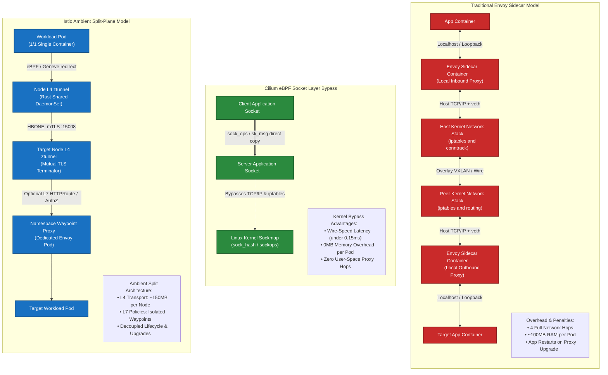
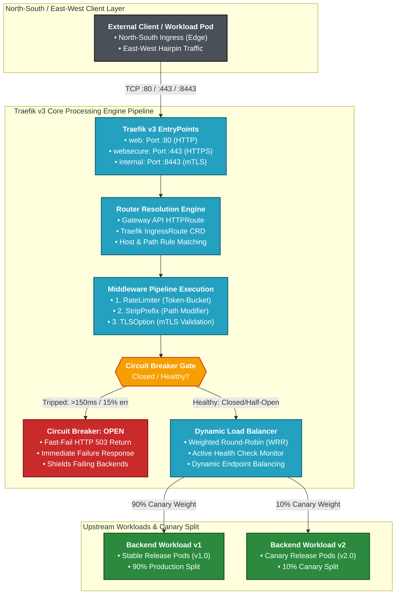
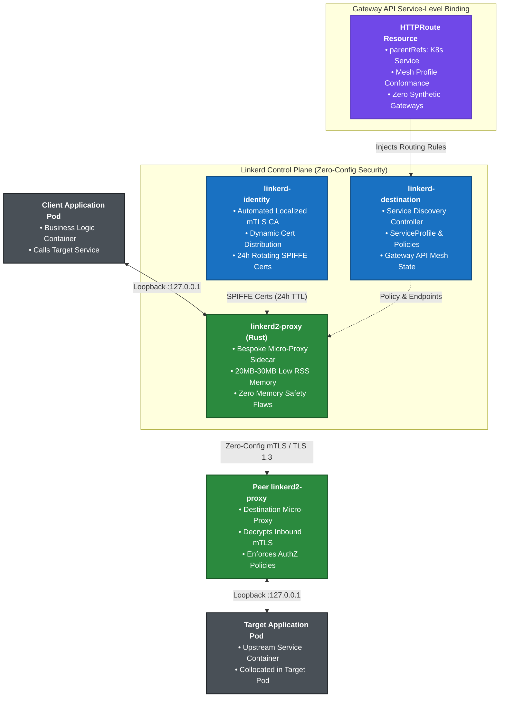
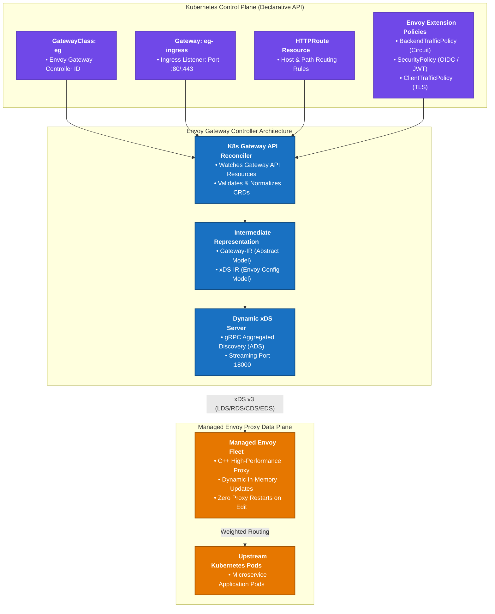
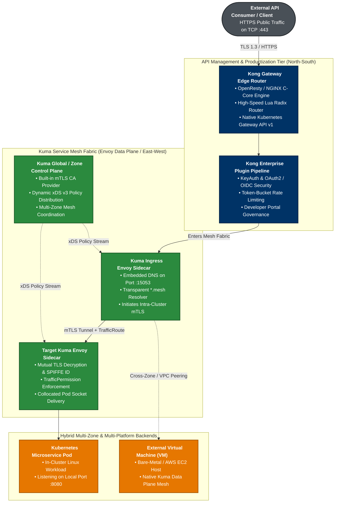
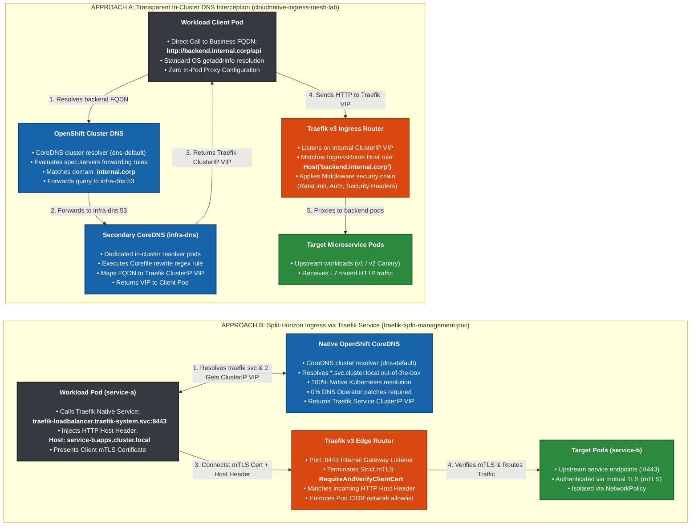
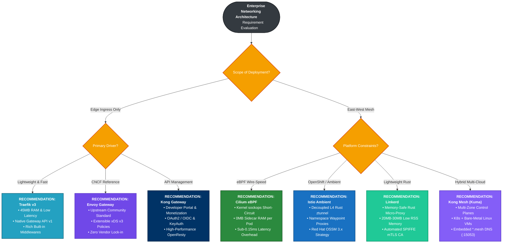

# Cloud-Native Ingress & Service Mesh Laboratory (2026 Edition)
### Production Evaluation Framework, Architectural Analyses, and Automated PoCs for Next-Generation Kubernetes & OpenShift Networking Fabrics

[](https://kubernetes.io/)
[](https://www.redhat.com/en/technologies/cloud-computing/openshift)
[](https://gateway-api.sigs.k8s.io/)
[](https://www.cncf.io/)
[](https://ebpf.io/)
[](https://csrc.nist.gov/publications/detail/sp/800-207/final)

[](https://cilium.io/)
[](https://istio.io/)
[](https://traefik.io/)
[](https://gateway.envoyproxy.io/)
[](https://linkerd.io/)
[](https://konghq.com/)

[](https://aws.amazon.com/rosa/)
[](https://cloud.google.com/kubernetes-engine)
[](https://azure.microsoft.com/en-us/products/kubernetes-service)
[](https://spiffe.io/)
[](https://www.wireguard.com/)
[](https://docs.openshift.com/)
[](https://csrc.nist.gov/publications/detail/fips/140/3/final)

[](Makefile)
[](docs/LAB_CILIUM.md)
[](docs/ARCHITECTURE.md)
[](LINKEDIN_NEWSLETTER_EN.md)
[](LINKEDIN_NEWSLETTER_ES.md)
[](https://youtube.com/@nubenetes)

---

> [!WARNING]
> ### ⚠️ AI-Generated Content & Environment Testing Disclaimer
> This repository, its architectural analyses, comparison matrices, diagrams, and configuration manifests were generated by **Gemini 3.8 Flash** and **have NOT been tested in a real production environment**.
> 
> While formulated with architectural depth based on official cloud-native standards (Kubernetes SIG-Network Gateway API, Istio, Cilium, Traefik, OpenShift), all manifests, scripts, and deployment steps must be independently reviewed, audited, and tested in dedicated sandbox or staging environments prior to any enterprise adoption.

> [!IMPORTANT]
> ### 🌟 Key Architectural Value & Industry Differentiators of This Laboratory
>
> 1. **100% Kubernetes Gateway API Native (`gateway.networking.k8s.io/v1`)**:
>    - **Zero Legacy Ingress**: Entirely abandons `networking.k8s.io/v1 Ingress` in favor of decoupled, role-oriented `GatewayClass`, `Gateway`, and `HTTPRoute` resources across **all** implementations.
>    - **Automated Experimental Channel Bootstrap**: Includes automated provisioning of experimental channel CRDs (`make install-gateway-api`) required for Istio Waypoint proxies (`gatewayClassName: istio-waypoint`) and advanced policy attachments.
> 2. **2026 Modern Sidecarless Data Plane Paradigm**:
>    - **In-Kernel eBPF (Cilium)**: Bypasses the host TCP/IP stack via Linux `sockops` socket-layer short-circuiting with wire-speed Layer 4 transmission.
>    - **Split-Plane Sidecarless Mesh (Istio Ambient / Red Hat OSSM 3.x)**: Decouples node-level L4 mutual TLS (`ztunnel` over HBONE) from opt-in namespace L7 traffic governance (`waypoint`), slashing memory overhead by 80%.
>    - **Pure Edge Ingress (Traefik v3)**: Demonstrates production canary splitting, rate limiting, and mTLS at the perimeter *without* the operational tax of a service mesh.
> 3. **Complete Dual-Plane FQDN Routing (North-South & East-West)**:
>    - Solves both external cluster ingress and internal pod-to-pod microservice calls via domain names with and without a service mesh.
>    - Resolves **OpenShift 4.20+ CoreDNS immutability** using a fully supported secondary unprivileged DNS forwarder pattern.
> 4. **Production-Grade Enterprise Hardening**:
>    - Validated configurations for OpenShift SecurityContextConstraints (`restricted-v2`, `anyuid`, `privileged`), SELinux contexts (`spc_t`), and FIPS 140-3 cryptography.
> 5. **Turnkey Automated Verification**:
>    - Zero placeholders, zero `# configure here` comments. Includes statistical canary verification engines (`test-canary.sh`), cryptographic mTLS validation (`test-mtls.sh`), and unified `Makefile` automation.

---

## Documentation Index & Navigation

| Document | Focus Area |
| :--- | :--- |
| **[ARCHITECTURE.md](docs/ARCHITECTURE.md)** | Multi-layer packet flow analyses, Linux `sockops` vs Envoy proxies, OpenShift SCCs |
| **[FQDN_ROUTING.md](docs/FQDN_ROUTING.md)** | Dual-plane (N-S & E-W) FQDN routing across mesh & non-mesh architectures |
| **[GATEWAY_API_WITHOUT_TRAEFIK.md](docs/GATEWAY_API_WITHOUT_TRAEFIK.md)** | Gateway API without Traefik: OpenShift Route limitations, Istio Ambient, Envoy GW, Cilium |
| **[GATEWAY_API_WITH_TRAEFIK.md](docs/GATEWAY_API_WITH_TRAEFIK.md)** | Gateway API with Traefik: ExtensionRef middlewares, PROXY protocol v2, zero-sidecar East-West FQDNs, OpenShift restricted-v2 |
| **[EXTENDED_SOLUTIONS.md](docs/EXTENDED_SOLUTIONS.md)** | Architectural deep dives on Linkerd (Rust), Envoy Gateway, and Kong Gateway + Kuma |
| **[SCENARIOS_AND_RECOMMENDATIONS.md](docs/SCENARIOS_AND_RECOMMENDATIONS.md)** | 6 Enterprise scenarios, TCO benchmarks, blast radius analysis, and migration playbooks |
| **[LAB_CILIUM.md](docs/LAB_CILIUM.md)** | Automated PoC: Kernel-level eBPF Gateway & Mesh, Canary, Hubble observability |
| **[LAB_ISTIO_AMBIENT.md](docs/LAB_ISTIO_AMBIENT.md)** | Automated PoC: Sidecarless Istio Ambient (ztunnel + Waypoint), mTLS validation |
| **[LAB_TRAEFIK_EDGE.md](docs/LAB_TRAEFIK_EDGE.md)** | Automated PoC: Gateway API-native Edge Router, Middlewares, CircuitBreaker |
| **[LINKEDIN_NEWSLETTER_EN.md](LINKEDIN_NEWSLETTER_EN.md)** | LinkedIn Newsletter Edition (English): Complete 2026 architecture analysis, Unified FQDN, TCO benchmarks & playbooks |
| **[LINKEDIN_NEWSLETTER_ES.md](LINKEDIN_NEWSLETTER_ES.md)** | Edición Boletín LinkedIn (Español): Análisis integral 2026, FQDN Unificado, comparativa TCO y guías de migración |

---

## Table of Contents
- [1. Executive Summary & 2026 Landscape Shifts](#1-executive-summary--2026-landscape-shifts)
  - [1.1 The Gateway API Advantage: Legacy Ingress vs. Modern Gateway API](#11-the-gateway-api-advantage-legacy-ingress-vs-modern-gateway-api)
- [2. Hands-on PoC Evaluation Matrix (Cilium vs. Istio Ambient vs. Traefik v3)](#2-hands-on-poc-evaluation-matrix-cilium-vs-istio-ambient-vs-traefik-v3)
- [3. Extended Ecosystem Alternatives & Competitive Landscape](#3-extended-ecosystem-alternatives--competitive-landscape)
  - [3.1 Linkerd: The Micro-Proxy (Rust) Sidecar Defense & Commercial Pivot](#31-linkerd-the-micro-proxy-rust-sidecar-defense--commercial-pivot)
  - [3.2 Envoy Gateway: The CNCF Gateway API Reference Controller](#32-envoy-gateway-the-cncf-gateway-api-reference-controller)
  - [3.3 Kong Gateway & Kuma: Enterprise API Management vs. Hybrid Mesh](#33-kong-gateway--kuma-enterprise-api-management-vs-hybrid-mesh)
  - [3.4 Comprehensive 6-Way Comparative Evaluation Matrix](#34-comprehensive-6-way-comparative-evaluation-matrix)
  - [3.5 Deep-Dive: North-South & East-West FQDN Routing Comparison](#35-deep-dive-north-south--east-west-fqdn-routing-comparison)
- [4. Platform Decision Matrix & Ranked Recommendations](#4-platform-decision-matrix--ranked-recommendations)
  - [Archetype 1: Ultra-Low Latency & Telco/Fintech](#archetype-1-high-performance-ultra-low-latency--telcofintech-workloads)
  - [Archetype 2: Enterprise Multi-Tenant Zero-Trust](#archetype-2-enterprise-multi-tenant-zero-trust-cloud-platform-eg-openshift-on-awsbare-metal)
  - [Archetype 3: High-Velocity API Edge Platform](#archetype-3-high-velocity-api-edge--developer-platform-north-south-ingress-focus)
- [5. Architecture Diagrams](#5-architecture-diagrams)
  - [Diagram 1: End-to-End North-South Ingress into East-West Zero-Trust Mesh Fabric](#diagram-1-end-to-end-north-south-ingress-into-east-west-zero-trust-mesh-fabric)
  - [Diagram 2: 3-Way Structural Data Plane Comparison (Sidecar vs. eBPF Bypass vs. Istio Ambient)](#diagram-2-3-way-structural-data-plane-comparison-sidecar-vs-ebpf-bypass-vs-istio-ambient)
  - [Diagram 3: Traefik Proxy v3 Edge Gateway & East-West Hairpin Pipeline](#diagram-3-traefik-proxy-v3-edge-gateway--east-west-hairpin-pipeline)
  - [Diagram 4: Linkerd Micro-Proxy (Rust) Sidecar & Service Attachment](#diagram-4-linkerd-micro-proxy-rust-sidecar--service-attachment)
  - [Diagram 5: Envoy Gateway CNCF Controller & Policy Engine](#diagram-5-envoy-gateway-cncf-controller--policy-engine)
  - [Diagram 6: Kong Gateway & Kuma Mesh Hybrid Topology](#diagram-6-kong-gateway--kuma-mesh-hybrid-topology)
  - [Diagram 7: Dual-Plane FQDN Routing Paradigms (Transparent In-Cluster vs. Split-Horizon Ingress)](#diagram-7-dual-plane-fqdn-routing-paradigms-transparent-in-cluster-vs-split-horizon-ingress)
  - [Diagram 8: Enterprise Platform Decision Tree & Scenario Recommendation Flowchart](#diagram-8-enterprise-platform-decision-tree--scenario-recommendation-flowchart)
- [6. Repository Structure](#6-repository-structure)
- [7. Quick Start & Global Automation](#7-quick-start--global-automation)
- [8. Authoritative References & Sources of Truth](#8-authoritative-references--sources-of-truth)
  - [8.1 Kubernetes Gateway API & Networking Standards](#81-kubernetes-gateway-api--networking-standards)
  - [8.2 Linux Kernel eBPF & Socket-Layer Acceleration (`sockops`)](#82-linux-kernel-ebpf--socket-layer-acceleration-sockops)
  - [8.3 Istio Ambient Mode & HBONE Architecture](#83-istio-ambient-mode--hbone-architecture)
  - [8.4 Traefik Proxy v3 (Edge Gateway & Ingress)](#84-traefik-proxy-v3-edge-gateway--ingress)
  - [8.5 Extended Alternatives: Linkerd, Envoy Gateway, Kong & Kuma](#85-extended-alternatives-linkerd-envoy-gateway-kong--kuma)
  - [8.6 Red Hat OpenShift Compliance & Platform Hardening](#86-red-hat-openshift-compliance--platform-hardening)
  - [8.7 Industry Standards for Zero-Trust & Identity](#87-industry-standards-for-zero-trust--identity)
- [9. Companion Projects & Ecosystem Cross-References](#9-companion-projects--ecosystem-cross-references)
- [10. 🎬 YouTube Video Masterclasses & Architectural Walkthroughs](#10--youtube-video-masterclasses--architectural-walkthroughs)

---

## 1. Executive Summary & 2026 Landscape Shifts

The Kubernetes networking landscape in 2026 has crossed two definitive architectural inflection points:

1. **The Formal Deprecation and Sunset of `networking.k8s.io/v1 Ingress`**:
   The legacy Ingress resource—defined in 2015 as a rudimentary reverse-proxy abstraction—has been fundamentally superseded by the **Kubernetes Gateway API (`gateway.networking.k8s.io/v1`)**. Legacy Ingress suffered from severe architectural flaws:
   - Monolithic role collision (cluster operators and application developers fighting over a single resource).
   - Proliferation of unstandardized, vendor-locked annotations (e.g., `nginx.ingress.kubernetes.io/*`, `traefik.ingress.kubernetes.io/*`).
   - Incapability of expressing modern routing topologies (weighted canaries, header manipulations, gRPC method-level routing, cross-namespace binding, SNI multiplexing) without out-of-tree Custom Resource Definitions (CRDs).
   The Gateway API introduces a decoupled, role-oriented resource model (`GatewayClass` for Infrastructure Providers, `Gateway` for Platform/Cluster Operators, and `*Route` for Application Developers) with first-class conformance testing across data plane providers.

2. **The Demise of the Sidecar Pattern in Favor of Sidecarless Meshes**:
   Injecting an Envoy sidecar proxy into every application pod (`O(N)` scaling) has proven unsustainable in large-scale enterprise environments:
   - **Resource Overhead (Sidecar Tax)**: 50MB–150MB of RSS memory per sidecar container, multiplied across tens of thousands of pods, leads to multi-gigabyte RAM waste purely for proxy infrastructure.
   - **Latency Penalty**: Every request traverses four network hops across the host TCP/IP stack (`App -> Loopback -> Sidecar -> eth0 -> Node -> eth0 -> Peer Sidecar -> Loopback -> Peer App`), adding 2ms–6ms of P99 latency.
   - **Operational Friction**: Pod restart cycles required for proxy upgrades, CPU throttling caused by Linux CFS quota starvation on proxy sidecars, and severe initialization race conditions (e.g., application containers starting before the sidecar proxy is online).

Modern 2026 infrastructures employ **Sidecarless Architectures**:
- **Kernel-level eBPF Short-Circuiting (Cilium)**: Bypassing the entire TCP/IP networking stack at the Linux socket layer (`sockops`), achieving wire-speed Layer 4 transmission and selective Layer 7 Envoy invocation only when cryptographic payload inspection is required.
- **Split-Layer Ambient Data Planes (Istio Ambient)**: Decoupling L4 transport security (Zero-Trust mTLS and identity verification handled at the node level by the Rust-based `ztunnel`) from L7 traffic management (handled by optional, namespace-scoped `waypoint` Envoy proxies).

This laboratory repository provides production-grade reference implementations, automated deployment harnesses, and comparative benchmarks for **Cilium eBPF**, **Istio Ambient**, and **Traefik v3** on both vanilla Kubernetes and Red Hat OpenShift.

### 1.1 The Gateway API Advantage: Legacy Ingress vs. Modern Gateway API

The table below contrasts the legacy Ingress abstraction with the modern Kubernetes Gateway API (`gateway.networking.k8s.io/v1`) implemented across this repository:

| Capability Dimension | Legacy Ingress (`networking.k8s.io/v1`) | Modern Gateway API (`gateway.networking.k8s.io/v1`) | Laboratory Realization in This Repository |
| :--- | :--- | :--- | :--- |
| **Persona Decoupling** | Monolithic: 1 resource shared by Ops, Devs, & NetEng | Role-Oriented: `GatewayClass` (Infra), `Gateway` (Cluster Ops), `*Route` (App Devs) | Demonstrated across all 3 labs with clear RBAC boundaries |
| **Portability** | Vendor lock-in via custom annotations (`nginx.ingress...`, `traefik...`) | First-class portable specification with conformance validation test suites | Identical `HTTPRoute` specs run on Cilium, Istio, and Traefik |
| **Traffic Splitting / Canary** | Flaky annotations or required service mesh CRDs (`VirtualService`) | Declarative weights natively built into `HTTPRoute.spec.rules.backendRefs` | Automated 90/10 canary split tested via `test-canary.sh` |
| **Cross-Namespace Routing** | Insecure or completely disallowed | Secure cross-namespace binding governed by `ReferenceGrant` | Multi-tenant namespace routing (`lab-mesh`, `lab-edge`) |
| **Protocol Coverage** | HTTP/1.1 and simple TLS termination only | First-class `HTTPRoute`, `GRPCRoute`, `TLSRoute`, `TCPRoute`, `UDPRoute` | HTTP/2, HBONE, gRPC, and mTLS passthrough validated |
| **Service Mesh Binding** | Ingress only; cannot express East-West mesh routing | Unified API for both North-South edge ingress and East-West mesh routing | Istio Waypoint & Cilium L7 bind directly to `HTTPRoute` |
| **CRD Automated Install** | Manual manifest scraping per vendor | Standardized experimental channel release (`GATEWAY_API_VERSION ?= v1.1.0`) | Automated via `make install-gateway-api` |

---

## 2. Hands-on PoC Evaluation Matrix (Cilium vs. Istio Ambient vs. Traefik v3)

| Evaluation Dimension | Cilium Service Mesh (v1.16+) | Istio Ambient Mesh (v1.23+) | Traefik v3 (Edge Gateway) |
| :--- | :--- | :--- | :--- |
| **Data Plane Architecture** | Sidecarless; in-kernel eBPF socket layer (`sockops`) + Host-level Envoy daemon | Sidecarless; Node-level Rust L4 `ztunnel` + Namespace-level L7 Envoy `waypoint` | Ingress Edge; Go-based proxy process (DaemonSet or Deployment) |
| **Gateway API Conformance** | GA Conformance (`GatewayClass`, `Gateway`, `HTTPRoute`, `TLSRoute`, `GRPCRoute`) | GA Conformance (`Gateway`, `HTTPRoute`, Waypoint binding via GatewayClass) | GA Conformance (`GatewayClass`, `Gateway`, `HTTPRoute`, `TLSRoute`) |
| **P99 Latency Overhead (L4)** | **< 0.15 ms** (Kernel socket bypass via `sock_hash`) | **0.25 – 0.40 ms** (Traverses local node `ztunnel` via Geneve/eBPF redirection) | N/A (Pure Edge Gateway) |
| **P99 Latency Overhead (L7)** | 1.10 – 1.80 ms (Targeted Envoy redirect) | 1.20 – 1.95 ms (Waypoint proxy hop) | 0.85 – 1.40 ms (Direct Ingress reverse proxy) |
| **Memory Footprint (Per Pod)**| **0 MB** (Zero sidecar injection) | **0 MB** (Zero sidecar injection) | 0 MB (Not an East-West mesh) |
| **Memory Footprint (Cluster-wide)**| ~1.2 GB per node (cilium-agent + hubble + Envoy daemon) | **~150 MB per node (`ztunnel`)** + ~60 MB per active Waypoint | ~120 MB per Edge Gateway replica |
| **mTLS Implementation Vector** | Node-to-Node WireGuard/IPsec + Cilium Mutual Auth (SPIRE / control-plane handshake) | **HBONE (HTTP-Based Overlay Network)** over port 15008 with SPIFFE X.509 certs | Edge TLS termination; mTLS upstream via IngressRoute/Gateway spec |
| **L7 Security Capabilities** | CiliumNetworkPolicy L7 rules, HTTP header filtering, DNS policies | Rich Istio AuthorizationPolicy (claims, paths, methods, JWT validation) | Advanced Middlewares (RateLimit, CircuitBreaker, ForwardAuth, Digest) |
| **Red Hat OpenShift Compliance** | **Complex**: Requires replacing OVN-K or Multus chaining; `privileged` SCC, SELinux policies | **Native**: Basis for Red Hat OpenShift Service Mesh 3.x; compatible with default OVN-K | **High**: Runs on OpenShift via standard SCC (`nonroot` or `anyuid`), simple Route bridging |
| **Operational & Upgrade Impact** | Zero app pod restarts during upgrades; high kernel dependency (Linux 5.10+) | Zero app pod restarts during upgrades; ztunnel upgrade hits 0-downtime connection draining | Zero app pod restarts; standard rolling deployment for edge gateways |
| **Observability Fabric** | Hubble (eBPF-native kernel tracing, OpenTelemetry, Prometheus, Grafana) | Kiali, Prometheus, Jaeger/Tempo via ztunnel/waypoint Envoy telemetry | Built-in Web UI, Prometheus metrics, OpenTelemetry tracing natively |

---

## 3. Extended Ecosystem Alternatives & Competitive Landscape

While the three hands-on laboratories in this repository evaluate the leading data plane archetypes (In-Kernel eBPF, Sidecarless Ambient, and Go-native Edge Ingress), enterprise architecture reviews require comparing other major cloud-native networking solutions: **Linkerd**, **Envoy Gateway**, **Kong Gateway**, and **Kuma**.

### 3.1 Linkerd: The Micro-Proxy (Rust) Sidecar Defense & Commercial Pivot
- **Architectural Defense of the Sidecar**: Linkerd (Buoyant) firmly defends the sidecar model against node-shared proxies. Their position is that running multi-tenant proxies in the host network namespace (like `ztunnel` or node-level Envoy) breaches POSIX container isolation boundaries and enlarges the CVE blast radius—where a single proxy parser exploit can expose traffic across all pods on a node.
- **The `linkerd2-proxy` Micro-Proxy**: Written strictly in **Rust**, Linkerd's proxy is memory-safe by design, consuming merely **~15MB–30MB RSS per pod** (roughly 1/4th the memory of an Envoy sidecar) with ultra-low latency and zero C/C++ memory corruption vulnerabilities.
- **Gateway API Support**: Implements `HTTPRoute` directly attached to Kubernetes `Service` objects for East-West traffic. For North-South ingress, Linkerd deliberately omits a bundled edge proxy, requiring integration with external controllers (e.g., Envoy Gateway or Traefik).
- **The 2024–2026 Commercial Licensing Shift**: In February 2024, Buoyant changed Linkerd's distribution model. While weekly "edge" releases remain open-source, official stable release binaries (`stable-2.14+`, `stable-2.15+`) require a paid commercial agreement for organizations with over 50 pods in production. This shift led many enterprises with pure open-source mandates to prioritize Apache 2.0 projects (**Istio Ambient** and **Cilium**).
- **OpenShift Fit**: Requires `linkerd-cni` and custom SCCs; lacks first-party Red Hat support (Red Hat standardizes on OSSM 3 / Istio Ambient).

### 3.2 Envoy Gateway: The CNCF Gateway API Reference Controller
- **The Official Reference Standard**: Created jointly by the Envoy Project steering committee and Kubernetes SIG-Network, Envoy Gateway is the canonical open-source translation layer from Kubernetes Gateway API directly to dynamic **Envoy v3 xDS**.
- **Envoy Without the Mesh**: Enables platform teams to deploy and manage upstream Envoy proxies using 100% vendor-neutral Gateway API resources, extended via native policies (`ClientTrafficPolicy`, `BackendTrafficPolicy`, `SecurityPolicy` for OIDC/JWT, and `EnvoyExtensionPolicy` for Wasm).
- **Comparison to Traefik v3**: While Traefik offers superior developer ergonomics and Go-native custom CRD middlewares, Envoy Gateway provides native Envoy filter parity and standardized xDS hooks for organizations already committed to the Envoy ecosystem.

### 3.3 Kong Gateway & Kuma: Enterprise API Management vs. Hybrid Mesh
- **Kong Gateway (KIC)**: Based on OpenResty (Nginx + LuaJIT) and modern C/Go cores. Excels at full-lifecycle API Management (developer portals, API monetization, OAuth2/OIDC token minting, fine-grained plugin catalog), but carries a heavier memory footprint (~150MB–300MB+ per instance) and operational complexity (PostgreSQL or decK GitOps tooling).
- **Kuma / Kong Mesh**: Envoy-based service mesh designed for multi-zone, hybrid cloud, and bare-metal VM environments. While mature for VM-to-K8s cross-cluster topologies, it has seen slower adoption in pure OpenShift/Kubernetes environments compared to Istio Ambient.

### 3.4 Comprehensive 6-Way Comparative Evaluation Matrix

| Evaluation Dimension | Cilium Service Mesh | Istio Ambient Mesh | Traefik Proxy v3 | Linkerd (2.16+) | Envoy Gateway | Kong Gateway (KIC) |
| :--- | :--- | :--- | :--- | :--- | :--- | :--- |
| **Primary Architectural Role** | In-kernel eBPF Mesh & Ingress | Split-Plane Sidecarless Mesh | Edge Ingress & API Router | Micro-Proxy Sidecar Mesh | Pure Gateway API Ingress | Full Lifecycle API Gateway |
| **Data Plane Engine** | eBPF bytecode + Node Envoy | Rust `ztunnel` + Envoy Waypoint | Go Core multiplexer | Rust `linkerd2-proxy` | Envoy Proxy (C++) | OpenResty (Nginx/Lua) + Go |
| **Mesh Topology** | Host/Node-level (Sidecarless) | Node L4 + Namespace L7 | None (North-South Edge) | Pod-scoped (Sidecar) | None (North-South Edge) | Optional Kuma sidecars |
| **Gateway API Conformance** | v1 GA Native | v1 GA Native (Waypoint binding) | v1 GA Native | v1 GA (East-West routing) | Official Reference Standard | v1 Partial / CRD-heavy |
| **North-South FQDN Routing** | Gateway listeners with `hostnames` + `HTTPRoute` matching; SNI via `TLSRoute` | Gateway (`istio`) + `HTTPRoute` host matching; SNI routing & TLS termination | Gateway listeners (`*.corp.internal`) + `HTTPRoute` / `IngressRoute` host rules | Relies on external Ingress (Envoy GW / Traefik) targeting mesh Services | Native Gateway API: exact/wildcard `hostnames`, SNI routing in `TLSRoute` | `HTTPRoute` host matching + `KongIngress` / `Ingress` regex host rules |
| **East-West FQDN Routing** | Direct pod-to-pod FQDN calls; in-kernel DNS proxy maps IP to name via eBPF | Synthetic VIPs via `ServiceEntry` + `HTTPRoute` binding on Waypoint proxies | Hairpin Ingress via CoreDNS forwarder/rewrite; Middlewares applied at proxy | `HTTPRoute` on Service; proxy matches `Host` / `:authority` header | Internal Gateway VIP via CoreDNS rewrite; `BackendTrafficPolicy` applied | Standalone: Hairpin via CoreDNS; Mesh: Kuma embedded DNS intercepts `*.mesh` |
| **DNS Interception Vector** | In-kernel eBPF socket hook intercepting port 53; dynamic sockmap cache | Node-level `ztunnel` DNS capture (`ISTIO_META_DNS_CAPTURE`) without sidecars | Standard CoreDNS rewrite / secondary DNS forwarder (OpenShift 4.20+) | Pod-level iptables redirecting port 53 or standard Kubernetes CoreDNS | Standard CoreDNS resolving internal FQDN to Envoy Gateway VIP | Kuma sidecar local DNS server on port 15053 or CoreDNS hairpin |
| **External FQDN Egress Security** | `toFQDNs` in `CiliumNetworkPolicy` dynamically whitelisting resolved IPs | `ServiceEntry` (DNS) + `AuthorizationPolicy` / Egress Gateway | ForwardAuth or custom Middleware proxying to external FQDNs | Egress traffic policy; opaque TLS bypass or external egress proxy | `BackendTrafficPolicy` with external endpoints or DNS resolution | External Service entities + `KongPlugin` egress filters |
| **Pod Workload Overhead** | **0 MB** (Zero sidecar) | **0 MB** (Zero sidecar) | 0 MB (Edge Proxy) | **~15–30 MB** (Rust proxy) | 0 MB (Edge Proxy) | ~150–300 MB per replica |
| **CVE Blast Radius Containment** | Shared Node Envoy | Split: Node L4 / Namespace L7 | Edge Perimeter | **Strict Pod Isolation** | Edge Perimeter | Edge Perimeter |
| **mTLS & Identity Backbone** | SPIRE / Node WireGuard | **HBONE / SPIFFE X.509** | Edge TLS Termination | Pod-to-Pod mTLS (SPIFFE) | Edge TLS / Backend mTLS | Edge TLS / Upstream mTLS |
| **Red Hat OpenShift Fit** | Requires CNI/SELinux bypass | **First-Class (OSSM 3.x Native)** | High (`restricted-v2` SCC) | Requires custom SCC & CNI | High (`anyuid` SCC) | Certified Operator Catalog |
| **Licensing Governance** | Apache 2.0 (CNCF Graduated) | Apache 2.0 (CNCF Graduated) | Apache 2.0 / Enterprise | Edge: Apache 2.0 / Stable: Paid | Apache 2.0 (CNCF) | Apache 2.0 / Kong Enterprise |

---

### 3.5 Deep-Dive: North-South & East-West FQDN Routing Comparison

FQDN-based routing behaves fundamentally differently across edge gateways and service meshes:

#### 1. Cilium Service Mesh (In-Kernel eBPF & Envoy)
- **North-South**: Edge Gateway API `Gateway` listeners match client request SNI (`TLSRoute`) and HTTP `Host` headers (`HTTPRoute`). Envoy handles TLS termination and forwards traffic directly to backend pods via eBPF host routing.
- **East-West**: Cilium’s standout capability is its **in-kernel eBPF DNS proxy**. When a pod requests `api.partner.internal`, eBPF intercepts the UDP/TCP port 53 packet, inspects the DNS response payload, and dynamically populates kernel ipsets. The `toFQDNs` egress policy allows connections strictly to the currently resolved IPs, preventing DNS spoofing and eliminating static IP dependencies.

#### 2. Istio Ambient Mesh (ztunnel & Waypoint)
- **North-South**: An Istio Ingress Gateway (`gatewayClassName: istio`) terminates edge TLS and applies Layer 7 routing via `HTTPRoute` before encapsulating traffic into HBONE (port 15008) toward the destination node’s `ztunnel`.
- **East-West**: With **Node-Level DNS Capture** (`ISTIO_META_DNS_CAPTURE=true`), the node `ztunnel` intercepts outbound DNS requests locally without requiring pod sidecars. External or non-mesh internal FQDNs are declared via `ServiceEntry` resources (`resolution: DNS`). Outbound requests to `api.partner.internal` receive a deterministic virtual IP from ztunnel, which routes the request to an Envoy `waypoint` proxy where mTLS, header matching, and canary splitting are enforced before egress.

#### 3. Traefik Proxy v3 (Edge Gateway & Hairpin Intermediary)
- **North-South**: Traefik natively matches FQDNs using Gateway API `Gateway` listeners with `hostname: "*.internal.corp"` and `HTTPRoute` rules, or Traefik `IngressRoute` with `Host()` and `HostSNI()` rule matchers. External traffic resolves via public/corporate DNS (Route 53, Infoblox) straight to the Edge Load Balancer, requiring **0% CoreDNS involvement**.
- **East-West (Non-Mesh Hairpin & Split-Horizon)**: In architectures without a service mesh, internal microservices call each other via shared FQDNs (e.g., `backend.internal.corp` or `service-b.apps.cluster.local`). Two proven enterprise patterns exist:
  - *Pattern A (Transparent In-Cluster Interception)*: CoreDNS rewrites the domain or forwards via an unprivileged secondary CoreDNS (`infra-dns`) on OpenShift 4.20+ to Traefik's internal ClusterIP. Workload pods call `http://backend.internal.corp` directly without custom headers.
  - *Pattern B (Split-Horizon Ingress via Traefik Service)*: Workload pods call Traefik's native cluster Service URL (`https://traefik.traefik-system.svc.cluster.local:8443`) with `-H "Host: service-b.apps.cluster.local"`. CoreDNS resolves `svc.cluster.local` natively out-of-the-box with **zero DNS forwarders and zero DNS operator patches**, while Traefik handles mTLS (`RequireAndVerifyClientCert`) and L7 routing at the proxy boundary. This is demonstrated in our companion project [**traefik-fqdn-management-poc-openshift-aws**](https://github.com/nubenetes/traefik-fqdn-management-poc-openshift-aws).

#### 4. Linkerd (Rust Micro-Proxy Sidecars)
- **North-South**: Linkerd does not provide a native Ingress controller; it delegates North-South FQDN termination to third-party Gateway API ingress controllers (such as Envoy Gateway or Traefik), which inject traffic into Linkerd-meshed services.
- **East-West**: Linkerd’s `linkerd2-proxy` sidecar captures outbound traffic and matches the HTTP `:authority` or `Host` header against Gateway API `HTTPRoute` objects attached directly to internal `Service` resources. Outbound requests to arbitrary external FQDNs bypass the mesh or pass through an external egress proxy.

#### 5. Envoy Gateway (CNCF Reference Implementation)
- **North-South**: Direct implementation of the Kubernetes Gateway API specification. Uses standard `hostnames` in `Gateway` and `HTTPRoute` to generate dynamic Envoy VirtualHosts and SNI match filters in xDS v3.
- **East-West**: Deployed as an internal cluster gateway. Microservices route to internal FQDNs backed by CoreDNS entries pointing to the Envoy Gateway internal IP. Envoy Gateway enforces `BackendTrafficPolicy` (rate limits, retries, circuit breaking) and `SecurityPolicy` (JWT/OIDC) before dispatching to destination pods.

#### 6. Kong Gateway (KIC) & Kuma
- **North-South**: High-performance domain routing powered by Kong's OpenResty router (radix tree index) matching `HTTPRoute` hostnames or `KongIngress` host rules.
- **East-West**: In standalone mode, uses CoreDNS hairpinning similar to Traefik. When paired with **Kuma (Kong Mesh)**, outbound DNS is intercepted by Kuma’s embedded DNS server running alongside the Envoy sidecar, resolving custom internal mesh domains (e.g., `service.mesh`) directly to destination sidecars.

---

## 4. Platform Decision Matrix & Ranked Recommendations

### Archetype 1: High-Performance, Ultra-Low Latency & Telco/Fintech Workloads
- **Rank 1: Cilium eBPF Service Mesh**
  - *Why*: Eliminates user-space/kernel-space context switching for internal pod-to-pod traffic. Using Linux `sockops` eBPF programs, Cilium connects client and server sockets directly at the kernel layer, bypassing the entire TCP/IP network stack (iptables, routing tables, and veth pairs). WireGuard kernel-level encryption provides line-rate hardware-accelerated confidentiality with zero proxy overhead.
- **Rank 2: Istio Ambient**
  - *Why*: Rust-based `ztunnel` provides high-throughput HBONE mutual TLS at Layer 4 with negligible overhead, routing through `waypoint` proxies only when L7 inspection is required.
- **Rank 3: Linkerd**
  - *Why*: Rust micro-proxy (`linkerd2-proxy`) delivers extremely fast forward proxying and minimal memory overhead (~15MB), though requests still traverse the pod loopback and veth stack twice.
- **Rank 4: Traefik v3 / Envoy Gateway** (Dedicated Edge Gateways; not applicable for East-West mesh fabrics).

### Archetype 2: Enterprise Multi-Tenant Zero-Trust Cloud Platform (e.g., OpenShift on AWS/Bare-Metal)
- **Rank 1: Istio Ambient (Red Hat OpenShift Service Mesh 3.x)**
  - *Why*: Operates seamlessly on top of Red Hat's default **OVN-Kubernetes** CNI without requiring kernel replacement. Enforces strict cryptographic zero-trust at Layer 4 across every pod through `ztunnel` without developer intervention. When Layer 7 traffic authorization, canary routing, or header manipulation is demanded, platform teams can selectively spin up a dedicated `waypoint` proxy for that specific namespace or service account, guaranteeing strong tenant isolation and blast-radius containment.
- **Rank 2: Linkerd**
  - *Why*: Superior pod-level CVE isolation and memory safety via Rust. However, it requires custom SCCs and third-party CNI deployment on OpenShift, and commercial stable licensing introduces procurement friction.
- **Rank 3: Cilium eBPF** (Heavy SCC and SELinux modification requirements on RHCOS; high friction for replacing default OVN-Kubernetes).
- **Rank 4: Traefik v3** (Perimeter edge routing; pairs with Istio Ambient or Linkerd for internal mesh).

### Archetype 3: High-Velocity API Edge & Developer Platform (North-South Ingress Focus)
- **Rank 1: Traefik v3 Gateway API**
  - *Why*: Unrivaled developer ergonomics, ultra-fast dynamic configuration updates without reloads, and rich native middlewares (token-bucket rate limiting, circuit breaking, distributed tracing). Native implementation of `gateway.networking.k8s.io/v1` combined with Traefik Middleware filters enables declarative, self-service edge routing without bloated custom controllers.
- **Rank 2: Envoy Gateway**
  - *Why*: Official CNCF Gateway API reference controller. Provides direct translation to Envoy xDS v3 with standard policy attachments (`SecurityPolicy`, `ClientTrafficPolicy`, Wasm) without requiring an Istio control plane.
- **Rank 3: Kong Gateway (KIC)**
  - *Why*: Ideal if the platform mandates full-lifecycle API Management (developer portal, API key generation, consumer billing, Lua/Python plugins), though at higher memory and operational cost.
- **Rank 4: Cilium Gateway API** (Excellent if Cilium is already deployed as the primary CNI).
- **Rank 5: Istio Ingress Gateway** (Heavyweight if deployed purely for edge ingress without an underlying mesh).

---

## 5. Architecture Diagrams

### Diagram 1: End-to-End North-South Ingress into East-West Zero-Trust Mesh Fabric

<details>
<summary><b>Diagram 1: End-to-End North-South Ingress into East-West Zero-Trust Mesh Fabric (Click to Expand / Collapse)</b></summary>


</details>

#### Architecture & Packet Lifecycle Breakdown
- **North-South Perimeter Ingestion**: External client requests reach the edge ingress tier via TLS 1.3 over TCP port 443. The ingress controller (e.g. Traefik v3) terminates edge TLS, inspects SNI and HTTP Host headers, and executes configured middleware pipelines (token-bucket rate limiting, JWT authentication, and path rewrites).
- **Gateway API Role-Oriented Dispatch**: The request is evaluated against Kubernetes Gateway API `HTTPRoute` rules (`gateway.networking.k8s.io/v1`). Routing rules match URL paths, methods, or headers without requiring vendor-locked Ingress annotations.
- **East-West Zero-Trust Transport Transit**: Once inside the cluster boundary, traffic is handed off to the internal service mesh transport fabric. Packets are encapsulated with mutual TLS (mTLS) via HBONE (HTTP/2 CONNECT over TCP port 15008) in Istio Ambient or Linux kernel WireGuard/IPsec tunnels in Cilium, carrying cryptographic SPIFFE identities (`spiffe://cluster.local/ns/...`).
- **Selective L4/L7 Split-Plane Processing**: Unlike legacy architectures that force every packet through an application proxy, the ambient/eBPF data plane discriminates between L4 and L7 requirements:
  - *Pure L4 Wire-Speed Path*: Requests requiring no HTTP-level filtering bypass user-space proxies entirely, flowing directly to target sockets via eBPF socket maps (`sockops`).
  - *Namespace L7 Waypoint Path*: Requests requiring fine-grained authorization policies (`AuthorizationPolicy`), weighted canary splitting, or header mutations are forwarded to dedicated, namespace-isolated Envoy Waypoint proxies before reaching the backend pods.

---

### Diagram 2: 3-Way Structural Data Plane Comparison (Sidecar vs. eBPF Bypass vs. Istio Ambient)

<details>
<summary><b>Diagram 2: 3-Way Structural Data Plane Comparison (Sidecar vs. eBPF Bypass vs. Istio Ambient) (Click to Expand / Collapse)</b></summary>



</details>

#### Structural Data Plane Trade-Offs
- **Traditional Envoy Sidecar Model**: Requires injecting an Envoy container alongside every application pod. Each request traverses 4 distinct TCP/IP network hops, with context switches between user-space and kernel-space at both the sender and receiver sides. The memory footprint scales linearly at $\mathcal{O}(N)$ ($50\text{MB}\text{--}150\text{MB}$ RSS per pod), and upgrading proxy versions forces a rolling restart of all application workloads.
- **Cilium eBPF Socket Layer Bypass**: Eliminates the TCP/IP stack entirely for intra-node communication. Using Linux kernel `sock_ops` and `sk_msg` programs, Cilium intercepts TCP socket creation and directly copies socket buffers (`sk_buff`) between the client and server sockets via kernel memory map lookup (`sock_hash`). This achieves near-zero latency overhead ($<0.15\text{ms}$) and consumes 0MB of sidecar memory per pod.
- **Istio Ambient Split-Plane Model**: Solves the operational friction of sidecars by bifurcating the data plane into two distinct layers:
  1. *Layer 4 Transport Security (`ztunnel`)*: A single DaemonSet per node written in Rust that terminates and initiates HBONE connections, enforcing mTLS and L4 authorization. Memory usage scales at $\mathcal{O}(\text{Nodes})$ ($\sim 150\text{MB}$ fixed per node).
  2. *Layer 7 Traffic Governance (`waypoint`)*: Namespace-scoped Envoy instances created on-demand only when L7 HTTPRoute policies, header modifications, or canary routing are required, scaling at $\mathcal{O}(\text{Namespaces})$ and allowing independent zero-downtime proxy upgrades.

---

### Diagram 3: Traefik Proxy v3 Edge Gateway & East-West Hairpin Pipeline

<details>
<summary><b>Diagram 3: Traefik Proxy v3 Edge Gateway & East-West Hairpin Pipeline (Click to Expand / Collapse)</b></summary>



</details>

#### Traefik v3 Engine Mechanics
- **Event-Driven Non-Blocking Architecture**: Written in Go, Traefik v3 leverages goroutines and non-blocking I/O multiplexing to maintain high concurrent throughput with exceptionally low base RSS memory ($\sim 45\text{MB}$ per replica), drastically undercutting heavy C++ proxy runtimes.
- **Strict Middleware Execution Pipeline**: Request filtering occurs across a deterministic chain. Inbound requests pass through token-bucket rate limiters (`average: 50, burst: 100`), URI prefix modifiers (`StripPrefix`), and cryptographic policy inspectors (`TLSOption` enforcing TLS 1.3 and client cert verification) before upstream load balancing decisions are executed.
- **Real-Time Circuit Breaker Protection**: Dynamic health monitoring evaluates moving latency windows and network error ratios (`LatencyAtQuantileMS(50.0) > 150 || NetworkErrorRatio() > 0.15`). If a backend pod degrades, the circuit trips from Closed to Open, immediately serving 503 responses to prevent cascade failure across the microservice mesh.
- **East-West Hairpin Routing Capabilities**: Beyond edge ingress, Traefik can serve as a lightweight internal service router. In clusters lacking a full service mesh, microservices can route East-West traffic through Traefik's internal listeners (e.g. port `8443`), benefiting from L7 canary splits, mTLS verification, and access logs without sidecar injection.

---

### Diagram 4: Linkerd Micro-Proxy (Rust) Sidecar & Service Attachment

<details>
<summary><b>Diagram 4: Linkerd Micro-Proxy (Rust) Sidecar & Service Attachment (Click to Expand / Collapse)</b></summary>



</details>

#### Linkerd Architecture & Operational Paradigms
- **Memory-Safe Rust Micro-Proxy (`linkerd2-proxy`)**: Linkerd rejects the general-purpose Envoy proxy model in favor of a bespoke, lightweight micro-proxy written entirely in Rust. By utilizing Tokio async I/O and zero-allocation network buffers, `linkerd2-proxy` consumes only $20\text{MB}\text{--}30\text{MB}$ RSS per pod and eliminates entire classes of memory safety vulnerabilities (buffer overflows, use-after-free).
- **Native Gateway API Mesh Conformance**: Rather than creating synthetic ingress gateways for internal routing, Linkerd adheres directly to the Gateway API Mesh Profile. Application developers attach `HTTPRoute` resources directly to the destination Kubernetes Service using `parentRefs: { group: "", kind: Service, name: backend }`.
- **Zero-Configuration Cryptographic Identity**: The `linkerd-identity` controller acts as an automated, localized Certificate Authority. It provisions short-lived (24-hour) TLS certificates signed with SPIFFE identities (`spiffe://<trust-domain>/ns/<ns>/sa/<sa>`), rotating them continuously without human intervention or secret-mounting overhead.
- **Enterprise Licensing Reality (Buoyant 2.15+)**: Following Buoyant's 2024 licensing restructure, official stable release artifacts (LTS builds) require a paid commercial subscription. Open-source deployments must consume rapid weekly "edge" releases, introducing distinct release governance considerations for enterprise platform teams.

---

### Diagram 5: Envoy Gateway CNCF Controller & Policy Engine

<details>
<summary><b>Diagram 5: Envoy Gateway CNCF Controller & Policy Engine (Click to Expand / Collapse)</b></summary>



</details>

#### Envoy Gateway Controller Breakdown
- **Official CNCF Standard Reference**: Envoy Gateway is the community-driven reference controller created by the Envoy Proxy community to unify Gateway API ingress implementations, avoiding proprietary forks and annotation sprawl.
- **Two-Stage Intermediate Representation (IR) Pipeline**: The control plane reconciles Kubernetes CRDs into an internal `Gateway-IR` (representing abstract routing semantics) and transforms it into `xDS-IR` (Envoy-specific construct models). This decoupled translation prevents invalid user manifests from corrupting the live xDS configuration stream.
- **Dynamic xDS v3 Streaming**: Configuration is transmitted to managed Envoy proxy pods via gRPC Aggregated Discovery Service (ADS) on TCP port 18000, streaming Listener (LDS), Route (RDS), Cluster (CDS), and Endpoint (EDS) updates dynamically without proxy reloads.
- **Type-Safe Policy Attachment**: Extends core Gateway API capabilities through typed, schema-validated CRDs:
  - `BackendTrafficPolicy`: Configures circuit breaking, connection timeouts, active health checks, and retry mechanisms.
  - `SecurityPolicy`: Enforces OIDC authorization flows, JWT validation, CORS, and WebAssembly (Wasm) filter injection.
  - `ClientTrafficPolicy`: Controls client-side TCP keep-alives, HTTP/2 settings, and TLS ciphers.

---

### Diagram 6: Kong Gateway & Kuma Mesh Hybrid Topology

<details>
<summary><b>Diagram 6: Kong Gateway & Kuma Mesh Hybrid Topology (Click to Expand / Collapse)</b></summary>



</details>

#### Kong & Kuma Architecture Breakdown
- **Unified Edge-to-Mesh Productization**: Bridges enterprise North-South API management (monetization, developer portals, OAuth2/OIDC, and API key authentication) with East-West service mesh encryption and routing.
- **Embedded Sidecar DNS Engine (`*.mesh`)**: Kuma sidecar proxies run an embedded DNS server on UDP/TCP port 15053. Applications resolve services using the `.mesh` top-level domain (e.g., `payment.mesh`), which resolves transparently without modifying cluster CoreDNS configurations or requiring external stub domains.
- **Hybrid Multi-Zone & Virtual Machine Support**: Kuma's distributed control plane architecture synchronizes policies between a Global Control Plane and decentralized Zone Control Planes, natively supporting workloads running inside Kubernetes, on AWS EC2/bare-metal Linux VMs, and across hybrid cloud boundaries.
- **Resource Footprint & Operational Complexity**: The combination represents the most feature-rich but also the most resource-intensive deployment in the ecosystem, pairing OpenResty (NGINX + LuaJIT) at the edge with Envoy sidecars across workloads.

---

### Diagram 7: Dual-Plane FQDN Routing Paradigms (Transparent In-Cluster vs. Split-Horizon Ingress)

<details>
<summary><b>Diagram 7: Dual-Plane FQDN Routing Paradigms (Transparent In-Cluster vs. Split-Horizon Ingress) (Click to Expand / Collapse)</b></summary>



</details>

#### FQDN Resolution Comparative Analysis
- **The CoreDNS Immutability Constraint (OpenShift 4.14–4.20+)**: In managed OpenShift environments, the `openshift-dns` operator reconciles `dns-default` continuously. Any direct manual edits to the cluster Corefile are automatically reverted within seconds, preventing arbitrary upstream zone overrides inside the core resolver.
- **Approach A (Transparent In-Cluster Resolution)**:
  - *Mechanics*: Configures `DNS.operator.openshift.io/default` with a `spec.servers` zone forwarding block for `internal.corp`, directing queries to an unprivileged secondary CoreDNS instance (`infra-dns`). The secondary resolver uses the `rewrite` plugin to point the FQDN to the Traefik ClusterIP.
  - *Pros*: Completely transparent to application code. Workloads call standard URLs (`http://backend.internal.corp/api`) with no special headers or environment-specific targets.
  - *Cons*: Requires cluster-admin privileges to patch the OpenShift DNS Operator.
- **Approach B (Split-Horizon Ingress via Traefik Service)**:
  - *Mechanics*: Demonstrated in the companion repository [traefik-fqdn-management-poc-openshift-aws](https://github.com/nubenetes/traefik-fqdn-management-poc-openshift-aws). Workloads explicitly target Traefik's native Kubernetes Service (`traefik-loadbalancer.traefik-system.svc.cluster.local:8443`) while providing the target FQDN inside the HTTP `Host` header and client TLS certificate.
  - *Pros*: Requires **zero** DNS operator configuration, zero secondary CoreDNS deployments, and zero cluster-admin privileges. All manifests deploy within unprivileged tenant namespaces.
  - *Cons*: Workload clients must configure explicit gateway target URLs and host headers.

---

### Diagram 8: Enterprise Platform Decision Tree & Scenario Recommendation Flowchart

<details>
<summary><b>Diagram 8: Enterprise Platform Decision Tree & Scenario Recommendation Flowchart (Click to Expand / Collapse)</b></summary>



</details>

#### Strategic Decision Framework
- **Edge Ingress Selection**:
  - Choose **Traefik Proxy v3** when memory efficiency, low latency, and rapid operational onboarding are paramount.
  - Choose **Envoy Gateway** when adhering strictly to upstream CNCF standards and dynamic xDS v3 policy attachments without vendor lock-in.
  - Choose **Kong Gateway** when enterprise API governance, monetization, consumer self-service, and a broad Lua/Wasm plugin marketplace are business requirements.
- **Service Mesh Selection**:
  - Choose **Cilium eBPF Mesh** on modern Linux kernels (5.10+) when wire-speed throughput and sub-millisecond latency (Fintech/Telco/AI) outweigh L7 application complexity.
  - Choose **Istio Ambient Mode** for enterprise multi-tenant platforms (OpenShift, ROSA, EKS) seeking the industry standard OSSM 3.x direction with decoupled node L4 security and opt-in L7 waypoints.
  - Choose **Linkerd** if dedicated sidecars are required with minimal memory overhead (Rust micro-proxy) and commercial support is budgeted.
  - Choose **Kong Mesh (Kuma)** for complex multi-zone topologies spanning heterogeneous Kubernetes clusters and legacy bare-metal virtual machines.

---

## 6. Repository Structure

```
cloudnative-ingress-mesh-lab/
├── README.md                 # Executive evaluation, architecture analysis, and ranking matrix
├── LINKEDIN_NEWSLETTER_EN.md # LinkedIn newsletter edition (English): Complete 2026 architectural analysis & Unified FQDN
├── LINKEDIN_NEWSLETTER_ES.md # Edición boletín LinkedIn (Español): Análisis arquitectónico integral 2026 y FQDN Unificado
├── Makefile                  # Global automation orchestrator for labs
├── docs/                     # Comprehensive architectural deep dives
│   ├── ARCHITECTURE.md       # Multi-layer packet flow analyses and tradeoffs
│   ├── FQDN_ROUTING.md       # Dual-plane (N-S & E-W) FQDN routing across mesh & non-mesh
│   ├── GATEWAY_API_WITHOUT_TRAEFIK.md # Gateway API without Traefik: OpenShift Route & non-mesh alternatives
│   ├── GATEWAY_API_WITH_TRAEFIK.md    # Gateway API with Traefik: ExtensionRef, zero-sidecar East-West, OpenShift
│   ├── EXTENDED_SOLUTIONS.md # Deep dive on Linkerd, Envoy Gateway, Kong & Kuma
│   ├── SCENARIOS_AND_RECOMMENDATIONS.md # 6 enterprise scenarios, TCO, and decision guide
│   ├── LAB_CILIUM.md         # Step-by-step automated PoC: Kernel-level eBPF Gateway & Mesh
│   ├── LAB_ISTIO_AMBIENT.md  # Step-by-step automated PoC: Sidecarless Istio Ambient
│   └── LAB_TRAEFIK_EDGE.md   # Step-by-step automated PoC: Gateway API-native Edge Router
├── deploys/                  # Raw manifests and scripts grouped by solution
│   ├── common/               # Sample microservice workloads (Frontend -> Backend App)
│   │   ├── namespace.yaml
│   │   ├── backend-v1.yaml
│   │   ├── backend-v2.yaml
│   │   ├── frontend.yaml
│   │   └── client-tester.yaml
│   ├── cilium/               # Cilium CNI, L7 Gateway, and CiliumClusterwideNetworkPolicies
│   │   ├── helm-values.yaml
│   │   ├── gateway.yaml
│   │   ├── httproute-canary.yaml
│   │   └── cilium-clusterwide-policy.yaml
│   ├── istio/                # Istio Ambient control plane, ztunnel, and Waypoint proxies
│   │   ├── helm-values.yaml
│   │   ├── ingress-gateway.yaml
│   │   ├── waypoint-gateway.yaml
│   │   ├── httproute-canary.yaml
│   │   └── authorization-policy.yaml
│   └── traefik/              # Traefik v3 Gateway API resources and Middlewares
│       ├── helm-values.yaml
│       ├── gateway.yaml
│       ├── httproute-canary.yaml
│       ├── middlewares.yaml
│       └── openshift-scc.yaml
└── scripts/                  # Automated verification and traffic analysis tools
    ├── test-canary.sh        # Statistical traffic-split verification engine
    └── test-mtls.sh          # Zero-trust cryptographic verification script
```

---

## 7. Quick Start & Global Automation

To execute any automated lab, run the central `Makefile`:

```bash
# Display dynamic target catalog
make help

# Bootstrap prerequisites (Gateway API v1 CRDs)
make install-gateway-api

# Execute Lab 1: Cilium eBPF Gateway & Service Mesh
make setup-cilium
make test-traffic-cilium
make test-canary-cilium

# Execute Lab 2: Istio Ambient (ztunnel + Waypoint)
make setup-istio
make test-traffic-istio
make test-mtls-istio

# Execute Lab 3: Traefik v3 Gateway API Edge Router
make setup-traefik
make test-traffic-traefik

# Clean up all laboratory resources
make clean-all
```

For complete step-by-step deep-dives, proceed directly to the [Architecture Deep Dive](docs/ARCHITECTURE.md) and individual lab runbooks in [docs/](docs/).

---

## 8. Authoritative References & Sources of Truth

The architectural analyses, comparative metrics, kernel configurations, and YAML payloads across this repository are grounded in official upstream specifications, Linux kernel documentation, and vendor implementation standards:

### 8.1 Kubernetes Gateway API & Networking Standards
- **Kubernetes Gateway API v1.1+ Specification (GA)**: [https://gateway-api.sigs.k8s.io/](https://gateway-api.sigs.k8s.io/)  
  *Official SIG-Network specification defining the role-oriented resource model (`GatewayClass`, `Gateway`, `HTTPRoute`, `TLSRoute`, `GRPCRoute`).*
- **GEP-709: Gateway API vs. Ingress Evolution Rationale**: [https://gateway-api.sigs.k8s.io/geps/gep-709/](https://gateway-api.sigs.k8s.io/geps/gep-709/)  
  *Architectural justification for the formal deprecation of `networking.k8s.io/v1 Ingress` in favor of expressive, multi-tenant Gateway API objects.*
- **Kubernetes Gateway API Conformance Test Suite & Reports**: [https://gateway-api.sigs.k8s.io/concepts/conformance/](https://gateway-api.sigs.k8s.io/concepts/conformance/)  
  *Upstream compliance validation matrices verifying feature support across ingress and service mesh controllers.*
- **IETF RFC 9113: HTTP/2 Specification (CONNECT Tunneling)**: [https://datatracker.ietf.org/doc/html/rfc9113](https://datatracker.ietf.org/doc/html/rfc9113)  
  *The underlying IETF standard governing HTTP/2 stream multiplexing and the `CONNECT` method used by HBONE data planes.*

### 8.2 Linux Kernel eBPF & Socket-Layer Acceleration (`sockops`)
- **Linux Kernel Documentation: BPF Program Types (`sock_ops` & `sk_msg`)**: [https://docs.kernel.org/bpf/](https://docs.kernel.org/bpf/)  
  *Primary kernel source of truth detailing socket map redirection via `bpf_msg_redirect_hash()` and `BPF_MAP_TYPE_SOCKHASH`.*
- **Cilium eBPF Host-Routing & Socket-Level Acceleration Architecture**: [https://docs.cilium.io/en/stable/network/ebpf/](https://docs.cilium.io/en/stable/network/ebpf/)  
  *Technical reference on how Cilium short-circuits the host TCP/IP stack (`veth`, `iptables`, `conntrack`) for local socket pairs.*
- **Cilium Gateway API Implementation Guide**: [https://docs.cilium.io/en/stable/network/servicemesh/gateway-api/](https://docs.cilium.io/en/stable/network/servicemesh/gateway-api/)  
  *Configuration reference for Cilium's native Gateway controller, Envoy daemon lifecycle, and L7 HTTPRoute translation.*
- **Isovalent Architecture Whitepaper: Eliminating the Sidecar Tax with eBPF**: [https://isovalent.com/blog/post/2021-12-08-ebpf-servicemesh/](https://isovalent.com/blog/post/2021-12-08-ebpf-servicemesh/)  
  *Empirical performance benchmarks documenting context-switch reductions, memory overhead, and P99 latency savings.*

### 8.3 Istio Ambient Mode & HBONE Architecture
- **Istio Ambient Mode Architectural Specification**: [https://istio.io/latest/docs/ambient/overview/](https://istio.io/latest/docs/ambient/overview/)  
  *Official Istio documentation covering the architectural decoupling of Layer 4 transport security from Layer 7 application policies.*
- **Istio ztunnel (Zero-Trust Tunnel) Technical Reference**: [https://istio.io/latest/docs/ambient/architecture/ztunnel/](https://istio.io/latest/docs/ambient/architecture/ztunnel/)  
  *In-depth dissection of the Rust-based node daemonset, in-pod traffic capture, and mTLS encapsulation on port 15008.*
- **Istio Waypoint Proxies & Gateway API Conformance**: [https://istio.io/latest/docs/ambient/usage/waypoint/](https://istio.io/latest/docs/ambient/usage/waypoint/)  
  *Operational runbook for provisioning namespace-scoped and service-scoped Envoy instances using `gatewayClassName: istio-waypoint`.*
- **Istio Ambient Security Assessment & Threat Modeling**: [https://istio.io/latest/docs/ambient/architecture/security/](https://istio.io/latest/docs/ambient/architecture/security/)  
  *Cryptographic identity guarantees, SPIFFE X.509 certificate exchange, and workload isolation verifications.*

### 8.4 Traefik Proxy v3 (Edge Gateway & Ingress)
- **Traefik v3 Kubernetes Gateway API Provider Documentation**: [https://doc.traefik.io/traefik/providers/kubernetes-gateway/](https://doc.traefik.io/traefik/providers/kubernetes-gateway/)  
  *Official provider reference for Traefik v3 GatewayClass controllers, HTTPRoute resolution, and extension filters.*
- **Traefik Middleware Engine Specification**: [https://doc.traefik.io/traefik/middlewares/overview/](https://doc.traefik.io/traefik/middlewares/overview/)  
  *Reference guide for rate limiting algorithms (token bucket), circuit breaking expressions, security headers, and forward authentication.*
- **Traefik Observability: Prometheus Metrics & OpenTelemetry**: [https://doc.traefik.io/traefik/observability/metrics/prometheus/](https://doc.traefik.io/traefik/observability/metrics/prometheus/)  
  *Metrics exposition schemas for ingress request duration quantiles, retry rates, and active backend connections.*

### 8.5 Extended Alternatives: Linkerd, Envoy Gateway, Kong & Kuma
- **Linkerd Architecture & The Case for Sidecars**: [https://linkerd.io/2/reference/architecture/](https://linkerd.io/2/reference/architecture/)  
  *Upstream architectural defense of pod-level Rust micro-proxies, POSIX namespace isolation, and memory-safety guarantees.*
- **Buoyant Linkerd Stable Release Distribution Announcement**: [https://buoyant.io/blog/announcing-linkerd-2-15](https://buoyant.io/blog/announcing-linkerd-2-15)  
  *Official statement detailing the dual-tier distribution model and commercial license requirement for stable artifacts.*
- **Envoy Gateway Official Documentation & Architecture**: [https://gateway.envoyproxy.io/](https://gateway.envoyproxy.io/)  
  *CNCF Gateway API reference implementation translating Kubernetes Gateway API specs into dynamic Envoy xDS v3 configurations.*
- **Kong Gateway & Kong Ingress Controller Documentation**: [https://docs.konghq.com/kubernetes-ingress-controller/latest/](https://docs.konghq.com/kubernetes-ingress-controller/latest/)  
  *Upstream technical reference for API productization, Gateway API integration, and plugin ecosystems.*
- **CNCF Kuma Service Mesh Architecture**: [https://kuma.io/docs/latest/](https://kuma.io/docs/latest/)  
  *Documentation on multi-zone, multi-cluster, and hybrid VM/Kubernetes service mesh topologies.*

### 8.6 Red Hat OpenShift Enterprise Compliance & Platform Hardening
- **OpenShift Container Platform: Security Context Constraints (SCCs)**: [https://docs.openshift.com/container-platform/latest/authentication/managing-security-context-constraints.html](https://docs.openshift.com/container-platform/latest/authentication/managing-security-context-constraints.html)  
  *Enterprise security authorization reference defining RBAC boundaries for `restricted-v2`, `anyuid`, and `privileged` workloads.*
- **Red Hat OpenShift Service Mesh 3.x (OSSM 3 / Ambient Architecture)**: [https://docs.openshift.com/container-platform/latest/service_mesh/](https://docs.openshift.com/container-platform/latest/service_mesh/)  
  *Red Hat's enterprise deployment model for Istio Ambient operating seamlessly over default OVN-Kubernetes networking.*
- **Red Hat Enterprise Linux CoreOS (RHCOS): SELinux Super Privileged Containers**: [https://access.redhat.com/documentation/en-us/red_hat_enterprise_linux/](https://access.redhat.com/documentation/en-us/red_hat_enterprise_linux/)  
  *SELinux type definitions (`spc_t`), container isolation boundaries, and `/sys/fs/bpf` mount propagation policies on immutable nodes.*
- **OVN-Kubernetes Architecture & Multus CNI Secondary Networks**: [https://docs.openshift.com/container-platform/latest/networking/ovn_kubernetes_network_provider/about-ovn-kubernetes.html](https://docs.openshift.com/container-platform/latest/networking/ovn_kubernetes_network_provider/about-ovn-kubernetes.html)  
  *Architecture guide for OpenShift's default Geneve overlay CNI and secondary network interface attachment definitions.*

### 8.7 Industry Standards for Zero-Trust & Identity
- **NIST Special Publication 800-207: Zero Trust Architecture**: [https://csrc.nist.gov/publications/detail/sp/800-207/final](https://csrc.nist.gov/publications/detail/sp/800-207/final)  
  *Authoritative federal guidelines for continuous cryptographic identity verification, micro-segmentation, and policy enforcement points.*
- **SPIFFE / SPIRE Workload Identity Specification**: [https://spiffe.io/](https://spiffe.io/)  
  *The CNCF standard governing cryptographic software identity issuance (`spiffe://...`) leveraged by Istio Ambient and Cilium mutual authentication.*

---

## 9. Companion Projects & Ecosystem Cross-References

Within the **nubenetes** cloud-native engineering ecosystem, this multi-engine laboratory works hand-in-hand with specialized reference implementations:

### 🔗 Companion Deep-Dive: Traefik Advanced FQDN Management on Red Hat OpenShift & AWS ROSA
👉 [**github.com/nubenetes/traefik-fqdn-management-poc-openshift-aws**](https://github.com/nubenetes/traefik-fqdn-management-poc-openshift-aws)

#### Why These Two Repositories Are Closely Related:
* **The Shared Architectural Problem**: Both repositories address enterprise FQDN routing on **Red Hat OpenShift (OCP 4.14 – 4.20+)**, where the **Cluster DNS Operator strictly locks down the cluster Corefile** (`dns-default`), preventing developers from performing in-place DNS rewrites.
* **Dual-Plane (North-South & East-West) Scope**: Both projects demonstrate how to eliminate default `.apps.<clustername>` dependency on North-South ingress, while establishing secure, auditable, mutual TLS-authenticated East-West communication inside the cluster.
* **Modern Standards Alignment**: Both projects implement concurrent dual-stack ingress: **Traefik Proxy v3 CRDs** (`IngressRoute`, `TLSOption`, `Middleware`) alongside the official **CNCF Kubernetes Gateway API v1** (`GatewayClass`, `Gateway`, `HTTPRoute`, `BackendTLSPolicy`).

#### Core Architectural Differences & When to Use Which:

| Evaluation Dimension | `cloudnative-ingress-mesh-lab` (This Repository) | `traefik-fqdn-management-poc-openshift-aws` (Companion Repo) |
| :--- | :--- | :--- |
| **Architectural Focus** | **Multi-Engine Comparative Evaluation**: Cilium eBPF vs. Istio Ambient vs. Traefik v3 vs. Linkerd vs. Envoy Gateway vs. Kong/Kuma. | **Production Implementation**: Deep-dive on Red Hat OpenShift (ROSA v4.14+) on AWS with Traefik Proxy v3 and Gateway API. |
| **East-West DNS Strategy** | **Transparent In-Cluster Interception**: Pods call `http://backend.internal.corp` directly; name resolution is handled via secondary in-cluster CoreDNS forwarder (`infra-dns`), pod `hostAliases`, or in-kernel eBPF/ztunnel interception. | **Split-Horizon Ingress Horizon**: Pods call Traefik's native cluster Service URL (`https://traefik.traefik-system.svc.cluster.local:8443`) with `-H "Host: service-b.apps.cluster.local"`, or resolve via AWS Route 53 Private Zones. |
| **OpenShift DNS Operator Impact** | Evaluates Pattern A (patching `dns.operator.openshift.io/default` `spec.servers`) and Pattern B (`hostAliases`). | **Zero (0%) DNS Operator Configuration**: Avoids both secondary forwarders and pod `hostAliases` by utilizing native `svc.cluster.local` resolution. |
| **Target Infrastructure** | **Distribution-Agnostic**: Identical manifests for Bare-Metal, Kind, OpenShift, EKS, AKS, GKE, and RKE2. | **AWS ROSA Optimized**: Leverages AWS Network Load Balancers (NLB) with PROXY protocol v2, ExternalDNS with Route 53, and AWS VPC networking. |
| **Inter-Service Security** | Compares in-kernel eBPF socket maps, Istio Ambient ztunnel HBONE mTLS, and Traefik reverse-proxying. | Focuses on mesh-less Traefik mTLS (`TLSOption` with `RequireAndVerifyClientCert`), Gateway API `BackendTLSPolicy`, and OVN CIDR allowlists. |
| **Detailed Comparison** | See [`docs/FQDN_ROUTING.md#214-cross-repository-deep-dive`](docs/FQDN_ROUTING.md#214-cross-repository-deep-dive-how-traefik-fqdn-management-poc-openshift-aws-bypasses-coredns-forwarders--pod-hostaliases). | See [`COMPARATIVE_MATRIX.md`](https://github.com/nubenetes/traefik-fqdn-management-poc-openshift-aws/blob/main/COMPARATIVE_MATRIX.md). |

---

## 10. 🎬 YouTube Video Masterclasses & Architectural Walkthroughs

The technical concepts, multi-engine comparisons, and FQDN patterns explored across this repository are accompanied by deep-dive video sessions published on the official [**nubenetes YouTube Channel (@nubenetes)**](https://youtube.com/@nubenetes).

> [!NOTE]
> **Multilingual Audio Settings:** All video masterclasses were generated with **original Spanish audio** and support **YouTube Multilingual Audio Tracks** / auto-dubbing. You can select your preferred listening language and subtitles directly in the YouTube player via **Settings (⚙️) ➔ Audio track**.

| Video Masterclass | Original Audio | Topic & Architectural Scope | Watch on YouTube |
| :--- | :---: | :--- | :--- |
| **Unified FQDN Routing with Traefik alternatives** | Spanish 🇪🇸 *(Multilingual ⚙️)* | Alternatives to Traefik for unified FQDN routing: in-kernel eBPF Cilium vs. Istio Ambient mode, sidecarless data plane efficiency (0 MB pod RAM overhead), OpenShift CoreDNS immutability, and L4 vs. L7 packet flow analysis. | [▶️ Ver Vídeo (8:14)](https://www.youtube.com/watch?v=xuDtcUZYeHU) |
| **Gateway API y FQDNs** | Spanish 🇪🇸 *(Multilingual ⚙️)* | Evolution of the Kubernetes Gateway API standard (`gateway.networking.k8s.io/v1`) towards 2026, dual-plane FQDN resolution (North-South external ingress & East-West in-cluster microservices), and avoiding environment drift across EKS, AKS, GKE, and ROSA. | [▶️ Ver Vídeo (8:44)](https://www.youtube.com/watch?v=vay32AcPJ9Q) |
| **FQDN unificado en OpenShift para north-south y east-west con Traefik y Gateway API** | Spanish 🇪🇸 *(Multilingual ⚙️)* | Solving the OpenShift CoreDNS immutability barrier with Traefik Proxy v3 and Kubernetes Gateway API without paying the sidecar memory tax. Contrasts Pattern A (DNS Operator Zone Forwarding) vs. Pattern B (Split-Horizon Route 53). | [▶️ Ver Vídeo (9:25)](https://www.youtube.com/watch?v=zUq_CYC7vM8) |
| **OpenShift con FQDN en north-south y east-west: Traefik vs Gateway API** | Spanish 🇪🇸 *(Multilingual ⚙️)* | End-to-end architectural walkthrough on Red Hat OpenShift on AWS (ROSA): Traefik CRDs (`IngressRoute`) vs. standard Gateway API (`HTTPRoute`), AWS NLB PROXY Protocol v2, strict mTLS (TLS 1.3), and `restricted-v2` SCC compliance. | [▶️ Ver Vídeo (9:06)](https://www.youtube.com/watch?v=kIEqhHRf-Ks) |

### Detailed Video Reference Breakdown

#### 1. [Unified FQDN Routing with Traefik alternatives](https://www.youtube.com/watch?v=xuDtcUZYeHU)
* **URL:** [https://www.youtube.com/watch?v=xuDtcUZYeHU](https://www.youtube.com/watch?v=xuDtcUZYeHU)
* **Duration:** 8m 14s
* **Language & Audio Settings:** Generated in **Spanish (Español)** with **Multilingual Audio Tracks** enabled (switch audio language in YouTube player Settings ⚙️ ➔ Audio track).
* **Technical Scope & Key Points:**
  - Addresses the "Holy Grail" of cloud-native networking: Unified FQDN routing for East-West internal microservices and North-South external ingress using corporate domains (e.g. `api.domain.com`) without fragile DNS hacks.
  - Deep-dive into the OpenShift Cluster DNS Operator CoreDNS immutability barrier (`dns.operator.openshift.io/default`).
  - Evaluates edge proxy routing (Traefik v3 Pattern A & B) against next-generation sidecarless service meshes (in-kernel Cilium eBPF via `sockops` and Istio Ambient `ztunnel` + HBONE).
  - Quantifies the memory and latency savings of eliminating the 100GB–250GB RAM "sidecar tax" in large-scale Kubernetes clusters.

#### 2. [Gateway API y FQDNs](https://www.youtube.com/watch?v=vay32AcPJ9Q)
* **URL:** [https://www.youtube.com/watch?v=vay32AcPJ9Q](https://www.youtube.com/watch?v=vay32AcPJ9Q)
* **Duration:** 8m 44s
* **Language & Audio Settings:** Generated in **Spanish (Español)** with **Multilingual Audio Tracks** enabled (switch audio language in YouTube player Settings ⚙️ ➔ Audio track).
* **Technical Scope & Key Points:**
  - Comprehensive analysis of the Kubernetes Gateway API standard (`gateway.networking.k8s.io/v1`) reaching GA and de jure enterprise adoption.
  - Explains the Dual-Plane FQDN dilemma: why configuring an `HTTPRoute` matching `Host("api.corp.internal")` fails for in-cluster microservices unless Layer 4 DNS resolution is explicitly solved.
  - Strategies for unifying external client hostnames and internal RPC endpoints to eliminate conditional logic (`EXTERNAL_URL` vs. `INTERNAL_URL`) in application code.
  - Cross-platform portability across AWS ROSA, Azure AKS, Google Cloud GKE Dataplane V2, and bare-metal environments.

#### 3. [FQDN unificado en OpenShift para north-south y east-west con Traefik y Gateway API](https://www.youtube.com/watch?v=zUq_CYC7vM8)
* **URL:** [https://www.youtube.com/watch?v=zUq_CYC7vM8](https://www.youtube.com/watch?v=zUq_CYC7vM8)
* **Duration:** 9m 25s
* **Language & Audio Settings:** Generated in **Spanish (Español)** with **Multilingual Audio Tracks** enabled (switch audio language in YouTube player Settings ⚙️ ➔ Audio track).
* **Technical Scope & Key Points:**
  - Platform engineering solution for Red Hat OpenShift: implementing unified domain routing without the operational overhead and memory consumption of traditional sidecar proxies.
  - Overcoming the OpenShift 4.14–4.20+ CoreDNS lockdown using Traefik Proxy v3 (~45MB RAM footprint) as an unprivileged Gateway API controller.
  - Side-by-side evaluation of Pattern A (Transparent Interception via secondary unprivileged CoreDNS forwarder) vs. Pattern B (Split-Horizon Ingress via AWS Route 53 Private Hosted Zones).
  - Concrete implementation manifests and live verification workflows.

#### 4. [OpenShift con FQDN en north-south y east-west: Traefik vs Gateway API](https://www.youtube.com/watch?v=kIEqhHRf-Ks)
* **URL:** [https://www.youtube.com/watch?v=kIEqhHRf-Ks](https://www.youtube.com/watch?v=kIEqhHRf-Ks)
* **Duration:** 9m 06s
* **Language & Audio Settings:** Generated in **Spanish (Español)** with **Multilingual Audio Tracks** enabled (switch audio language in YouTube player Settings ⚙️ ➔ Audio track).
* **Technical Scope & Key Points:**
  - Hands-on architectural walkthrough on Red Hat OpenShift on AWS (ROSA): Solution A (Traefik native CRDs: `IngressRoute`, `Middleware`, `TLSOption`) vs. Solution B (Kubernetes Gateway API: `Gateway`, `HTTPRoute`, `BackendTLSPolicy`).
  - Mitigating public hairpinning by routing internal East-West traffic directly through the ingress controller.
  - Enforcing strict mutual TLS (mTLS) with TLS 1.3 modern ciphers and SAN verification.
  - Hardening for OpenShift Security Context Constraints (`restricted-v2` SCC) and integrating AWS Network Load Balancer (NLB) with PROXY Protocol v2 to preserve true client source IPs.

