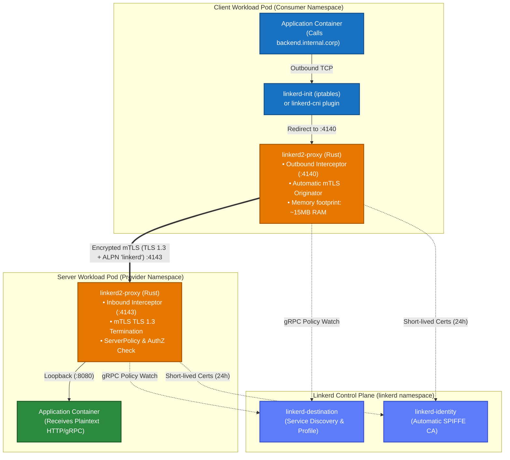
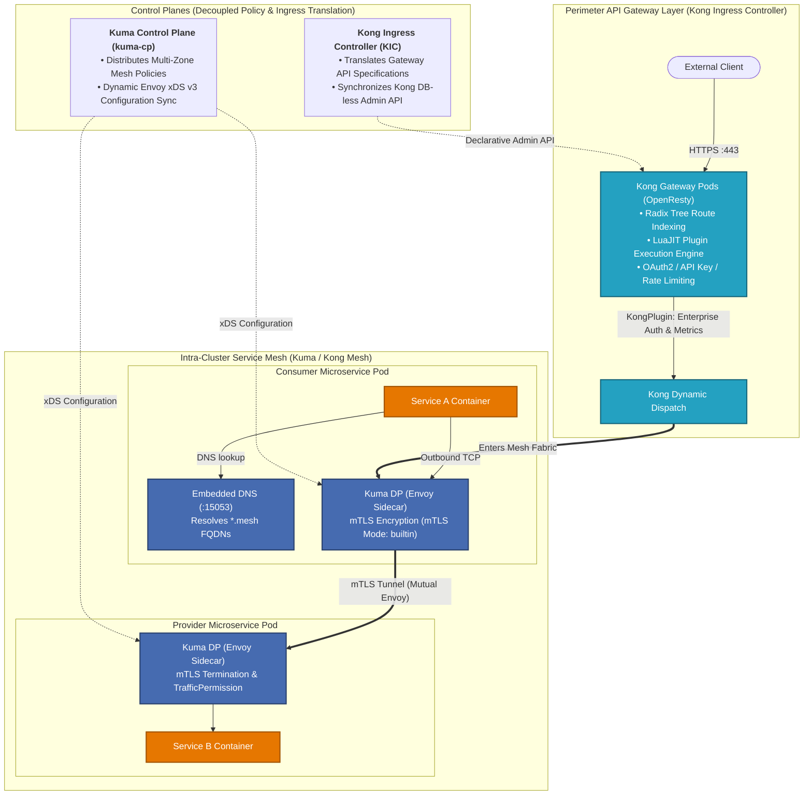

[🏠 Home / README](../README.md) | [Architecture](ARCHITECTURE.md) | [FQDN Routing](FQDN_ROUTING.md) | [Gateway API without Traefik](GATEWAY_API_WITHOUT_TRAEFIK.md) | **Extended Solutions** | [Scenarios & Recommendations](SCENARIOS_AND_RECOMMENDATIONS.md) | [Lab 1: Cilium](LAB_CILIUM.md) | [Lab 2: Istio Ambient](LAB_ISTIO_AMBIENT.md) | [Lab 3: Traefik Edge](LAB_TRAEFIK_EDGE.md)

---

# Extended Solutions Deep Dive: Linkerd, Envoy Gateway & Kong Gateway with Kuma

While the primary hands-on laboratories in this repository evaluate **Cilium eBPF**, **Istio Ambient Mode**, and **Traefik Proxy v3**, modern cloud-native architectures frequently evaluate three other prominent CNCF data planes:

1. **Linkerd (Buoyant)**: The ultra-lightweight, memory-safe Rust micro-proxy sidecar mesh.
2. **Envoy Gateway**: The official CNCF reference implementation of the Kubernetes Gateway API.
3. **Kong Gateway & Kuma (Kong Mesh)**: Enterprise API management combined with an Envoy-powered hybrid service mesh.

This document provides principal-level architecture breakdowns, dynamic configuration models, Gateway API resource bindings, cryptographic identity mechanisms, and production manifests for each solution.

---

## Table of Contents
- [1. Linkerd: The Micro-Proxy (Rust) Sidecar Defense](#1-linkerd-the-micro-proxy-rust-sidecar-defense)
  - [1.1 Architecture & The `linkerd2-proxy` Micro-Proxy](#11-architecture--the-linkerd2-proxy-micro-proxy)
  - [1.2 Zero-Config Mutual TLS & SPIFFE Workload Identity](#12-zero-config-mutual-tls--spiffe-workload-identity)
  - [1.3 Gateway API Integration: HTTPRoute Attached to Services](#13-gateway-api-integration-httproute-attached-to-services)
  - [1.4 North-South Ingress Delegation](#14-north-south-ingress-delegation)
  - [1.5 Commercial Licensing Shift (Buoyant 2.15+)](#15-commercial-licensing-shift-buoyant-215)
  - [1.6 Production Manifests](#16-production-manifests)
- [2. Envoy Gateway: The CNCF Gateway API Reference Controller](#2-envoy-gateway-the-cncf-gateway-api-reference-controller)
  - [2.1 Architecture & Controller Mechanics](#21-architecture--controller-mechanics)
  - [2.2 Dynamic xDS v3 Translation Pipeline](#22-dynamic-xds-v3-translation-pipeline)
  - [2.3 Policy Attachments: BackendTrafficPolicy & SecurityPolicy](#23-policy-attachments-backendtrafficpolicy--securitypolicy)
  - [2.4 East-West Internal Gateway Topology](#24-east-west-internal-gateway-topology)
  - [2.5 Production Manifests](#25-production-manifests)
- [3. Kong Gateway & Kuma: Enterprise API Management vs. Hybrid Mesh](#3-kong-gateway--kuma-enterprise-api-management-vs-hybrid-mesh)
  - [3.1 Kong Ingress Controller (KIC) Architecture & OpenResty Data Plane](#31-kong-ingress-controller-kic-architecture--openresty-data-plane)
  - [3.2 Gateway API Implementation in Kong](#32-gateway-api-implementation-in-kong)
  - [3.3 Kuma (Kong Mesh) Sidecar Architecture & Embedded DNS](#33-kuma-kong-mesh-sidecar-architecture--embedded-dns)
  - [3.4 Plugin Ecosystem & API Governance](#34-plugin-ecosystem--api-governance)
  - [3.5 Production Manifests](#35-production-manifests)
- [4. Extended Solutions 3-Way Comparative Matrix](#4-extended-solutions-3-way-comparative-matrix)
- [5. References & Authoritative Sources of Truth](#5-references--authoritative-sources-of-truth)

---

## 1. Linkerd: The Micro-Proxy (Rust) Sidecar Defense

### 1.1 Architecture & The `linkerd2-proxy` Micro-Proxy

Linkerd is the only CNCF Graduated service mesh that intentionally **rejects the general-purpose Envoy proxy**, opting instead for a purpose-built micro-proxy written entirely in **Rust** (`linkerd2-proxy`).

<details>
<summary><b>Diagram 1.1: Linkerd Data Plane Architecture & Pod Interception (Click to Expand / Collapse)</b></summary>


</details>

#### Key Architectural Drivers of the Rust Micro-Proxy:
* **Memory Safety Without Garbage Collection**: Eliminates entire classes of CVEs common in C/C++ codebases (buffer overflows, use-after-free, dangling pointers) without the latency jitter of Go's garbage collector.
* **Radically Small Memory Footprint**: Where an Envoy sidecar consumes **80MB–200MB RAM** per pod replica, `linkerd2-proxy` consumes only **15MB–30MB RAM**, allowing dense multi-tenant bin-packing on worker nodes.
* **Strict POSIX Namespace Boundary Isolation**: Because the proxy runs inside the pod's network namespace (`cgroup`), an exploited application container cannot intercept traffic belonging to adjacent tenants on the same physical node.

---

### 1.2 Zero-Config Mutual TLS & SPIFFE Workload Identity

Linkerd's core philosophy is zero-configuration operational simplicity:
1. **Automatic Discovery**: When Pod A calls Pod B, `linkerd2-proxy` transparently probes whether the destination endpoint has a Linkerd proxy by inspecting Kubernetes endpoints.
2. **Opportunistic mTLS**: If the target pod is meshed, Linkerd upgrades the TCP connection to TLS 1.3 using ALPN negotiation (`l5d-transport-tls`). If the target is non-meshed, it falls back to plaintext (unless strict `ServerAuthorization` is configured).
3. **SPIFFE Workload Identity**: Certificates are signed by the in-cluster `linkerd-identity` service, encoding the identity as:
   `spiffe://<cluster-domain>/ns/<namespace>/sa/<serviceaccount>`
4. **Ephemerality**: Workload TLS certificates have a 24-hour lifetime and are rotated every 12 hours automatically with zero connection disruption.

---

### 1.3 Gateway API Integration: HTTPRoute Attached to Services

Unlike Istio or Traefik, which attach Gateway API `HTTPRoute` resources to a `Gateway` parent, **Linkerd attaches `HTTPRoute` directly to standard Kubernetes `Service` resources**:

```yaml
apiVersion: gateway.networking.k8s.io/v1
kind: HTTPRoute
metadata:
  name: backend-canary-split
  namespace: lab-linkerd
spec:
  parentRefs:
    - group: ""
      kind: Service
      name: backend-svc
      port: 8080
  rules:
    - matches:
        - path:
            type: PathPrefix
            value: /api/v2
      backendRefs:
        - name: backend-v2
          port: 8080
          weight: 10
        - name: backend-v1
          port: 8080
          weight: 90
```

* **Client-Side Balancing**: The client's `linkerd2-proxy` evaluates this route rule before emitting packets, distributing traffic directly to the backend pods across version weights without requiring an intermediate reverse proxy hop.

---

### 1.4 North-South Ingress Delegation

Linkerd **does not provide an Ingress controller**. It deliberately delegates North-South edge routing to third-party Gateway API controllers:
* **Edge Ingress**: Traefik Proxy v3 or Envoy Gateway terminates public TLS (`*.internal.corp`).
* **Handoff**: The ingress controller injects traffic into the Linkerd mesh by addressing the target Kubernetes `Service`.
* **Zero-Trust Bridge**: Linkerd's ingress integration ensures that traffic entering from the edge proxy is immediately wrapped in mutual TLS before traversing the cluster data plane.

---

### 1.5 Commercial Licensing Shift (Buoyant 2.15+)

In February 2024, Buoyant (the primary commercial steward of Linkerd) modified the distribution model for Linkerd 2.15+:
* **Edge Releases**: Weekly edge releases (`edge-XX.X.X`) remain completely free, open-source (Apache 2.0), and publicly available.
* **Stable Releases**: Official pre-compiled container images for **stable release channels (e.g., `stable-2.15.x`)** now require a commercial license for organizations with more than 50 pods in production.
* **Engineering Impact**: Enterprise platforms that mandate stable, long-term support (LTS) releases without building binaries from upstream source must evaluate commercial licensing costs against Istio Ambient or Cilium.

---

### 1.6 Production Manifests

```yaml
# ==============================================================================
# Linkerd ServerAuthorization & AuthorizationPolicy (Zero-Trust)
# ==============================================================================
apiVersion: policy.linkerd.io/v1beta1
kind: Server
metadata:
  name: backend-server
  namespace: lab-linkerd
spec:
  podSelector:
    matchLabels:
      app: backend
  port: 8080
  proxyProtocol: HTTP/2
---
apiVersion: policy.linkerd.io/v1alpha1
kind: AuthorizationPolicy
metadata:
  name: allow-frontend-only
  namespace: lab-linkerd
spec:
  targetRef:
    group: policy.linkerd.io
    kind: Server
    name: backend-server
  requiredAuthenticationRefs:
    - group: policy.linkerd.io
      kind: MeshTLSAuthentication
      name: frontend-identity
---
apiVersion: policy.linkerd.io/v1alpha1
kind: MeshTLSAuthentication
metadata:
  name: frontend-identity
  namespace: lab-linkerd
spec:
  identities:
    - "frontend.lab-linkerd.serviceaccount.identity.linkerd.cluster.local"
```

---

## 2. Envoy Gateway: The CNCF Gateway API Reference Controller

### 2.1 Architecture & Controller Mechanics

Envoy Gateway is a CNCF open-source project founded by Envoy maintainers (Tetrate, VMware, Ambassador, Red Hat) designed to eliminate the fragmented ecosystem of custom Envoy control planes (Contour, Emissary, Gloo Edge) by providing **the canonical Kubernetes Gateway API implementation for Envoy**.

```mermaid
flowchart LR
    subgraph K8sAPI ["&nbsp;&nbsp;&nbsp;&nbsp;Kubernetes Control Plane (API Server)&nbsp;&nbsp;&nbsp;&nbsp;"]
        GWClass["&nbsp;&nbsp;&nbsp;&nbsp;GatewayClass&nbsp;&nbsp;&nbsp;&nbsp;<br/>&nbsp;&nbsp;&nbsp;&nbsp;gateway.envoyproxy.io&nbsp;&nbsp;&nbsp;&nbsp;"]
        GW["&nbsp;&nbsp;&nbsp;&nbsp;Gateway&nbsp;&nbsp;&nbsp;&nbsp;<br/>&nbsp;&nbsp;&nbsp;&nbsp;Listeners: HTTP / HTTPS&nbsp;&nbsp;&nbsp;&nbsp;"]
        HR["&nbsp;&nbsp;&nbsp;&nbsp;HTTPRoute / TLSRoute&nbsp;&nbsp;&nbsp;&nbsp;<br/>&nbsp;&nbsp;&nbsp;&nbsp;Rules, Filters, Matches&nbsp;&nbsp;&nbsp;&nbsp;"]
        BTP["&nbsp;&nbsp;&nbsp;&nbsp;BackendTrafficPolicy&nbsp;&nbsp;&nbsp;&nbsp;<br/>&nbsp;&nbsp;&nbsp;&nbsp;Rate Limit, Retries, CB&nbsp;&nbsp;&nbsp;&nbsp;"]
        SP["&nbsp;&nbsp;&nbsp;&nbsp;SecurityPolicy&nbsp;&nbsp;&nbsp;&nbsp;<br/>&nbsp;&nbsp;&nbsp;&nbsp;OIDC, JWT, CORS&nbsp;&nbsp;&nbsp;&nbsp;"]
    end

    subgraph EGController ["&nbsp;&nbsp;&nbsp;&nbsp;Envoy Gateway Controller (envoy-gateway-system)&nbsp;&nbsp;&nbsp;&nbsp;"]
        Reconciler["&nbsp;&nbsp;&nbsp;&nbsp;Gateway API Reconciler&nbsp;&nbsp;&nbsp;&nbsp;<br/>&nbsp;&nbsp;&nbsp;&nbsp;• Validates Hierarchy&nbsp;&nbsp;&nbsp;&nbsp;<br/>&nbsp;&nbsp;&nbsp;&nbsp;• Merges Policies&nbsp;&nbsp;&nbsp;&nbsp;"]
        xDSGen["&nbsp;&nbsp;&nbsp;&nbsp;xDS Generator&nbsp;&nbsp;&nbsp;&nbsp;<br/>&nbsp;&nbsp;&nbsp;&nbsp;• LDS (Listeners)&nbsp;&nbsp;&nbsp;&nbsp;<br/>&nbsp;&nbsp;&nbsp;&nbsp;• RDS (Routes)&nbsp;&nbsp;&nbsp;&nbsp;<br/>&nbsp;&nbsp;&nbsp;&nbsp;• CDS (Clusters)&nbsp;&nbsp;&nbsp;&nbsp;<br/>&nbsp;&nbsp;&nbsp;&nbsp;• EDS (Endpoints)&nbsp;&nbsp;&nbsp;&nbsp;"]
        Reconciler --> xDSGen
    end

    subgraph DataPlane ["&nbsp;&nbsp;&nbsp;&nbsp;Envoy Proxy Data Plane (Automated Deployment)&nbsp;&nbsp;&nbsp;&nbsp;"]
        EnvoyInstance["&nbsp;&nbsp;&nbsp;&nbsp;Envoy Proxy Daemon / Pods&nbsp;&nbsp;&nbsp;&nbsp;<br/>&nbsp;&nbsp;&nbsp;&nbsp;• High-Performance C++ Core&nbsp;&nbsp;&nbsp;&nbsp;<br/>&nbsp;&nbsp;&nbsp;&nbsp;• Hot Restart & Zero Downtime&nbsp;&nbsp;&nbsp;&nbsp;<br/>&nbsp;&nbsp;&nbsp;&nbsp;• Rate Limiting & Auth Extension&nbsp;&nbsp;&nbsp;&nbsp;"]
        UpstreamApp["&nbsp;&nbsp;&nbsp;&nbsp;Backend Service Pods&nbsp;&nbsp;&nbsp;&nbsp;<br/>&nbsp;&nbsp;&nbsp;&nbsp;(Production Workloads)&nbsp;&nbsp;&nbsp;&nbsp;"]
        EnvoyInstance -->|"Load Balanced TCP / HTTP"| UpstreamApp
    end

    K8sAPI -->|"Watches CRDs"| Reconciler
    xDSGen ==>|"Dynamic xDS v3 over gRPC (:18000)"| EnvoyInstance

    classDef k8s fill:#326CE5,stroke:#1a4699,stroke-width:2px,color:#fff;
    classDef eg fill:#466BB0,stroke:#2b426e,stroke-width:2px,color:#fff;
    classDef dp fill:#c92a2a,stroke:#861c1c,stroke-width:2px,color:#fff;

    class GWClass,GW,HR,BTP,SP k8s;
    class Reconciler,xDSGen eg;
    class EnvoyInstance,UpstreamApp dp;
```

<details>
<summary><b>Diagram 2.1: Envoy Gateway Control & Data Plane Pipeline (Click to Expand / Collapse)</b></summary>


</details>

---

### 2.2 Dynamic xDS v3 Translation Pipeline

Envoy Gateway translates declarative Kubernetes Gateway API resources directly into native Envoy xDS v3 configurations:
1. **Listeners (`LDS`)**: Created from `spec.listeners` on `Gateway` resources, mapping ports, protocols, and TLS certificates (`tls.certificateRefs`).
2. **Routes (`RDS`)**: Generated from `HTTPRoute` rules, compiling path prefixes, regex matches, header conditions, and canary percentage weights.
3. **Clusters (`CDS`)**: Mapped from Kubernetes `Service` references (`backendRefs`), configuring health checks, connection pooling, and circuit breaking.
4. **Endpoints (`EDS`)**: Watches Kubernetes `Endpoints` or `EndpointSlices` to stream real-time backend pod IP updates to Envoy instances without restarting proxy processes.

---

### 2.3 Policy Attachments: BackendTrafficPolicy & SecurityPolicy

To remain 100% compliant with Gateway API without relying on non-portable annotations, Envoy Gateway introduces standard Policy Attachment resources:

#### 1. `BackendTrafficPolicy`: L7 Resilience
* **Token-Bucket Rate Limiting**: Global and local rate limits per client IP or request header.
* **Circuit Breaking**: Max connections, max pending requests, and consecutive 5xx error thresholds.
* **Fault Injection**: Controlled delay and abort injection for chaos engineering.

#### 2. `SecurityPolicy`: Edge Zero-Trust
* **OIDC Authentication**: Authenticates end-users against Okta, Keycloak, or Google Identity before forwarding traffic.
* **JWT Verification**: Validates cryptographic signatures, audiences, and expiration timestamps on bearer tokens.
* **CORS Rules**: Declarative cross-origin headers.

---

### 2.4 East-West Internal Gateway Topology

While typically deployed as an external North-South gateway, Envoy Gateway can be instantiated internally:
* An internal `Gateway` binds to private subnets with a `ClusterIP` or internal cloud load balancer.
* CoreDNS or an in-cluster secondary resolver forwards internal corporate FQDNs (`*.internal.corp`) to Envoy Gateway's IP.
* Envoy Gateway applies enterprise rate-limiting, JWT authentication, and canary splitting before dispatching traffic to backend pods.

---

### 2.5 Production Manifests

```yaml
apiVersion: gateway.networking.k8s.io/v1
kind: GatewayClass
metadata:
  name: eg
spec:
  controllerName: gateway.envoyproxy.io/gatewayclass-controller
---
apiVersion: gateway.networking.k8s.io/v1
kind: Gateway
metadata:
  name: internal-eg-gateway
  namespace: lab-envoy-gateway
spec:
  gatewayClassName: eg
  listeners:
    - name: https-internal
      protocol: HTTPS
      port: 8443
      hostname: "backend.internal.corp"
      tls:
        mode: Terminate
        certificateRefs:
          - name: internal-corp-cert
---
apiVersion: gateway.envoyproxy.io/v1alpha1
kind: BackendTrafficPolicy
metadata:
  name: backend-circuit-breaker
  namespace: lab-envoy-gateway
spec:
  targetRefs:
    - group: gateway.networking.k8s.io
      kind: HTTPRoute
      name: backend-route
  circuitBreaker:
    maxConnections: 1024
    maxPendingRequests: 128
    maxRequests: 2048
  rateLimit:
    type: Global
    global:
      rules:
        - clientSelectors:
            - headers:
                - name: X-Tenant-ID
          limit:
            requests: 100
            unit: Second
```

---

## 3. Kong Gateway & Kuma: Enterprise API Management vs. Hybrid Mesh

### 3.1 Kong Ingress Controller (KIC) Architecture & OpenResty Data Plane

Kong Gateway is the leading enterprise API gateway, built upon a high-performance **OpenResty (NGINX + LuaJIT)** core engine.

<details>
<summary><b>Diagram 3.1: Kong Ingress + Kuma Service Mesh Hybrid Architecture (Click to Expand / Collapse)</b></summary>


</details>

#### OpenResty Radix Tree Matching:
Kong routes requests using a C-based radix tree algorithm that matches URI prefixes and domain names in logarithmic time \(O(k)\), providing superior throughput compared to regex-heavy proxy tables when managing tens of thousands of routes.

---

### 3.2 Gateway API Implementation in Kong

The Kong Ingress Controller (KIC v3.x) implements the Kubernetes Gateway API:
* Supported CRDs: `GatewayClass`, `Gateway`, `HTTPRoute`, `TLSRoute`, `TCPRoute`, `UDPRoute`, `GRPCRoute`.
* Plugin Bindings: Plugins (rate-limiting, JWT, OAuth2) are attached to `HTTPRoute` rules using the `ExtensionRef` filter:

```yaml
apiVersion: gateway.networking.k8s.io/v1
kind: HTTPRoute
metadata:
  name: api-service-route
  namespace: lab-kong
spec:
  parentRefs:
    - name: kong-edge-gateway
  rules:
    - matches:
        - path:
            type: PathPrefix
            value: /api/v1
      filters:
        - type: ExtensionRef
          extensionRef:
            group: configuration.konghq.com
            kind: KongPlugin
            name: enterprise-rate-limit
      backendRefs:
        - name: backend-v1
          port: 8080
```

---

### 3.3 Kuma (Kong Mesh) Sidecar Architecture & Embedded DNS

When paired with **Kuma (Kong Mesh)**, the architecture extends from edge API management into full inter-service mesh transit:
* **Sidecar Deployment**: Uses Envoy sidecars injected into application pods.
* **Embedded DNS Server (Port 15053)**: Kuma runs an embedded DNS resolver inside each sidecar. Workloads can resolve synthetic internal domain names:
  `<service-name>.<namespace>.mesh`
  This eliminates CoreDNS queries entirely for mesh-internal East-West calls.
* **Multi-Zone / Multi-Cloud Topologies**: Kuma excels at interconnecting multiple Kubernetes clusters, OpenShift clusters, and non-containerized virtual machines (VMs) across clouds via Kuma Zone Ingress/Egress proxies.

---

### 3.4 Plugin Ecosystem & API Governance

Kong's dominant advantage is its **200+ enterprise-grade plugins**:
* **Security**: OpenID Connect, SAML 2.0, OAuth2, Mutual TLS, IP Restriction, HMAC Authentication.
* **Traffic Control**: AI Semantic Cache, Rate Limiting Advanced, Request Size Limiting, Proxy Cache.
* **Observability**: Datadog, Prometheus, Zipkin, OpenTelemetry, Logstash.

---

### 3.5 Production Manifests

```yaml
apiVersion: configuration.konghq.com/v1
kind: KongPlugin
metadata:
  name: enterprise-rate-limit
  namespace: lab-kong
plugin: rate-limiting-advanced
config:
  limit:
    - 50
  window_size:
    - 1
  sync_rate: 0
  strategy: redis
  redis:
    host: redis-master.infra.svc.cluster.local
    port: 6379
---
apiVersion: kuma.io/v1alpha1
kind: Mesh
metadata:
  name: default
spec:
  mtls:
    enabledBackend: ca-builtin
    backends:
      - name: ca-builtin
        type: builtin
        dpCert:
          rotation:
            expiration: 24h
  routing:
    zoneEgress: true
```

---

## 4. Extended Solutions 3-Way Comparative Matrix

| Architecture Dimension | Linkerd (Buoyant) | Envoy Gateway (CNCF) | Kong Gateway + Kuma |
| :--- | :--- | :--- | :--- |
| **Primary Design Role** | Lightweight Intra-Cluster Service Mesh | Pure-Play CNCF Gateway API Edge Router | Enterprise API Gateway + Multi-Zone Mesh |
| **Data Plane Runtime** | **Rust Micro-Proxy (`linkerd2-proxy`)** | **Envoy Proxy (C++)** | **OpenResty (NGINX + Lua) & Envoy** |
| **Gateway API Maturity** | `HTTPRoute` attached to `Service` | **Reference Implementation (v1.x Full)** | Complete Gateway API controller in KIC |
| **Memory Footprint per Pod** | **~15MB – 30MB RAM** (Very Low) | 0MB (Edge) / ~150MB (Gateway Pod) | ~150MB – 300MB RAM (Sidecar mode) |
| **East-West DNS Model** | Native Kubernetes CoreDNS | Standard CoreDNS to Internal VIP | **Embedded DNS Server (:15053) for `*.mesh`** |
| **mTLS Cryptographic Identity**| SPIFFE Identity via `linkerd-identity` | Edge TLS or BackendTLSPolicy | Built-in CA or Vault / cert-manager |
| **Licensing Governance** | Edge: Apache 2.0 / Stable: Commercial | **100% Apache 2.0 (CNCF Governed)** | Apache 2.0 Core / Kong Enterprise |
| **CVE Blast Radius** | **Pod-Isolated** (Single-tenant proxy) | Edge Perimeter Gateway | Dual: Edge Gateway + Pod Sidecars |
| **Multi-Cluster / Hybrid VM** | Flat network or Multi-Cluster link | Cross-namespace / Multi-cluster | **Industry Leader in Multi-Zone & Hybrid VM** |
| **Red Hat OpenShift Fit** | Requires custom SCCs & CNI tuning | Runs under `anyuid` / custom SCC | **Red Hat Certified Operator Catalog** |

---

## 5. References & Authoritative Sources of Truth

- **Linkerd Architecture & Documentation**: [https://linkerd.io/2/reference/architecture/](https://linkerd.io/2/reference/architecture/)  
  *Official architectural guide on `linkerd2-proxy`, zero-config mTLS, and Service-level route attachment.*
- **Buoyant Linkerd Distribution & Licensing Announcement**: [https://buoyant.io/blog/announcing-linkerd-2-15](https://buoyant.io/blog/announcing-linkerd-2-15)  
  *Authoritative details regarding the dual-track release model (edge vs. enterprise stable).*
- **Envoy Gateway Official Documentation**: [https://gateway.envoyproxy.io/](https://gateway.envoyproxy.io/)  
  *Upstream guide detailing xDS generation, GatewayClass reconcilers, and Policy Attachment APIs.*
- **CNCF Kubernetes Gateway API v1 Specification**: [https://gateway-api.sigs.k8s.io/](https://gateway-api.sigs.k8s.io/)  
  *Official standard governing GatewayClass, Gateway, HTTPRoute, and BackendTLSPolicy.*
- **Kong Ingress Controller Documentation**: [https://docs.konghq.com/kubernetes-ingress-controller/latest/](https://docs.konghq.com/kubernetes-ingress-controller/latest/)  
  *Complete specification of the OpenResty data plane, Gateway API conformance, and plugin bindings.*
- **CNCF Kuma (Kong Mesh) Architecture**: [https://kuma.io/docs/latest/](https://kuma.io/docs/latest/)  
  *Technical guide on embedded DNS resolution (`*.mesh`), multi-zone synchronization, and Envoy sidecar control.*

---

⬅️ Previous: [Gateway API without Traefik](GATEWAY_API_WITHOUT_TRAEFIK.md) | 🏠 [Home](../README.md) | ➡️ Next: [Scenarios & Recommendations](SCENARIOS_AND_RECOMMENDATIONS.md)
