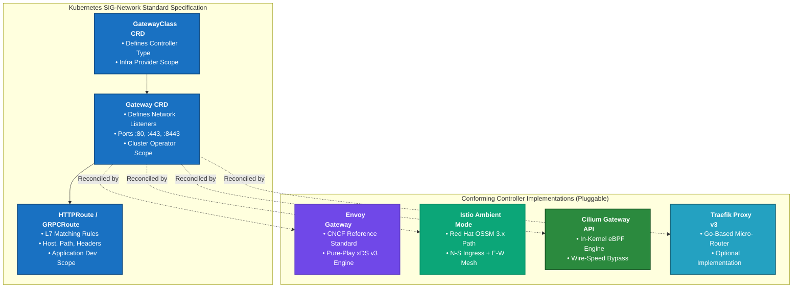
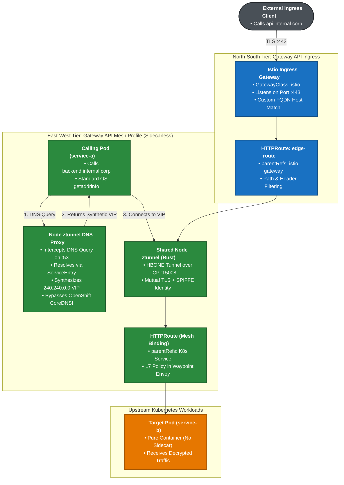
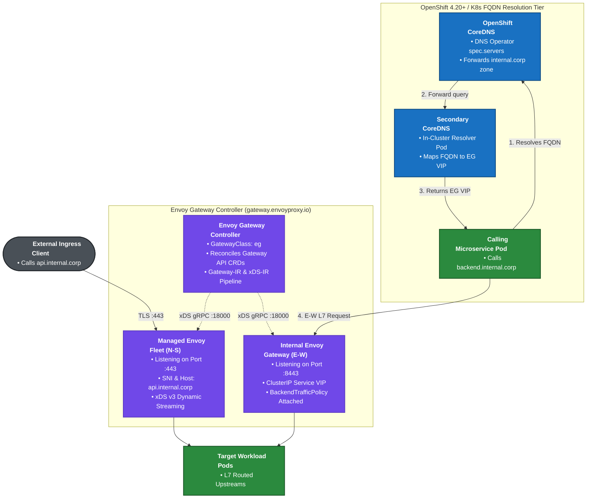
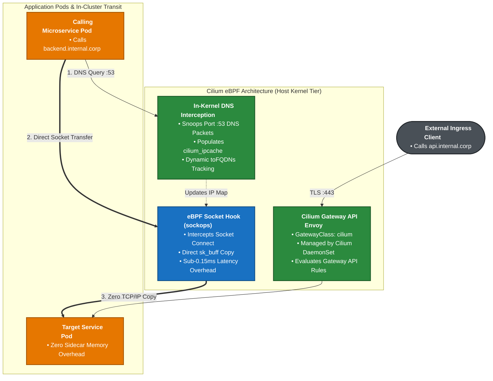
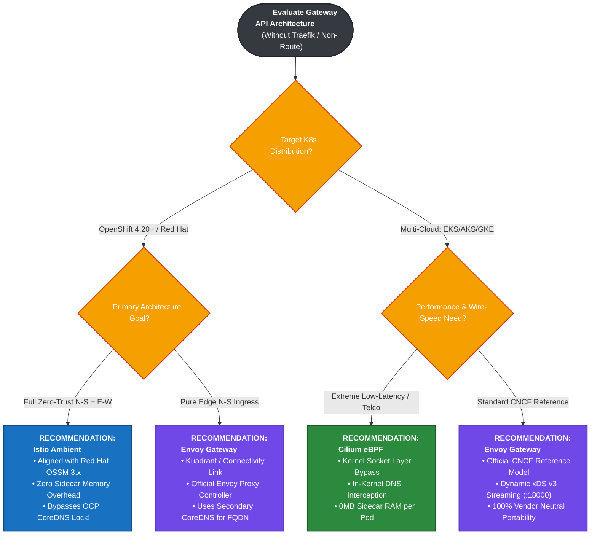

[🏠 Home / README](../README.md) | [Architecture](ARCHITECTURE.md) | [FQDN Routing](FQDN_ROUTING.md) | [Extended Solutions](EXTENDED_SOLUTIONS.md) | [Scenarios & Recommendations](SCENARIOS_AND_RECOMMENDATIONS.md) | **Gateway API without Traefik** | [Lab 1: Cilium](LAB_CILIUM.md) | [Lab 2: Istio Ambient](LAB_ISTIO_AMBIENT.md) | [Lab 3: Traefik Edge](LAB_TRAEFIK_EDGE.md)

---

# Setting Up Kubernetes Gateway API for North-South & East-West (with FQDNs) Without Traefik

A common misconception among platform engineers evaluating cloud-native architectures is that adopting the modern **Kubernetes Gateway API (`gateway.networking.k8s.io`)** requires deploying **Traefik Proxy**.

**This is definitively false.**

Gateway API is an open, vendor-neutral Kubernetes standard maintained by the **Kubernetes SIG-Network community**. Traefik is merely one of over fifteen independent controllers that implement this standard.

Furthermore, in enterprise platforms like **Red Hat OpenShift (4.14 – 4.20+)**, traditional OpenShift `Route` (`route.openshift.io/v1`) is increasingly **not an option** for modern microservice architectures.

This guide clarifies:
1. **The Standard vs. Controller separation**: Why Gateway API does not depend on Traefik or any single vendor.
2. **Why OpenShift `Route` is not an option**: The 6 technical and strategic reasons why enterprise architects reject legacy routes.
3. **Alternative architectures without Traefik**: How to implement Gateway API across both North-South and East-West transit (including non-`apps` custom FQDNs) using **Istio Ambient Mode (Red Hat OSSM 3.x native)**, **Envoy Gateway (CNCF standard reference)**, and **Cilium eBPF Gateway API**.
4. **Production manifests, foldable architecture diagrams, and scenario-based recommendations** for OpenShift 4.20+, AWS EKS, Azure AKS, Google Cloud GKE, and on-premises Kubernetes.

---

## Table of Contents
- [1. Gateway API Specification vs. Implementations: Does Gateway API Require Traefik?](#1-gateway-api-specification-vs-implementations-does-gateway-api-require-traefik)
  - [1.1 The Decoupled Specification Layer](#11-the-decoupled-specification-layer)
  - [1.2 The Multi-Vendor Controller Ecosystem](#12-the-multi-vendor-controller-ecosystem)
  - [1.3 Role-Oriented Separation of Concerns](#13-role-oriented-separation-of-concerns)
- [2. Why OpenShift `Route` is NOT an Option (Deep Architectural Analysis)](#2-why-openshift-route-is-not-an-option-deep-architectural-analysis)
  - [2.1 Limitation 1: Zero East-West Service Mesh Capabilities (Perimeter Only)](#21-limitation-1-zero-east-west-service-mesh-capabilities-perimeter-only)
  - [2.2 Limitation 2: Proprietary Red Hat Lock-In & Portability Barrier](#22-limitation-2-proprietary-red-hat-lock-in--portability-barrier)
  - [2.3 Limitation 3: Hardcoded Dependence on `*.apps.<cluster>` Domain Suffix](#23-limitation-3-hardcoded-dependence-on-appscluster-domain-suffix)
  - [2.4 Limitation 4: Primitive L7 Traffic Steering & Brittle Annotations](#24-limitation-4-primitive-l7-traffic-steering--brittle-annotations)
  - [2.5 Limitation 5: Monolithic Conflation of Roles and RBAC](#25-limitation-5-monolithic-conflation-of-roles-and-rbac)
  - [2.6 Limitation 6: Red Hat's Strategic Deprecation & Alignment with Gateway API](#26-limitation-6-red-hats-strategic-deprecation--alignment-with-gateway-api)
- [3. Implementing Gateway API (N-S + E-W + FQDN) Without Traefik](#3-implementing-gateway-api-n-s--e-w--fqdn-without-traefik)
  - [3.1 Option 1: Istio Ambient Mode (The Strategic OpenShift 4.20+ / OSSM 3.x Path)](#31-option-1-istio-ambient-mode-the-strategic-openshift-420--ossm-3x-path)
  - [3.2 Option 2: Envoy Gateway (Official CNCF Reference Model)](#32-option-2-envoy-gateway-official-cncf-reference-model)
  - [3.3 Option 3: Cilium eBPF Gateway API & Service Mesh](#33-option-3-cilium-ebpf-gateway-api--service-mesh)
  - [3.4 Option 4: Red Hat Connectivity Link (Kuadrant + Envoy Gateway)](#34-option-4-red-hat-connectivity-link-kuadrant--envoy-gateway)
- [4. Comprehensive Cross-Distribution Matrix](#4-comprehensive-cross-distribution-matrix)
- [5. Deep Technical Analysis & Architectural Conclusions](#5-deep-technical-analysis--architectural-conclusions)
- [6. Scenario-Based Recommendations: Which Option to Choose?](#6-scenario-based-recommendations-which-option-to-choose)
  - [6.1 Enterprise Master Decision Flowchart](#61-enterprise-master-decision-flowchart)
  - [6.2 Granular Use-Case Evaluation: Recommended vs. Simplest](#62-granular-use-case-evaluation-recommended-vs-simplest)

---

## 1. Gateway API Specification vs. Implementations: Does Gateway API Require Traefik?

### 1.1 The Decoupled Specification Layer
The **Kubernetes Gateway API** is not software you run; it is an open **API specification** defined by Kubernetes Custom Resource Definitions (CRDs) residing in the API group `gateway.networking.k8s.io`:
- **`GatewayClass`**: Cluster-scoped resource declaring a controller implementation (e.g. `istio`, `eg`, `cilium`, `traefik`).
- **`Gateway`**: Namespace-scoped resource defining network listeners (ports, protocols, hostnames, and TLS certificates).
- **`HTTPRoute` / `GRPCRoute` / `TCPRoute` / `TLSRoute`**: Application routing resources defining Layer 7 or Layer 4 steering rules, filters, and upstream backend references (`backendRefs`).
- **`ReferenceGrant`**: Cross-namespace security handshake permitting gateways in one namespace to route to services or secrets in another.

### 1.2 The Multi-Vendor Controller Ecosystem
Any controller that understands these CRDs and programs a proxy data plane can implement Gateway API. There are more than 15 conformant controllers in the cloud-native ecosystem:

| Controller Implementation | Data Plane Technology | Primary Maintainer | Primary Scope |
| :--- | :--- | :--- | :--- |
| **Envoy Gateway** | Envoy Proxy (C++) | CNCF Community | North-South Edge & E-W Internal Routing |
| **Istio (Ambient / Classic)** | Rust `ztunnel` + Envoy Waypoint | CNCF / Google / Red Hat | North-South Ingress + East-West Zero-Trust Mesh |
| **Cilium Gateway API** | Linux eBPF Kernel + Envoy | Isovalent / Cisco / CNCF | In-Kernel North-South & East-West Mesh |
| **Red Hat Connectivity Link** | Envoy Gateway + Kuadrant | Red Hat | Enterprise Multi-Cluster API Governance |
| **Kong Gateway** | OpenResty (NGINX + LuaJIT) | Kong Inc. | Enterprise API Management & Productization |
| **HAProxy Kubernetes Gateway** | HAProxy | HAProxy Technologies | High-Throughput L4/L7 Ingress |
| **Traefik Proxy v3** | Traefik Core (Go) | Traefik Labs | Lightweight Edge Gateway & Micro-Routing |

Traefik is merely an optional entry in this list. **You can completely eliminate Traefik and achieve full Gateway API compliance across all traffic directions.**

### 1.3 Role-Oriented Separation of Concerns
Gateway API introduces a strict separation of administrative roles that legacy Ingress and OpenShift Route never offered:
1. **Infrastructure Provider**: Manages cluster infrastructure and installs the `GatewayClass`.
2. **Cluster Operator**: Provisions the `Gateway` listeners (ports, edge TLS certificates, and ingress policies).
3. **Application Developer**: Authors the `HTTPRoute` resources attached to the gateway via `parentRefs`, controlling path routing and canary releases without needing cluster-level permissions.

<details>
<summary><b>Diagram 1: Gateway API Specification vs. Multi-Vendor Implementation Ecosystem (Click to Expand / Collapse)</b></summary>



</details>

---

## 2. Why OpenShift `Route` is NOT an Option (Deep Architectural Analysis)

When migrating modern containerized architectures to **Red Hat OpenShift (OCP 4.14 – 4.20+)**, developers and platform teams frequently ask: *"Why can't we simply use OpenShift Routes?"*

While OpenShift `Route` (`route.openshift.io/v1`) pioneered Kubernetes ingress concepts in 2015, in modern cloud-native architectures it is frequently an **unacceptable architectural choice**. Here are the six technical and architectural reasons why:

### 2.1 Limitation 1: Zero East-West Service Mesh Capabilities (Perimeter Only)
- OpenShift `Route` is strictly a **North-South edge ingress** mechanism managed by the `openshift-ingress-operator` running HAProxy router pods on dedicated worker nodes.
- It provides **zero service-to-service (East-West) capabilities**: no pod-to-pod mutual TLS, no cryptographic SPIFFE/SPIRE workload identity, no dynamic client-side load balancing, and no in-cluster traffic telemetry.
- If a pod inside the cluster attempts to call an OpenShift Route's FQDN, the traffic is forced to exit the pod network, route through the HAProxy edge routers, and "hairpin" back into the cluster—introducing significant latency and saturating cluster edge bandwidth.

### 2.2 Limitation 2: Proprietary Red Hat Lock-In & Portability Barrier
- OpenShift `Route` is a proprietary API (`route.openshift.io/v1`) that exists **only inside OpenShift / OKD clusters**.
- Any application repository or Helm chart that relies on OpenShift `Route` objects **cannot run on AWS EKS, Microsoft Azure AKS, Google Cloud GKE, SUSE Rancher, or vanilla upstream Kubernetes**.
- Organizations building multi-cloud or hybrid platform topologies cannot maintain a single set of declarative deployment manifests if OpenShift Routes are used.

### 2.3 Limitation 3: Hardcoded Dependence on `*.apps.<cluster>` Domain Suffix
- By default, OpenShift Routes automatically generate hostnames matching `*.<route-name>-<namespace>.apps.<cluster-domain>`.
- In enterprise environments requiring clean, corporate FQDNs (e.g., `payment.corp.internal` or `api.prod.company.com`) without the `apps.<cluster-name>` moniker:
  1. OpenShift Route allows overriding the `.spec.host` field, but **does not configure internal DNS**.
  2. Pods inside the cluster attempting to resolve `payment.corp.internal` fail because OpenShift's immutable CoreDNS (`dns-default`) does not know how to resolve custom FQDNs to internal services.

### 2.4 Limitation 4: Primitive L7 Traffic Steering & Brittle Annotations
- OpenShift Routes do not natively support modern Layer 7 traffic routing:
  - No clean declarative path rewrites or regex replacements.
  - No request header injection or query parameter routing without brittle HAProxy-specific annotations (e.g. `haproxy.router.openshift.io/rewrite-target`).
  - No weighted canary traffic splits across services located in **different namespaces**.
  - No declarative circuit breaking or connection pool limits.

### 2.5 Limitation 5: Monolithic Conflation of Roles and RBAC
- The OpenShift `Route` CRD bundles the domain name, TLS certificates, path matchers, and target backend service into a single object created in the application namespace.
- This creates severe security friction: application developers require permissions to specify hostnames and attach TLS secrets, which should be the exclusive domain of platform/network administrators.

### 2.6 Limitation 6: Red Hat's Strategic Deprecation & Alignment with Gateway API
- Red Hat has officially embraced the Kubernetes Gateway API across its entire modern portfolio:
  - **OpenShift Service Mesh 3.x (OSSM 3)** completely abandons legacy OpenShift routing constructs in favor of **Istio Ambient Mode and native Gateway API**.
  - **Red Hat Connectivity Link (Kuadrant)** builds Red Hat's enterprise multi-cluster API management tier natively on **Envoy Gateway**.
  - OpenShift 4.14 through 4.20+ ships with the Gateway API CRDs pre-installed or installable via standard operators.
- Investing in OpenShift `Route` in 2026 is investing in legacy technical debt slated for long-term obsolescence.

```mermaid
flowchart TD
    subgraph OCPRoute ["&nbsp;&nbsp;&nbsp;&nbsp;&nbsp;&nbsp;&nbsp;&nbsp;&nbsp;&nbsp;&nbsp;&nbsp;Legacy OpenShift Route (route.openshift.io/v1)&nbsp;&nbsp;&nbsp;&nbsp;&nbsp;&nbsp;&nbsp;&nbsp;&nbsp;&nbsp;&nbsp;&nbsp;"]
        RClient(["&nbsp;&nbsp;&nbsp;&nbsp;&nbsp;&nbsp;&nbsp;&nbsp;&nbsp;&nbsp;<b>External Ingress Client</b>&nbsp;&nbsp;&nbsp;&nbsp;&nbsp;&nbsp;&nbsp;&nbsp;&nbsp;&nbsp;<br/>&nbsp;&nbsp;&nbsp;&nbsp;• Calls *.apps.cluster Domain&nbsp;&nbsp;&nbsp;&nbsp;"]) -->|"Port :80 / :443"| RRouter["&nbsp;&nbsp;&nbsp;&nbsp;&nbsp;&nbsp;&nbsp;&nbsp;&nbsp;&nbsp;<b>HAProxy Router Pods</b>&nbsp;&nbsp;&nbsp;&nbsp;&nbsp;&nbsp;&nbsp;&nbsp;&nbsp;&nbsp;<br/>&nbsp;&nbsp;&nbsp;&nbsp;• Managed by Ingress Operator&nbsp;&nbsp;&nbsp;&nbsp;<br/>&nbsp;&nbsp;&nbsp;&nbsp;• Monolithic Route CRD&nbsp;&nbsp;&nbsp;&nbsp;"]
        
        RRouter -->|"N-S Only (Zero E-W)"| RApp["&nbsp;&nbsp;&nbsp;&nbsp;&nbsp;&nbsp;&nbsp;&nbsp;&nbsp;&nbsp;<b>Backend Workload</b>&nbsp;&nbsp;&nbsp;&nbsp;&nbsp;&nbsp;&nbsp;&nbsp;&nbsp;&nbsp;<br/>&nbsp;&nbsp;&nbsp;&nbsp;• Plain HTTP in Cluster&nbsp;&nbsp;&nbsp;&nbsp;"]
        
        RLimit["&nbsp;&nbsp;&nbsp;&nbsp;&nbsp;&nbsp;&nbsp;&nbsp;&nbsp;&nbsp;<b>Route Critical Limitations</b>&nbsp;&nbsp;&nbsp;&nbsp;&nbsp;&nbsp;&nbsp;&nbsp;&nbsp;&nbsp;<br/>&nbsp;&nbsp;&nbsp;&nbsp;• 1. 0% East-West Service Mesh&nbsp;&nbsp;&nbsp;&nbsp;<br/>&nbsp;&nbsp;&nbsp;&nbsp;• 2. Hardcoded *.apps Suffix&nbsp;&nbsp;&nbsp;&nbsp;<br/>&nbsp;&nbsp;&nbsp;&nbsp;• 3. Red Hat Vendor Lock-In&nbsp;&nbsp;&nbsp;&nbsp;<br/>&nbsp;&nbsp;&nbsp;&nbsp;• 4. Monolithic Inflexible RBAC&nbsp;&nbsp;&nbsp;&nbsp;"]
    end

    subgraph GWAPIMesh ["&nbsp;&nbsp;&nbsp;&nbsp;&nbsp;&nbsp;&nbsp;&nbsp;&nbsp;&nbsp;&nbsp;&nbsp;Modern Gateway API (gateway.networking.k8s.io)&nbsp;&nbsp;&nbsp;&nbsp;&nbsp;&nbsp;&nbsp;&nbsp;&nbsp;&nbsp;&nbsp;&nbsp;"]
        GClient(["&nbsp;&nbsp;&nbsp;&nbsp;&nbsp;&nbsp;&nbsp;&nbsp;&nbsp;&nbsp;<b>External / Internal Client</b>&nbsp;&nbsp;&nbsp;&nbsp;&nbsp;&nbsp;&nbsp;&nbsp;&nbsp;&nbsp;<br/>&nbsp;&nbsp;&nbsp;&nbsp;• Arbitrary Custom FQDNs&nbsp;&nbsp;&nbsp;&nbsp;"]) -->|"Port :80 / :443"| GGateway["&nbsp;&nbsp;&nbsp;&nbsp;&nbsp;&nbsp;&nbsp;&nbsp;&nbsp;&nbsp;<b>Gateway API Controller</b>&nbsp;&nbsp;&nbsp;&nbsp;&nbsp;&nbsp;&nbsp;&nbsp;&nbsp;&nbsp;<br/>&nbsp;&nbsp;&nbsp;&nbsp;• Istio Ambient / Envoy GW&nbsp;&nbsp;&nbsp;&nbsp;<br/>&nbsp;&nbsp;&nbsp;&nbsp;• Role-Oriented Separation&nbsp;&nbsp;&nbsp;&nbsp;"]
        
        GGateway -->|"N-S + E-W Zero-Trust"| GApp["&nbsp;&nbsp;&nbsp;&nbsp;&nbsp;&nbsp;&nbsp;&nbsp;&nbsp;&nbsp;<b>Backend Microservices</b>&nbsp;&nbsp;&nbsp;&nbsp;&nbsp;&nbsp;&nbsp;&nbsp;&nbsp;&nbsp;<br/>&nbsp;&nbsp;&nbsp;&nbsp;• End-to-End mTLS Encryption&nbsp;&nbsp;&nbsp;&nbsp;"]
        
        GAdv["&nbsp;&nbsp;&nbsp;&nbsp;&nbsp;&nbsp;&nbsp;&nbsp;&nbsp;&nbsp;<b>Gateway API Modern Advantages</b>&nbsp;&nbsp;&nbsp;&nbsp;&nbsp;&nbsp;&nbsp;&nbsp;&nbsp;&nbsp;<br/>&nbsp;&nbsp;&nbsp;&nbsp;• 1. Native E-W Mesh Profile&nbsp;&nbsp;&nbsp;&nbsp;<br/>&nbsp;&nbsp;&nbsp;&nbsp;• 2. Multi-Cloud Portability&nbsp;&nbsp;&nbsp;&nbsp;<br/>&nbsp;&nbsp;&nbsp;&nbsp;• 3. Custom FQDN DNS Proxies&nbsp;&nbsp;&nbsp;&nbsp;<br/>&nbsp;&nbsp;&nbsp;&nbsp;• 4. Red Hat Strategic Future&nbsp;&nbsp;&nbsp;&nbsp;"]
    end

    classDef legacy fill:#c92a2a,stroke:#861c1c,stroke-width:2px,color:#fff;
    classDef modern fill:#1971c2,stroke:#114d84,stroke-width:2px,color:#fff;

    class RClient,RRouter,RApp,RLimit legacy;
    class GClient,GGateway,GApp,GAdv modern;
```

<details>
<summary><b>Diagram 2: Architectural Comparison: Legacy OpenShift Route vs. Modern Gateway API & Mesh (Click to Expand / Collapse)</b></summary>



</details>

---

## 3. Implementing Gateway API (N-S + E-W + FQDN) Without Traefik

When Traefik is omitted and OpenShift Route is rejected, how do we architect Gateway API for **both North-South edge ingress and East-West service-to-service transit with custom enterprise FQDNs**?

There are three principal, production-grade architectures:

---

### 3.1 Option 1: Istio Ambient Mode (The Strategic OpenShift 4.20+ / OSSM 3.x Path)

Istio Ambient Mode represents the premier architectural pattern for Red Hat OpenShift 4.20+ and multi-cloud Kubernetes. It completely eliminates sidecars while natively embracing Gateway API across both transit planes.

#### Mechanics:
1. **North-South Edge Ingress**:
   - Deploys an Istio Ingress Gateway programmed purely via `GatewayClass: istio` and standard `Gateway` listeners.
   - External clients connect to `https://api.internal.corp:443`. The Gateway terminates TLS and routes traffic to backend pods based on `HTTPRoute` rules.
2. **East-West Service-to-Service Transit (Gateway API Mesh Profile)**:
   - Rather than creating artificial ingress gateway hops for internal microservices, Istio implements the **Gateway API v1.1+ Mesh Profile**.
   - Developers attach an `HTTPRoute` directly to the target Kubernetes Service using `parentRefs: { group: "", kind: Service, name: backend-service }`.
   - Pod `service-a` communicates with `service-b` transparently. At Layer 4, the node-level Rust `ztunnel` encapsulates traffic inside an HBONE mTLS tunnel (TCP port 15008). If L7 policies (canary splits, retries, header matching) are declared in the `HTTPRoute`, `ztunnel` automatically directs the packet to a namespace-isolated Envoy **Waypoint proxy**.
3. **FQDN Resolution in OpenShift 4.20+ (Bypassing Immutable CoreDNS)**:
   - **The Problem**: OpenShift's DNS Operator forbids manual CoreDNS rewrites for custom corporate FQDNs (`backend.internal.corp`).
   - **The Solution**: Istio Ambient's **DNS Proxying / DNS Capture**. The node-level `ztunnel` intercepts port 53 UDP/TCP DNS queries originating from enrolled application pods *before* they leave the node network namespace.
   - When a `ServiceEntry` is created for `backend.internal.corp`, the Istio control plane allocates a synthetic, non-routable IP address (from the `240.240.0.0/16` range) and programs the node's local DNS proxy.
   - When `service-a` queries `backend.internal.corp`, the query is intercepted locally and answered instantly with the synthetic VIP. The subsequent TCP connection to the VIP is captured by `ztunnel` and tunneled to the target service.
   - **Result**: 100% transparent FQDN resolution with **zero OpenShift DNS Operator edits, zero secondary CoreDNS instances, and zero cluster-admin privileges required**.

<details>
<summary><b>Diagram 3: Istio Ambient Gateway API Architecture on OpenShift 4.20+ (Click to Expand / Collapse)</b></summary>



</details>

#### Production Manifests: Istio Ambient Mode on OpenShift 4.20+

##### 1. North-South Gateway API Resource (`edge-gateway.yaml`)
```yaml
apiVersion: gateway.networking.k8s.io/v1
kind: Gateway
metadata:
  name: edge-gateway
  namespace: istio-system
spec:
  gatewayClassName: istio
  listeners:
    - name: https
      protocol: HTTPS
      port: 443
      hostname: "api.internal.corp"
      tls:
        mode: Terminate
        certificateRefs:
          - kind: Secret
            name: internal-corp-tls
      allowedRoutes:
        namespaces:
          from: All
---
apiVersion: gateway.networking.k8s.io/v1
kind: HTTPRoute
metadata:
  name: api-north-south-route
  namespace: production
spec:
  parentRefs:
    - group: gateway.networking.k8s.io
      kind: Gateway
      name: edge-gateway
      namespace: istio-system
  hostnames:
    - "api.internal.corp"
  rules:
    - matches:
        - path:
            type: PathPrefix
            value: /api/v1
      backendRefs:
        - name: backend-service
          port: 8080
```

##### 2. East-West Gateway API Mesh Profile + FQDN DNS Proxying (`east-west-mesh.yaml`)
```yaml
# 1. Capture the custom enterprise FQDN into Istio Ambient's local DNS proxy
apiVersion: networking.istio.io/v1alpha3
kind: ServiceEntry
metadata:
  name: internal-corp-fqdn
  namespace: production
spec:
  hosts:
    - "backend.internal.corp"
  addresses:
    - 240.240.0.100  # Synthetic VIP allocated by Istio DNS Proxy
  ports:
    - number: 80
      name: http
      protocol: HTTP
    - number: 443
      name: https
      protocol: HTTPS
  resolution: DNS
  location: MESH_INTERNAL
---
# 2. Bind Gateway API HTTPRoute directly to Service (Mesh Profile)
apiVersion: gateway.networking.k8s.io/v1
kind: HTTPRoute
metadata:
  name: backend-east-west-mesh-route
  namespace: production
spec:
  parentRefs:
    - group: ""
      kind: Service
      name: backend-service  # Attached to destination Service, NOT a Gateway!
  rules:
    - matches:
        - headers:
            - name: X-Canary-Channel
              value: insider
      backendRefs:
        - name: backend-service-canary
          port: 8080
    - backendRefs:
        - name: backend-service-stable
          port: 8080
          weight: 90
        - name: backend-service-canary
          port: 8080
          weight: 10
```

---

### 3.2 Option 2: Envoy Gateway (Official CNCF Reference Model)

If your organization does not want a full service mesh and seeks the purest upstream CNCF standard implementation of Gateway API, **Envoy Gateway (`gateway.envoyproxy.io`)** is the recommended choice.

#### Mechanics:
1. **North-South Edge Ingress**:
   - The Envoy Gateway controller reconciles `GatewayClass: eg` and provisions a managed fleet of high-performance Envoy proxy pods in the cluster.
   - Dynamic configuration is streamed via gRPC Aggregated Discovery Service (ADS) over port 18000 using standard xDS v3 models.
2. **East-West Transit via Internal Listeners**:
   - To route East-West traffic without Traefik, an internal `Gateway` instance is created with a `ClusterIP` Kubernetes Service listening on internal ports (e.g., port `8443`).
   - Microservices target this internal gateway while attaching typed Envoy extension policies (`BackendTrafficPolicy` for circuit breaking, `SecurityPolicy` for OIDC/JWT).
3. **FQDN Resolution in OpenShift 4.20+ without Traefik**:
   - **Approach A (DNS Operator Zone Forwarding)**: Configure OpenShift's `DNS.operator.openshift.io/default` with a `spec.servers` block forwarding `internal.corp` queries to an unprivileged secondary CoreDNS instance (`infra-dns`) deployed in the cluster, which rewrites `*.internal.corp` to the Envoy Gateway's `ClusterIP`.
   - **Approach B (Split-Horizon Ingress via Envoy Service)**: Application pods target Envoy Gateway's native service name directly (`eg-internal.envoy-gateway-system.svc.cluster.local:8443`) while sending `Host: backend.internal.corp`. Requires zero DNS operator configuration.

<details>
<summary><b>Diagram 4: Envoy Gateway CNCF Reference Architecture on OpenShift & Multi-Cloud (Click to Expand / Collapse)</b></summary>



</details>

#### Production Manifests: Envoy Gateway on OpenShift 4.20+ / Multi-Cloud

##### 1. Envoy Gateway Ingress & East-West Internal Router (`envoy-gateway-setup.yaml`)
```yaml
apiVersion: gateway.networking.k8s.io/v1
kind: GatewayClass
metadata:
  name: eg
spec:
  controllerName: gateway.envoyproxy.io/gatewayclass-controller
---
# Dual-tier Gateway: Edge HTTPS + Internal E-W mTLS Listener
apiVersion: gateway.networking.k8s.io/v1
kind: Gateway
metadata:
  name: enterprise-gateway
  namespace: envoy-gateway-system
spec:
  gatewayClassName: eg
  listeners:
    # 1. North-South Public Edge Listener
    - name: https-edge
      protocol: HTTPS
      port: 443
      hostname: "api.internal.corp"
      tls:
        mode: Terminate
        certificateRefs:
          - name: edge-tls-cert
      allowedRoutes:
        namespaces:
          from: All
    # 2. East-West Internal Microservice Hairpin Listener
    - name: internal-ew
      protocol: HTTPS
      port: 8443
      hostname: "backend.internal.corp"
      tls:
        mode: Terminate
        certificateRefs:
          - name: internal-ew-tls-cert
      allowedRoutes:
        namespaces:
          from: All
```

##### 2. Advanced Envoy Gateway Circuit Breaker Policy (`backend-policy.yaml`)
```yaml
apiVersion: gateway.envoyproxy.io/v1alpha1
kind: BackendTrafficPolicy
metadata:
  name: backend-circuit-breaker
  namespace: production
spec:
  targetRef:
    group: gateway.networking.k8s.io
    kind: HTTPRoute
    name: backend-route
  circuitBreaker:
    maxConnections: 1024
    maxPendingRequests: 128
    maxRequests: 2048
  faultInjection:
    abort:
      percentage: 0.1
      statusCode: 503
```

---

### 3.3 Option 3: Cilium eBPF Gateway API & Service Mesh

For organizations requiring line-rate wire speed and minimal CPU overhead (Fintech, Telco, AI workloads), **Cilium** delivers Gateway API support directly at the Linux kernel socket layer.

#### Mechanics:
1. **North-South Edge Ingress**:
   - The Cilium agent DaemonSet manages embedded Envoy proxy instances directly (`GatewayClass: cilium`), terminating edge TLS and enforcing Gateway API `HTTPRoute` rules.
2. **East-West Transit via eBPF Kernel Bypass**:
   - Intra-cluster communications bypass the TCP/IP stack entirely using eBPF `sock_ops` and `sk_msg` maps.
   - Packets are copied directly between the client and server sockets via kernel memory map lookup (`sock_hash`), incurring $<0.15\text{ms}$ latency overhead.
3. **FQDN Resolution via In-Kernel DNS Interception**:
   - Cilium monitors DNS queries on port 53 directly inside the kernel via eBPF.
   - When a pod resolves `backend.internal.corp`, Cilium's in-kernel DNS proxy intercepts the packet, records the returned IP in the kernel's `cilium_ipcache`, and dynamically enforces Layer 7 `toFQDNs` network policies.

<details>
<summary><b>Diagram 5: Cilium eBPF Gateway API & In-Kernel FQDN Routing (Click to Expand / Collapse)</b></summary>



</details>

---

### 3.4 Option 4: Red Hat Connectivity Link (Kuadrant + Envoy Gateway)

In **OpenShift 4.20+**, Red Hat packages **Red Hat Connectivity Link** (based on the upstream open-source **Kuadrant** project).

- **Architecture**: It layers multi-cluster DNS management, distributed rate limiting, and API authentication policies directly on top of **Envoy Gateway**.
- **Enterprise Benefit**: Provides enterprise Red Hat product support for Gateway API without requiring third-party tools like Traefik.
- **FQDN Routing**: Employs Kuadrant's `DNSPolicy` to automate the registration of custom non-`apps` FQDNs with cloud DNS providers (AWS Route53, Google Cloud DNS) and local OpenShift DNS forwarders.

---

## 4. Comprehensive Cross-Distribution Matrix

How does setting up Gateway API for both North-South and East-West FQDN traffic compare across Kubernetes distributions when Traefik is omitted?

| Evaluation Dimension | Red Hat OpenShift 4.20+ | Amazon EKS | Microsoft Azure AKS | Google Cloud GKE | Vanilla K8s / Kind |
| :--- | :--- | :--- | :--- | :--- | :--- |
| **Primary Non-Traefik Gateway API Controller** | **Istio Ambient (OSSM 3)** or **Kuadrant (Envoy GW)** | **Envoy Gateway** or **AWS VPC Lattice Controller** | **Envoy Gateway** or **Istio Ambient** | **GKE Gateway Controller** (Cloud LB) or **Envoy GW** | **Envoy Gateway** or **Cilium Gateway API** |
| **East-West Service Mesh Integration** | Native via **Gateway API Mesh Profile** (ztunnel + Waypoint) | Native via **Istio Ambient** or **Envoy Internal GW** | Native via **Istio Ambient** or **Envoy Internal GW** | Native via **Istio Ambient** or **Envoy Internal GW** | Native via **Cilium sockops** or **Istio Ambient** |
| **Custom FQDN Resolution Mechanism** | **Istio DNS Proxy** (zero CoreDNS edits) or **DNS Operator Forwarder** | **`coredns-custom`** ConfigMap rewrite or **Istio DNS Proxy** | **`coredns-custom`** ConfigMap rewrite or **Istio DNS Proxy** | **Cloud DNS Stub Domains** or **Istio DNS Proxy** | **CoreDNS `rewrite` plugin** in Corefile |
| **CoreDNS Immutability Constraint** | **Strictly Locked** by `openshift-dns` operator | **Mutable** via `coredns-custom` ConfigMap | **Mutable** via `coredns-custom` ConfigMap | **Managed** by Google Cloud DNS | **100% Mutable** |
| **Sidecar RAM Overhead per Pod** | **0MB** (Ambient ztunnel: ~150MB fixed per node) | **0MB** (Ambient) or **50MB** (Envoy sidecar) | **0MB** (Ambient) or **50MB** (Envoy sidecar) | **0MB** (Ambient) or **50MB** (Envoy sidecar) | **0MB** (Cilium eBPF: 0MB) |
| **Portability to Other Clouds** | **100%** (via standard Gateway API manifests) | **100%** | **100%** | **100%** | **100%** |

---

## 5. Deep Technical Analysis & Architectural Conclusions

### 1. Gateway API Completely Decouples Routing from Ingress Vendors
Gateway API successfully solves the legacy "annotation hell" of Kubernetes Ingress and the proprietary isolation of OpenShift Route. Because the API surface is standardized under `gateway.networking.k8s.io`, platform teams can migrate their data plane between Envoy Gateway, Istio Ambient, Cilium, or Traefik with **zero changes to application `HTTPRoute` resources**.

### 2. Why OpenShift 4.20+ Specifically Favors Istio Ambient Mode
In OpenShift 4.20+, the core challenge for custom non-`apps` FQDN routing has always been the **immutability of the OpenShift DNS Operator**.
- In standard architectures (including Traefik and Envoy Gateway), routing custom FQDNs East-West requires either patching the cluster DNS Operator (`spec.servers`) with secondary CoreDNS instances, or forcing applications to target cluster-internal URLs with synthetic `Host` headers.
- **Istio Ambient Mode completely bypasses this obstacle**: By capturing DNS traffic at the node level through `ztunnel` and synthesizing `240.240.0.0/16` addresses from declarative `ServiceEntry` definitions, Istio delivers transparent corporate FQDN routing for East-West traffic without modifying a single line of OpenShift DNS configuration.

### 3. Envoy Gateway is the Gold Standard for Pure North-South Standardization
For platforms that only require high-performance edge ingress without service mesh encryption, **Envoy Gateway** is the uncontested industry leader. Backed directly by the CNCF and the Envoy Proxy community, it avoids proprietary extensions, implements 100% of Gateway API v1 core specifications, and provides dynamic xDS streaming without proxy process restarts.

### 4. Cilium eBPF is the Performance Zenith for Modern Linux Kernels
When hardware resource consumption and ultra-low latency are paramount, Cilium's combination of in-kernel eBPF socket maps (`sockops`), in-kernel DNS tracking (`toFQDNs`), and DaemonSet-managed Envoy Gateway delivers superior throughput with zero sidecar proxy hops.

---

## 6. Scenario-Based Recommendations: Which Option to Choose?

<details>
<summary><b>Diagram 6: Enterprise Master Decision Flowchart (Without Traefik) (Click to Expand / Collapse)</b></summary>



</details>

### 6.2 Granular Use-Case Evaluation: Recommended vs. Simplest

| Scenario & Use Case | Recommended Architecture | Simplest Architecture | Architectural Rationale |
| :--- | :--- | :--- | :--- |
| **1. Red Hat OpenShift 4.20+ Enterprise Multi-Tenant (N-S + E-W + Custom FQDN)** | **Istio Ambient Mode (OSSM 3.x)** | **Envoy Gateway + Split-Horizon Service** | **Recommended**: Solves custom FQDN resolution via local DNS proxying without patching immutable CoreDNS, and provides native Gateway API Mesh Profile.<br/>**Simplest**: Direct Envoy Gateway deployment avoiding service mesh installation. |
| **2. Multi-Cloud Portability (EKS, AKS, GKE, On-Prem) without Service Mesh** | **Envoy Gateway** | **Envoy Gateway** | **Recommended & Simplest**: Purest CNCF upstream reference implementation. Zero vendor lock-in, dynamic xDS v3 configuration, and universal Kubernetes compatibility. |
| **3. Ultra-Low Latency, High-Throughput (Fintech / Telco / AI Inference)** | **Cilium eBPF Gateway API** | **Cilium eBPF Gateway API** | **Recommended & Simplest**: In-kernel `sockops` socket-layer short-circuiting delivers sub-0.15ms latency, 0MB proxy RAM per pod, and kernel-level DNS tracking. |
| **4. OpenShift 4.20+ Pure Edge Ingress (Replacing OpenShift Route)** | **Red Hat Connectivity Link (Kuadrant)** | **Envoy Gateway** | **Recommended**: Direct Red Hat supported enterprise product with multi-cluster DNS and rate-limiting policies.<br/>**Simplest**: Standalone Envoy Gateway controller. |
| **5. Zero-Trust Security with Strict Mutual TLS across Microservices** | **Istio Ambient Mode** | **Istio Ambient Mode** | **Recommended & Simplest**: HBONE tunnel over TCP port 15008 with short-lived SPIFFE cryptographic identities managed transparently by node `ztunnel`. |

---

[🏠 Home / README](../README.md) | [Architecture](ARCHITECTURE.md) | [FQDN Routing](FQDN_ROUTING.md) | [Extended Solutions](EXTENDED_SOLUTIONS.md) | [Scenarios & Recommendations](SCENARIOS_AND_RECOMMENDATIONS.md) | **Gateway API without Traefik** | [Lab 1: Cilium](LAB_CILIUM.md) | [Lab 2: Istio Ambient](LAB_ISTIO_AMBIENT.md) | [Lab 3: Traefik Edge](LAB_TRAEFIK_EDGE.md)
