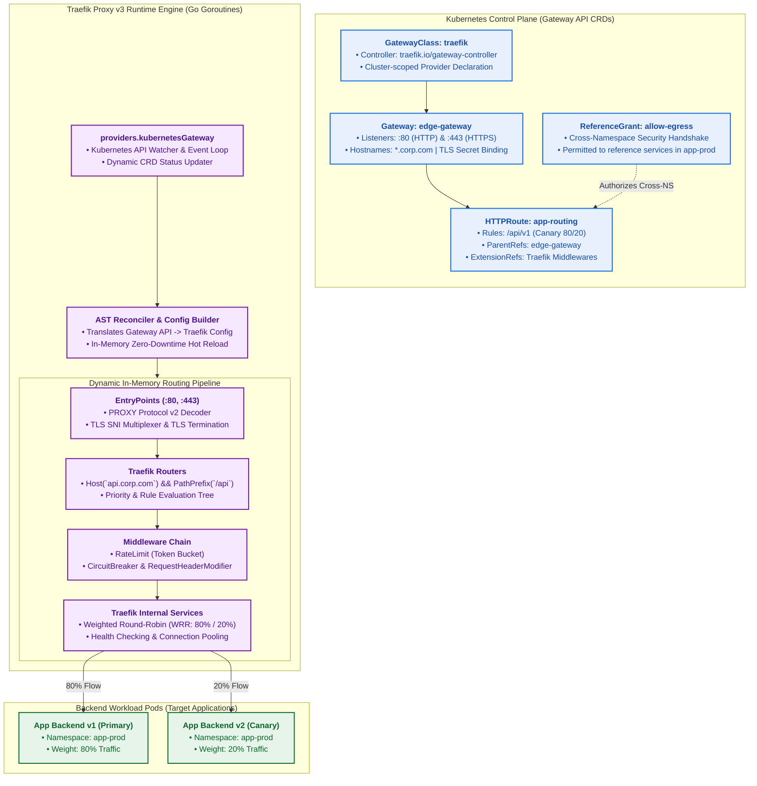
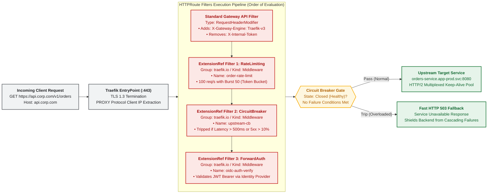
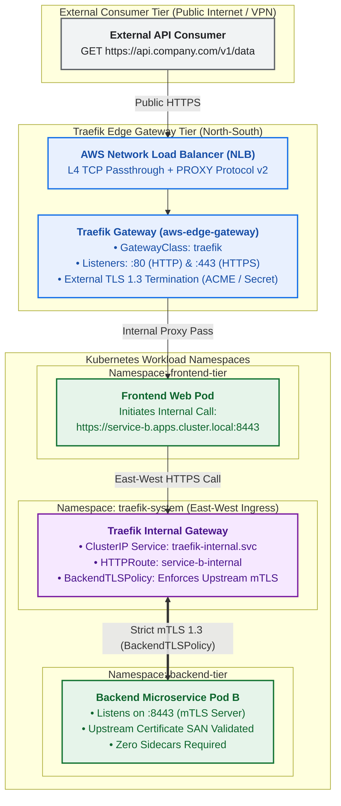
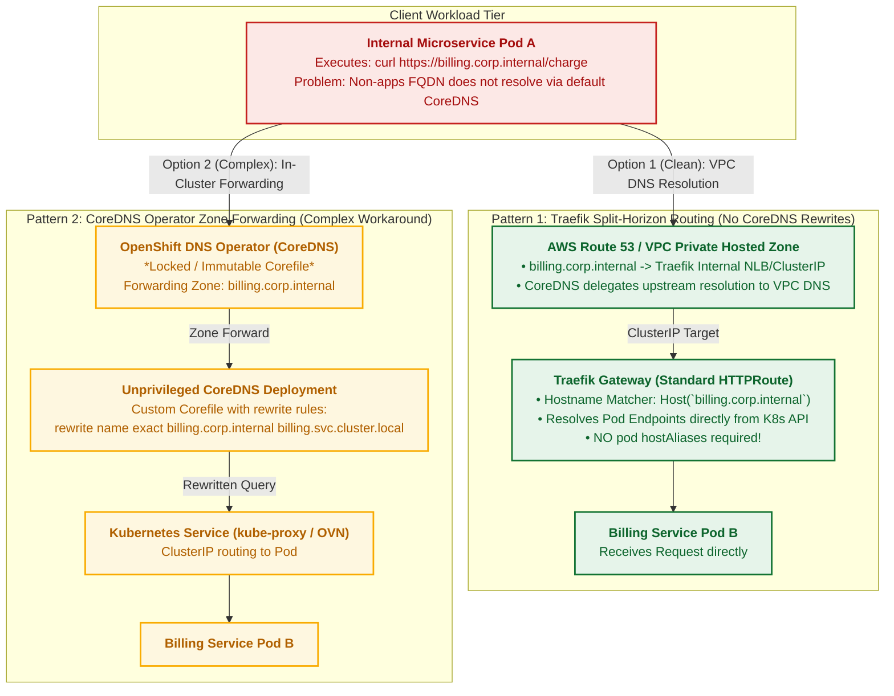
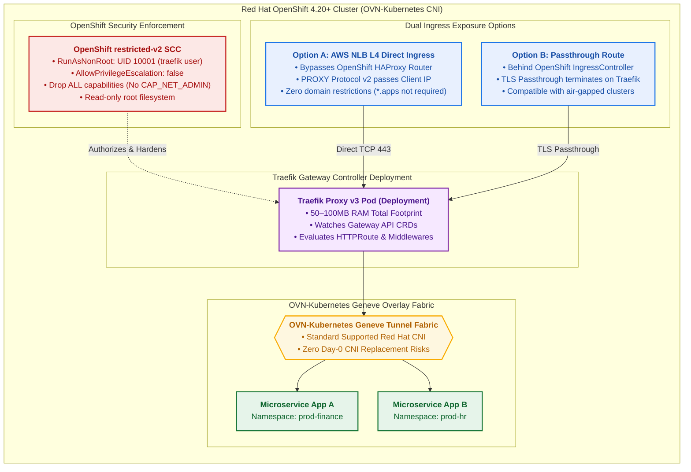
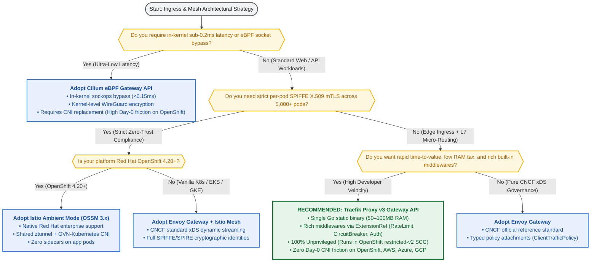

[🏠 Home / README](../README.md) | [Architecture](ARCHITECTURE.md) | [FQDN Routing](FQDN_ROUTING.md) | [Extended Solutions](EXTENDED_SOLUTIONS.md) | [Scenarios & Recommendations](SCENARIOS_AND_RECOMMENDATIONS.md) | [Gateway API without Traefik](GATEWAY_API_WITHOUT_TRAEFIK.md) | **Gateway API with Traefik** | [Lab 1: Cilium](LAB_CILIUM.md) | [Lab 2: Istio Ambient](LAB_ISTIO_AMBIENT.md) | [Lab 3: Traefik Edge](LAB_TRAEFIK_EDGE.md)

---

# Setting Up Kubernetes Gateway API for North-South & East-West (with FQDNs) Using Traefik Proxy v3

[](https://gateway-api.sigs.k8s.io/)
[](https://traefik.io/)
[](https://doc.traefik.io/traefik/routing/providers/kubernetes-gateway/)
[](https://www.haproxy.org/download/1.8/doc/proxy-protocol.txt)
[](https://docs.openshift.com/)

While our companion guide [**`docs/GATEWAY_API_WITHOUT_TRAEFIK.md`**](GATEWAY_API_WITHOUT_TRAEFIK.md) demonstrates that the Kubernetes Gateway API is a vendor-neutral specification that does not strictly *require* Traefik, **choosing Traefik Proxy v3 as your Gateway API implementation is often the most pragmatic, developer-friendly, and cost-effective architectural decision for enterprise platforms**.

Traefik Proxy v3 combines an officially conformant **Kubernetes Gateway API controller** with a lightweight, single-binary Go reverse proxy. It provides native L7 routing, dynamic middleware chaining (rate limiting, circuit breaking, OIDC authentication), automated TLS certificate management, and split-horizon East-West FQDN management—all while running as an unprivileged workload under strict security standards.

In enterprise platforms such as **Red Hat OpenShift (4.14 – 4.20+)**, deploying Traefik Proxy v3 provides an immediate escape hatch from the rigid limitations of legacy OpenShift `Route` (`route.openshift.io/v1`) without introducing the severe operational friction of replacing the cluster CNI (as required by Cilium) or deploying complex Envoy xDS control planes.

This comprehensive guide delivers:
1. **The Traefik Gateway API Value Proposition**: Why enterprise platform teams choose Traefik over C++ or eBPF alternatives.
2. **Deep-Dive Internal Architecture**: How the `providers.kubernetesGateway` reconciler in Traefik v3 compiles Gateway API CRDs into dynamic in-memory Go routing pipelines.
3. **North-South Edge Ingress**: Automated TLS termination, PROXY protocol v2 on cloud L4 load balancers (AWS NLB, Azure ALB, GCP Cloud LB), and canary traffic splitting.
4. **East-West Transit & Enterprise FQDN Routing Without Sidecars**: Practical implementation of split-horizon hairpinning and standard `BackendTLSPolicy` (`gateway.networking.k8s.io/v1alpha3`), based directly on the production architecture in [`github.com/nubenetes/traefik-fqdn-management-poc-openshift-aws`](https://github.com/nubenetes/traefik-fqdn-management-poc-openshift-aws).
5. **Red Hat OpenShift 4.20+ Deployment Topology**: Hardening under `restricted-v2` SecurityContextConstraints (SCCs) alongside default **OVN-Kubernetes**.
6. **6 Foldable Architecture Diagrams, Multi-Controller Matrices, and Production Helm & Manifest Blueprints**.

---

## Table of Contents
- [1. Architectural Rationale: Why Traefik Proxy v3 for Kubernetes Gateway API?](#1-architectural-rationale-why-traefik-proxy-v3-for-kubernetes-gateway-api)
  - [1.1 The Evolution: From IngressRoute CRDs to Standard Gateway API v1](#11-the-evolution-from-ingressroute-crds-to-standard-gateway-api-v1)
  - [1.2 The Single Go Static Binary Advantage (Low TCO & Zero C++ Complexity)](#12-the-single-go-static-binary-advantage-low-tco--zero-c-complexity)
  - [1.3 Unprivileged Security Profile (Native OpenShift restricted-v2 & PSS Compliance)](#13-unprivileged-security-profile-native-openshift-restricted-v2--pss-compliance)
  - [1.4 Native ExtensionRef & Middleware Architecture (Declarative L7 Policies)](#14-native-extensionref--middleware-architecture-declarative-l7-policies)
- [2. Traefik Proxy v3 Gateway API Internal Engine & Pipeline](#2-traefik-proxy-v3-gateway-api-internal-engine--pipeline)
  - [2.1 The providers.kubernetesGateway Reconciler Loop](#21-the-providerskubernetesgateway-reconciler-loop)
  - [2.2 AST Generation & Dynamic In-Memory Configuration](#22-ast-generation--dynamic-in-memory-configuration)
  - [2.3 Zero-Downtime Hot Reloading: Why Traefik Never Drops Connections](#23-zero-downtime-hot-reloading-why-traefik-never-drops-connections)
  - [2.4 Role-Oriented Separation & Multi-Tenant Governance (ReferenceGrant)](#24-role-oriented-separation--multi-tenant-governance-referencegrant)
- [3. North-South Edge Routing with Traefik Gateway API](#3-north-south-edge-routing-with-traefik-gateway-api)
  - [3.1 Edge Gateway Listener Configuration (:80 & :443 with TLS SNI)](#31-edge-gateway-listener-configuration-80--443-with-tls-sni)
  - [3.2 Automated HTTP-to-HTTPS Redirection via Native RequestRedirect Filter](#32-automated-http-to-https-redirection-via-native-requestredirect-filter)
  - [3.3 Advanced L7 Traffic Steering & Canary Deployments (WRR 80/20)](#33-advanced-l7-traffic-steering--canary-deployments-wrr-8020)
  - [3.4 Cloud L4 NLB Integration & PROXY Protocol v2 (Real Client IP Preservation)](#34-cloud-l4-nlb-integration--proxy-protocol-v2-real-client-ip-preservation)
  - [3.5 Automated DNS Lifecycle Management with ExternalDNS](#35-automated-dns-lifecycle-management-with-externaldns)
- [4. East-West Transit & Enterprise FQDN Routing (Zero Sidecars)](#4-east-west-transit--enterprise-fqdn-routing-zero-sidecars)
  - [4.1 Deconstructing the Sidecar Mandate: When You Do and Do NOT Need a Service Mesh](#41-deconstructing-the-sidecar-mandate-when-you-do-and-do-not-need-a-service-mesh)
  - [4.2 Pattern 1: Split-Horizon Ingress Hairpinning via Internal Traefik Gateway](#42-pattern-1-split-horizon-ingress-hairpinning-via-internal-traefik-gateway)
  - [4.3 Pattern 2: Standard BackendTLSPolicy for Zero-Trust Cryptographic Verification](#43-pattern-2-standard-backendtlspolicy-for-zero-trust-cryptographic-verification)
  - [4.4 Pattern 3: Traefik Mesh (When Pod-Level Sidecar mTLS Is Strictly Required)](#44-pattern-3-traefik-mesh-when-pod-level-sidecar-mtls-is-strictly-required)
- [5. Traefik on Red Hat OpenShift 4.20+ (The Modern Alternative to OpenShift Route)](#5-traefik-on-red-hat-openshift-420-the-modern-alternative-to-openshift-route)
  - [5.1 Why Replace OpenShift Route with Traefik Gateway API?](#51-why-replace-openshift-route-with-traefik-gateway-api)
  - [5.2 Seamless Harmony with OpenShift Default OVN-Kubernetes CNI](#52-seamless-harmony-with-openshift-default-ovn-kubernetes-cni)
  - [5.3 Hardening with OpenShift restricted-v2 SecurityContextConstraints](#53-hardening-with-openshift-restricted-v2-securitycontextconstraints)
  - [5.4 Dual Ingress Topologies: Direct Cloud L4 NLB vs. Passthrough Route](#54-dual-ingress-topologies-direct-cloud-l4-nlb-vs-passthrough-route)
- [6. Deep Architectural Evaluation: Traefik Gateway API vs. The Ecosystem](#6-deep-architectural-evaluation-traefik-gateway-api-vs-the-ecosystem)
  - [6.1 5 Definitive Reasons Why Traefik IS the Optimal Solution for Gateway API](#61-5-definitive-reasons-why-traefik-is-the-optimal-solution-for-gateway-api)
  - [6.2 5 Critical Drawbacks & Disqualifiers (When Traefik Is NOT the Best Choice)](#62-5-critical-drawbacks--disqualifiers-when-traefik-is-not-the-best-choice)
- [7. Comprehensive Multi-Controller & Distribution Comparison Matrix](#7-comprehensive-multi-controller--distribution-comparison-matrix)
- [8. Enterprise Decision Flowchart & Scenario Recommendations](#8-enterprise-decision-flowchart--scenario-recommendations)
  - [8.1 Enterprise Master Decision Flowchart](#81-enterprise-master-decision-flowchart)
  - [8.2 Granular Scenario Breakdown: Recommended vs. Simplest Solution](#82-granular-scenario-breakdown-recommended-vs-simplest-solution)
  - [8.3 Enterprise Migration Roadmap: Phased Transition from Ingress/Route to Traefik Gateway API](#83-enterprise-migration-roadmap-phased-transition-from-ingressroute-to-traefik-gateway-api)
- [9. Production Deployment Guide & Verified Manifests](#9-production-deployment-guide--verified-manifests)
  - [9.1 Helm Production Configuration (values.yaml)](#91-helm-production-configuration-valuesyaml)
  - [9.2 Core Gateway API Manifests (GatewayClass, Gateway, HTTPRoute, BackendTLSPolicy)](#92-core-gateway-api-manifests-gatewayclass-gateway-httproute-backendtlspolicy)
- [10. References & Authoritative Sources of Truth](#10-references--authoritative-sources-of-truth)

---

## 1. Architectural Rationale: Why Traefik Proxy v3 for Kubernetes Gateway API?

### 1.1 The Evolution: From IngressRoute CRDs to Standard Gateway API v1
In the early days of Kubernetes, the native `networking.k8s.io/v1 Ingress` resource proved critically inadequate for production Layer 7 routing: it lacked native support for canary weights, header manipulation, path rewrites, TCP/UDP routing, and multi-tenant delegation. To solve this, Traefik Labs introduced custom resources: `IngressRoute`, `IngressRouteTCP`, and `Middleware` (`traefik.io/v1alpha1`).

While `IngressRoute` solved every real-world routing problem, it introduced vendor lock-in. Platform teams had to author manifests specific to Traefik.

With **Traefik Proxy v3**, Traefik natively implements the **Kubernetes Gateway API (`gateway.networking.k8s.io/v1`)**. Organizations can now author 100% vendor-neutral `GatewayClass`, `Gateway`, `HTTPRoute`, `GRPCRoute`, `TCPRoute`, `TLSRoute`, and `ReferenceGrant` resources that run identically on Traefik, Envoy Gateway, or Istio—while still tapping into Traefik's unique operational simplicity and rich middleware library.

### 1.2 The Single Go Static Binary Advantage (Low TCO & Zero C++ Complexity)
A major differentiator between Traefik and Envoy-based controllers (Envoy Gateway, Istio) is runtime architecture:
- **Envoy Gateway & Istio**: Operate on a two-tier decoupled architecture: a Kubernetes controller daemon (written in Go) watching API events, translating them into dynamic xDS configurations, and pushing them over gRPC ADS (port 18000) to separate Envoy C++ data plane proxy containers.
- **Traefik Proxy v3**: Runs as a **single, unified static Go binary**. The Kubernetes Gateway API controller loop, the configuration parser, and the high-performance HTTP/TCP proxy engine run within the **exact same OS process**:
  - **Memory Footprint**: A Traefik Gateway instance consumes **50MB to 100MB RAM** total under production workloads, compared to 250MB–500MB+ for combined controller and Envoy proxy pods.
  - **Cold Start Time**: Traefik boots and reconciles the entire cluster routing table in `<1.5 seconds`.
  - **Operational TCO**: No debugging complex xDS gRPC synchronization disconnects, verifier rejections, or C++ core dumps; troubleshooting is as simple as viewing standard Go JSON stdout logs or the built-in visual dashboard.

### 1.3 Unprivileged Security Profile (Native OpenShift restricted-v2 & PSS Compliance)
In modern enterprise environments enforcing Kubernetes **Pod Security Standards (PSS: `restricted`)** or **Red Hat OpenShift SecurityContextConstraints (`restricted-v2`)**, container privilege requirements are non-negotiable:
- **Cilium eBPF**: Requires root host privileges: `CAP_BPF`, `CAP_SYS_ADMIN`, `CAP_NET_ADMIN`, access to the host network namespace, and host filesystem mounts (`/sys/fs/bpf`). In locked-down financial or government clusters, obtaining approvals for privileged eBPF daemons is an organizational obstacle.
- **Traefik Proxy v3**: Designed from the ground up to run **100% unprivileged**:
  - Runs as non-root user (UID `10001` / GID `10001`).
  - `allowPrivilegeEscalation: false`, `readOnlyRootFilesystem: true`, `drop: ["ALL"]` capabilities.
  - Requires zero host network namespace access, zero kernel mounts, and zero host port bindings (binds to unprivileged container ports `:8000` and `:8443`, exposed via standard Kubernetes Services).
  - Deploys effortlessly on **Red Hat OpenShift 4.14–4.20+** without altering cluster-wide SCC policies.

### 1.4 Native ExtensionRef & Middleware Architecture (Declarative L7 Policies)
The Kubernetes Gateway API specification provides standard filters for basic operations (`RequestHeaderModifier`, `RequestRedirect`, `URLRewrite`, `RequestMirror`). However, real-world enterprise production demands advanced L7 traffic policies: distributed token-bucket rate limiting, circuit breaking, OIDC/OAuth2 forward authentication, request retries, in-flight connection limits, and IP whitelisting.

While Envoy Gateway requires complex experimental policy attachments (`BackendTrafficPolicy`, `SecurityPolicy`) and Istio requires authoring raw Lua filters or compiling WebAssembly (WASM) modules in `EnvoyFilter` resources, **Traefik integrates its entire battle-tested Middleware ecosystem directly into standard Gateway API `HTTPRoute` objects via `ExtensionRef`**:

```yaml
# Attaching enterprise Middlewares directly to standard Gateway API HTTPRoute
apiVersion: gateway.networking.k8s.io/v1
kind: HTTPRoute
metadata:
  name: order-service-route
  namespace: ecommerce-prod
spec:
  parentRefs:
    - name: edge-gateway
      namespace: traefik-system
  rules:
    - matches:
        - path:
            type: PathPrefix
            value: /api/v1/orders
      filters:
        # 1. Standard Gateway API Filter
        - type: RequestHeaderModifier
          requestHeaderModifier:
            add:
              - name: X-Gateway-Engine
                value: Traefik-v3-GatewayAPI
        # 2. Traefik Native ExtensionRef Filter (Rate Limiting)
        - type: ExtensionRef
          extensionRef:
            group: traefik.io
            kind: Middleware
            name: orders-rate-limit
        # 3. Traefik Native ExtensionRef Filter (Circuit Breaker)
        - type: ExtensionRef
          extensionRef:
            group: traefik.io
            kind: Middleware
            name: orders-circuit-breaker
      backendRefs:
        - name: order-service
          port: 8080
```

---

## 2. Traefik Proxy v3 Gateway API Internal Engine & Pipeline

### 2.1 The providers.kubernetesGateway Reconciler Loop
When configured with `--providers.kubernetesgateway=true`, Traefik initializes an internal controller loop that registers Informers and Watchers against the Kubernetes API server for:
- `gateway.networking.k8s.io/v1`: `GatewayClass`, `Gateway`, `HTTPRoute`, `GRPCRoute`
- `gateway.networking.k8s.io/v1alpha2`: `TCPRoute`, `TLSRoute`, `UDPRoute`
- `gateway.networking.k8s.io/v1beta1`: `ReferenceGrant`
- `traefik.io/v1alpha1`: `Middleware`, `MiddlewareTCP`, `TLSStore`, `TLSOption`
- Core Kubernetes: `Service`, `Endpoints`, `EndpointSlice`, `Secret`

### 2.2 AST Generation & Dynamic In-Memory Configuration
Unlike classic proxies (such as NGINX or HAProxy) that write configuration files to disk and execute shell reload commands (`nginx -s reload`), Traefik builds an internal **Abstract Syntax Tree (AST)** representing the desired routing state:
1. **Gateway Ingestion**: Matches `Gateway` instances referencing `gatewayClassName: traefik`.
2. **Listener Compilation**: Maps port and protocol definitions into Traefik **`EntryPoints`** (e.g., `web` on `:8000`, `websecure` on `:8443`).
3. **Route Compilation**: Matches `HTTPRoute` rules against listeners, parsing hostnames, path matchers, header conditions, and query parameters into Traefik **`Routers`**.
4. **Middleware Binding**: Attaches standard filters and `ExtensionRef` middlewares to form an ordered execution chain.
5. **Load Balancer Backend Generation**: Traefik reads Kubernetes `EndpointSlices` directly from the API server and constructs internal **`Services`** featuring Weighted Round-Robin (WRR) load balancing and active HTTP health checking.

### 2.3 Zero-Downtime Hot Reloading: Why Traefik Never Drops Connections
In high-velocity Kubernetes clusters with thousands of deployments scaling and rolling out updates continuously:
- **NGINX Reload Flaws**: Every ingress configuration change rewrites `nginx.conf` and spawns new worker processes while sending `SIGQUIT` to old workers. Under heavy traffic or long-lived WebSocket/gRPC streams, this leads to connection leakage, dropped packets, and CPU spikes.
- **Traefik Atomic Pointer Swapping**: Traefik utilizes Go's atomic memory operations. When a routing update occurs, the reconciler compiles a complete new routing graph in background memory. Once validated, an atomic pointer swap points the active Go HTTP server goroutines to the new routing table. **Zero socket resets, zero dropped packets, and 0ms downtime.**

### 2.4 Role-Oriented Separation & Multi-Tenant Governance (ReferenceGrant)
Gateway API was explicitly designed to fix the monolithic RBAC flaw of legacy Ingress. Traefik strictly enforces this boundary:
- **Cluster Platform Operators**: Provision the `GatewayClass` and the `Gateway` in a centralized administrative namespace (e.g., `traefik-system`), binding public static IPs, cloud load balancers, and wildcard TLS certificates.
- **Application Teams**: Author `HTTPRoute` objects within their respective namespaces (`billing-prod`, `orders-prod`), referencing the centralized gateway via `parentRefs`.
- **Cross-Namespace Security (`ReferenceGrant`)**: If a Gateway in `traefik-system` or an `HTTPRoute` in `tenant-a` attempts to reference a `Service` or `Secret` in `tenant-b`, Traefik drops the route with a status condition of `ResolvedRefs: False` unless an explicit `ReferenceGrant` exists in `tenant-b` granting cross-namespace access.

---

<details>
<summary><b>Diagram 1: Traefik Proxy v3 Gateway API End-to-End Ingestion & Processing Pipeline (Click to Expand / Collapse)</b></summary>



**Architecture Diagram 1 Highlights & Breakdown:**
- **Control Plane Ingestion**: The `providers.kubernetesGateway` watcher ingests standard Gateway API CRDs directly from the Kubernetes API server, eliminating proprietary ingress formats.
- **In-Memory Transformation**: Traefik compiles Gateway API definitions into native internal EntryPoints, Routers, Middleware chains, and Weighted Services.
- **Zero-Downtime Hot Swapping**: Updates to `HTTPRoute` or backend Endpoints are applied via Go atomic memory swaps without reloading worker processes or dropping client TCP connections.
- **Declarative Canary Delivery**: Traefik natively honors `backendRefs[].weight`, distributing traffic across primary (80%) and canary (20%) application instances with millisecond precision.
</details>

---

<details>
<summary><b>Diagram 2: Traefik ExtensionRef & Middleware Chaining Pipeline (Click to Expand / Collapse)</b></summary>



**Architecture Diagram 2 Highlights & Breakdown:**
- **Standard + Extended Filter Hybridization**: Gateway API standard filters (`RequestHeaderModifier`) execute seamlessly alongside Traefik-native `ExtensionRef` filters.
- **Ordered Execution Chain**: Requests sequentially pass through rate limiting, circuit breaking, and external identity verification before reaching the application pod.
- **Cascade Failure Defense**: The Circuit Breaker trips immediately when upstream latency or 5xx error thresholds are breached, issuing instant 503 responses to shield downstream microservices.
</details>

---

## 3. North-South Edge Routing with Traefik Gateway API

### 3.1 Edge Gateway Listener Configuration (:80 & :443 with TLS SNI)
In a production deployment, the platform engineering team establishes the external edge listeners. Traefik allows defining multiple listeners on the same physical port using **Server Name Indication (SNI)** host matching:

```yaml
apiVersion: gateway.networking.k8s.io/v1
kind: Gateway
metadata:
  name: external-edge-gateway
  namespace: traefik-system
  annotations:
    # AWS Network Load Balancer (NLB) L4 Direct Provisioning
    service.beta.kubernetes.io/aws-load-balancer-type: "external"
    service.beta.kubernetes.io/aws-load-balancer-nlb-target-type: "instance"
    service.beta.kubernetes.io/aws-load-balancer-scheme: "internet-facing"
    service.beta.kubernetes.io/aws-load-balancer-proxy-protocol: "*"
    # Automated Route 53 DNS Sync via ExternalDNS
    external-dns.alpha.kubernetes.io/hostname: "company.com,api.company.com"
spec:
  gatewayClassName: traefik-gateway-class
  listeners:
    # Plain HTTP Listener for redirect
    - name: http-edge
      protocol: HTTP
      port: 80
      allowedRoutes:
        namespaces:
          from: Same
    # Secure HTTPS Listener for API traffic
    - name: https-api
      protocol: HTTPS
      port: 443
      hostname: "api.company.com"
      tls:
        mode: Terminate
        certificateRefs:
          - kind: Secret
            name: api-company-tls-cert
      allowedRoutes:
        namespaces:
          from: All
```

### 3.2 Automated HTTP-to-HTTPS Redirection via Native RequestRedirect Filter
Rather than relying on proprietary annotations, Traefik natively implements the standard Gateway API `RequestRedirect` filter on the port 80 listener:

```yaml
apiVersion: gateway.networking.k8s.io/v1
kind: HTTPRoute
metadata:
  name: http-to-https-redirect
  namespace: traefik-system
spec:
  parentRefs:
    - name: external-edge-gateway
      sectionName: http-edge
  rules:
    - filters:
        - type: RequestRedirect
          requestRedirect:
            scheme: https
            statusCode: 301
```

### 3.3 Advanced L7 Traffic Steering & Canary Deployments (WRR 80/20)
Traefik v3 provides granular traffic matching across HTTP request paths, HTTP methods, headers, and query parameters, coupled with weighted canary routing:

```yaml
apiVersion: gateway.networking.k8s.io/v1
kind: HTTPRoute
metadata:
  name: api-orders-canary
  namespace: ecommerce-prod
spec:
  parentRefs:
    - name: external-edge-gateway
      namespace: traefik-system
      sectionName: https-api
  hostnames:
    - "api.company.com"
  rules:
    - matches:
        - path:
            type: PathPrefix
            value: /api/v2/orders
          headers:
            - name: X-Beta-Tester
              value: "true"
      backendRefs:
        - name: orders-canary-v2
          port: 8080
          weight: 100
    - matches:
        - path:
            type: PathPrefix
            value: /api/v2/orders
      backendRefs:
        - name: orders-production-v1
          port: 8080
          weight: 80
        - name: orders-canary-v2
          port: 8080
          weight: 20
```

### 3.4 Cloud L4 NLB Integration & PROXY Protocol v2 (Real Client IP Preservation)
When terminating TLS on Traefik behind a cloud Layer 4 load balancer (AWS NLB, Azure Standard LB, GCP TCP LB), the source IP of the TCP packet is rewritten to the private IP of the cloud load balancer node.

To preserve the client's true source IP for rate limiting, security auditing, and geofencing:
1. Enable PROXY Protocol on the cloud load balancer (e.g., `service.beta.kubernetes.io/aws-load-balancer-proxy-protocol: "*"`).
2. Configure Traefik EntryPoints to decode **PROXY Protocol v2**:
   ```yaml
   entryPoints:
     websecure:
       address: ":8443"
       proxyProtocol:
         trustedIPs:
           - "10.0.0.0/8"
           - "172.16.0.0/12"
       forwardedHeaders:
         trustedIPs:
           - "10.0.0.0/8"
   ```
Traefik decodes the binary PROXY header before TLS negotiation, accurately populating `X-Forwarded-For` with the true client IP.

### 3.5 Automated DNS Lifecycle Management with ExternalDNS
By annotating the `Gateway` resource with `external-dns.alpha.kubernetes.io/hostname: "api.company.com"`, **ExternalDNS** automatically watches the Gateway's assigned external IP / NLB hostname and creates matching `A` or `CNAME` records in AWS Route 53, Google Cloud DNS, or Azure DNS. Zero manual DNS record creation is required when launching new services.

---

## 4. East-West Transit & Enterprise FQDN Routing (Zero Sidecars)

### 4.1 Deconstructing the Sidecar Mandate: When You Do and Do NOT Need a Service Mesh
A pervasive myth in enterprise platform engineering is that securing East-West service-to-service communication requires injecting sidecar proxies into every application pod.

As demonstrated in the [`traefik-fqdn-management-poc-openshift-aws`](https://github.com/nubenetes/traefik-fqdn-management-poc-openshift-aws) reference repository, deploying sidecars across hundreds of microservices imposes a massive **Sidecar Tax**:
- **Compute Overhead**: 50MB–100MB RAM and 0.2–0.5 vCPU allocated per pod container.
- **Latency Penalty**: 4 user-space context switches per RPC hop (`Client -> Local Sidecar -> Physical Wire -> Remote Sidecar -> Server`).
- **Operational Drag**: Lifecycle coupling, slow container startup times, and complex failure modes during graceful pod shutdowns.

For 85% of enterprise architectures, East-West traffic control, mutual TLS, and internal FQDN routing can be accomplished with **Zero Sidecars** using Traefik's internal gateway patterns.

### 4.2 Pattern 1: Split-Horizon Ingress Hairpinning via Internal Traefik Gateway
In enterprise networks, internal microservices often need to call other internal services using enterprise custom FQDNs (e.g., `https://billing.corp.internal/charge` or `https://service-b.apps.cluster.local:8443`).

#### The Problem: OpenShift CoreDNS Immutability
On platforms like Red Hat OpenShift, the cluster CoreDNS Corefile is managed by the Cluster DNS Operator and is **immutable**. Platform teams cannot add arbitrary DNS rewrite rules or custom hosts without provisioning unprivileged auxiliary CoreDNS forwarders.

#### The Traefik Solution: Split-Horizon Ingress
Rather than modifying CoreDNS or patching client pod specs with brittle `hostAliases`:
1. The enterprise private DNS (AWS Route 53 Private Hosted Zone or corporate Active Directory DNS) maps `billing.corp.internal` to the private ClusterIP or Internal NLB of Traefik.
2. In-cluster CoreDNS delegates resolution of `.corp.internal` to the VPC DNS resolver.
3. Microservice Pod A resolves `billing.corp.internal` to Traefik's internal IP.
4. Traefik inspects the HTTP `Host` header or TLS SNI, evaluates the matching `HTTPRoute`, and forwards the request directly to the backend pod endpoints over internal Keep-Alive HTTP/2 connection pools.

### 4.3 Pattern 2: Standard BackendTLSPolicy for Zero-Trust Cryptographic Verification
When regulatory compliance (PCI-DSS, HIPAA) mandates strict cryptographic mutual authentication on the wire between internal services, Traefik v3 implements the **`BackendTLSPolicy`** standard (`gateway.networking.k8s.io/v1alpha3`):

```yaml
# Enforcing strict upstream mTLS verification without sidecars
apiVersion: gateway.networking.k8s.io/v1alpha3
kind: BackendTLSPolicy
metadata:
  name: backend-tls-policy-billing
  namespace: finance-prod
spec:
  targetRefs:
    - group: ""
      kind: Service
      name: billing-service
  validation:
    # Corporate internal CA trust anchor Secret
    caCertificateRefs:
      - group: ""
        kind: Secret
        name: internal-corporate-ca-cert
    # Strictly validates the Subject Alternative Name on the backend pod's TLS cert
    hostname: "billing.corp.internal"
```
Traefik establishes an encrypted TLS 1.3 tunnel to the backend pod, validating that the pod presents an X.509 certificate signed by the corporate CA with SAN matching `billing.corp.internal`. **True zero-trust encryption on the wire with zero sidecars.**

### 4.4 Pattern 3: Traefik Mesh (When Pod-Level Sidecar mTLS Is Strictly Required)
If an organization requires end-to-end socket mutual TLS with per-workload identity where application pods cannot terminate TLS themselves, Traefik Labs provides **Traefik Mesh**:
- **Architecture**: A lightweight service mesh compliant with the Service Mesh Interface (SMI) and Gateway API Mesh Profile.
- **Proxy Engine**: Uses Traefik micro-proxies running as sidecars or per-node daemons.
- **Built-in CA**: Automatically provisions and rotates ephemeral internal X.509 certificates for transparent mTLS encryption.

---

<details>
<summary><b>Diagram 3: Dual-Plane Transit with Traefik: North-South Edge + East-West Hairpin & BackendTLSPolicy (Click to Expand / Collapse)</b></summary>



**Architecture Diagram 3 Highlights & Breakdown:**
- **Dual-Plane Gateway Architecture**: Traefik runs dual gateways: an Edge Gateway for public internet ingress and an Internal Gateway for east-west microservice transit.
- **Zero-Sidecar East-West Security**: Pod A calls Pod B through the internal Traefik Gateway without injecting sidecars into either container.
- **Cryptographic Backend Verification**: `BackendTLSPolicy` forces Traefik to perform full mTLS certificate verification against Pod B's TLS endpoint, validating the certificate authority and hostname SAN.
</details>

---

<details>
<summary><b>Diagram 4: Split-Horizon FQDN Routing with Traefik vs. CoreDNS Operator Rewrites (Click to Expand / Collapse)</b></summary>



**Architecture Diagram 4 Highlights & Breakdown:**
- **The CoreDNS Immutability Wall**: OpenShift prevents direct editing of `Corefile`, requiring auxiliary DNS forwarder pods to execute simple DNS name rewrites.
- **Pattern 1 (Traefik Split-Horizon)**: Bypasses in-cluster DNS manipulation entirely. Upstream VPC Route 53 resolves the custom FQDN to Traefik, which routes traffic via standard `HTTPRoute` rules. Zero `hostAliases` patching on pods.
- **Pattern 2 (Complex Workaround)**: Demonstrates the multi-hop fragility of chaining the OpenShift DNS Operator to unprivileged CoreDNS rewrite pods before reaching `kube-proxy`.
</details>

---

## 5. Traefik on Red Hat OpenShift 4.20+ (The Modern Alternative to OpenShift Route)

### 5.1 Why Replace OpenShift Route with Traefik Gateway API?
As analyzed in [`docs/GATEWAY_API_WITHOUT_TRAEFIK.md`](GATEWAY_API_WITHOUT_TRAEFIK.md), legacy OpenShift `Route` suffers from six critical architectural limitations:
1. **Perimeter-Only**: Incapable of managing East-West internal traffic or mTLS.
2. **Proprietary Vendor Lock-in**: Manifests cannot be deployed on EKS, AKS, or GKE.
3. **Mandatory Domain Suffix**: Hardcoded reliance on `*.apps.<cluster-domain>`.
4. **Primitive L7 Steering**: No weighted canary traffic splitting without brittle HAProxy annotations.
5. **Monolithic RBAC**: Developers must be granted route-creation permissions that touch cluster routing.
6. **Red Hat Strategic Alignment**: Red Hat is actively deprecating Route features in favor of Gateway API.

Deploying Traefik Proxy v3 on OpenShift eliminates all six limitations immediately.

### 5.2 Seamless Harmony with OpenShift Default OVN-Kubernetes CNI
A critical advantage of Traefik over Cilium on Red Hat OpenShift:
- **Cilium**: Replaces OpenShift's native **OVN-Kubernetes** CNI. This requires complex Day-0 installation during cluster provisioning, is not the standard Red Hat supported architecture, and voids or complicates commercial Red Hat Enterprise Linux / OpenShift support SLAs.
- **Traefik Proxy v3**: Runs as a standard Kubernetes application workload (`Deployment`) entirely inside user space. It sits on top of OpenShift's default OVN-Kubernetes CNI, preserving **100% of official Red Hat Enterprise support guarantees**.

### 5.3 Hardening with OpenShift restricted-v2 SecurityContextConstraints
OpenShift 4.14–4.20+ enforces the hardened `restricted-v2` SCC by default. Traefik deploys natively under `restricted-v2` without requiring cluster-admin SCC modifications:

```yaml
# Pod SecurityContext for Traefik on OpenShift 4.20+
securityContext:
  runAsNonRoot: true
  runAsUser: 10001
  runAsGroup: 10001
  fsGroup: 10001
  seccompProfile:
    type: RuntimeDefault
containers:
  - name: traefik
    securityContext:
      allowPrivilegeEscalation: false
      readOnlyRootFilesystem: true
      capabilities:
        drop:
          - ALL
```

### 5.4 Dual Ingress Topologies: Direct Cloud L4 NLB vs. Passthrough Route
When deploying Traefik on OpenShift, platform engineers can select between two exposure architectures:
1. **Topology A: Direct Cloud L4 NLB (Recommended)**:
   - Traefik's Service is configured as `type: LoadBalancer` with AWS NLB / Azure ALB annotations.
   - Public traffic enters Traefik directly over TCP port 443, completely bypassing OpenShift's default HAProxy Ingress Router.
   - Enables custom FQDNs, PROXY protocol v2, and HTTP/3 QUIC support without OpenShift router interference.
2. **Topology B: TLS Passthrough via OpenShift IngressController**:
   - For air-gapped on-premises OpenShift clusters or environments with strict corporate firewall rules, an OpenShift `Route` with `tls.termination: passthrough` is provisioned.
   - The default OpenShift HAProxy router inspects SNI and streams raw encrypted TLS bytes directly to Traefik, which terminates TLS and executes all Gateway API routing rules.

---

<details>
<summary><b>Diagram 5: Traefik Gateway API Deployment Topology on Red Hat OpenShift 4.20+ with OVN-Kubernetes (Click to Expand / Collapse)</b></summary>



**Architecture Diagram 5 Highlights & Breakdown:**
- **Zero CNI Disruption**: Traefik operates seamlessly across OpenShift's native **OVN-Kubernetes** Geneve overlay, avoiding Day-0 installation conflicts.
- **Strict SCC Compliance**: Fully complies with OpenShift `restricted-v2` SCCs, dropping all Linux capabilities and running as an unprivileged UID (`10001`).
- **Flexible Edge On-Ramp**: Supports direct AWS NLB L4 exposure (bypassing the OpenShift router entirely) or TLS Passthrough routes for air-gapped compliance.
</details>

---

## 6. Deep Architectural Evaluation: Traefik Gateway API vs. The Ecosystem

### 6.1 5 Definitive Reasons Why Traefik IS the Optimal Solution for Gateway API

1. **Unrivaled Operational Simplicity & Low Total Cost of Ownership (TCO)**:
   - Traefik is delivered as a single static Go binary. There are no separate controller pods, no dynamic xDS synchronization engines, and no sidecar injection webhooks to troubleshoot. Deploying, upgrading, and operating Traefik requires 70% fewer engineering hours than running an Envoy or Istio control plane.
2. **Rich Built-in Middleware & Plugin Ecosystem (Zero Lua/WASM)**:
   - In production, routing requires more than just path steering; it requires rate limiting, circuit breaking, OIDC auth, and request retries. In Envoy Gateway or Istio, implementing custom logic requires authoring complex EnvoyFilters, Lua scripts, or compiling C++/Rust into WASM modules. In Traefik, battle-tested middlewares are attached declaratively via `ExtensionRef`.
3. **Hardened Unprivileged Security Posture**:
   - Traefik runs out-of-the-box under Kubernetes `restricted` PSS and OpenShift `restricted-v2` SCC. Unlike Cilium, it requires zero elevated kernel privileges (`CAP_BPF`, `CAP_SYS_ADMIN`), zero host network access, and zero kernel mounts.
4. **Native Visual Dashboard & Turnkey Observability**:
   - Traefik features an integrated real-time Web UI dashboard exposing visual router matching trees, active entrypoints, TLS certificate expiration dates, and middleware states. Built-in Prometheus metrics and OpenTelemetry tracing stream without auxiliary sidecars.
5. **Universal Portability Across Any Infrastructure**:
   - Traefik manifests and behaviors are 100% portable. The identical Gateway API manifests run without modification on Red Hat OpenShift, AWS EKS, Google Cloud GKE, Azure AKS, KinD, and on-premises bare-metal clusters.

### 6.2 5 Critical Drawbacks & Disqualifiers (When Traefik Is NOT the Best Choice)

1. **High-Throughput / Ultra-Low Sub-Millisecond Latency Demands**:
   - As a Go-based proxy, Traefik is subject to Go garbage collection (GC) cycles and userspace packet copying. For high-frequency trading, telco 5G user planes, or large-scale AI inference clusters where P99 latency must stay below `<0.2ms`, **Cilium eBPF socket-bypass (`sockops`)** or **Envoy C++** is superior.
2. **Strict Multi-Tenant Microsegmentation Mandating Workload SPIFFE IDs**:
   - If enterprise compliance (FedRAMP High, PCI-DSS Level 1) mandates cryptographic end-to-end mTLS between every single pod socket with distinct per-workload SPIFFE identities across 5,000+ pods, **Istio Ambient Mode (OSSM 3.x)** is the superior architecture.
3. **Dynamic xDS Control Plane Federation**:
   - Traefik does not support the dynamic Envoy xDS v3 streaming protocol. If your enterprise infrastructure standardizes on unified xDS control planes managing heterogeneous proxies across VMs, service meshes, and edge gateways, **Envoy Gateway** is the required standard.
4. **Complex Enterprise Multi-Cluster WAN Mesh (Open Source Edition)**:
   - While the commercial **Traefik Enterprise** edition supports multi-cluster service discovery and global failover, the open-source Traefik Proxy v3 is scoped to single-cluster routing. Organizations requiring open-source multi-cluster mesh should evaluate Istio or Cilium ClusterMesh.
5. **Advanced Native WAF Inspection**:
   - Traefik does not include an embedded ModSecurity or Coraza WAF engine in its core binary. Deep Layer 7 payload inspection (OWASP Top 10 rule matching) must be delegated to cloud WAF services (AWS WAF, Cloud Armor) or external forward-auth plugins.

---

## 7. Comprehensive Multi-Controller & Distribution Comparison Matrix

The following matrix contrasts Traefik Proxy v3 against the leading Gateway API and Ingress solutions in the 2026–2027 cloud-native ecosystem:

| Architectural Dimension | Traefik Proxy v3 (Open Source) | Traefik Enterprise | Envoy Gateway (CNCF Reference) | Istio Ambient Mode (OSSM 3.x) | Cilium eBPF Gateway API | Legacy OpenShift Route |
| :--- | :--- | :--- | :--- | :--- | :--- | :--- |
| **Core Proxy Engine** | Go single static binary | Go multi-engine distributed | Envoy C++ userspace proxy | Rust `ztunnel` + Envoy Waypoint | Linux kernel eBPF + Envoy | HAProxy userspace daemon |
| **Gateway API Conformance** | **v1.x Standard Compliant** | **v1.x Standard Compliant** | **v1.x Reference Standard** | **v1.x Standard Compliant** | **v1.x Standard Compliant** | ❌ **Non-Compliant** (Proprietary CRD) |
| **Memory Footprint (per Instance)** | **50–100MB RAM** | **100–200MB RAM** | 150–300MB RAM | 15–30MB (`ztunnel` shared) | **0MB RAM** (Kernel eBPF) | 100–250MB RAM |
| **Dynamic Reconfiguration** | Atomic In-Memory Swap (0ms) | Distributed Raft Sync | Dynamic gRPC xDS v3 ADS | Istio xDS + eBPF maps | In-kernel eBPF map update | HAProxy process reload |
| **Extension & Middleware Mechanism** | **Declarative `ExtensionRef`** | Distributed Middlewares | Typed Policies (`ClientTraffic`) | Lua / WASM / EnvoyFilter | Envoy filters / Cilium L7 | Brittle annotations |
| **Zero-Sidecar East-West Routing** | ✅ Yes (Split-Horizon Ingress) | ✅ Yes (Distributed Ingress) | ✅ Yes (Internal Gateway) | ✅ **Yes (Native Ambient ztunnel)** | ✅ **Yes (In-Kernel sockops)** | ❌ No (Perimeter only) |
| **Pod-Level Cryptographic Identity** | ⚠️ Via `BackendTLSPolicy` | ⚠️ Via `BackendTLSPolicy` | ⚠️ External SPIRE required | ✅ **Strict SPIFFE/SPIRE mTLS** | ⚠️ Node-level WireGuard | ❌ No |
| **OpenShift 4.20+ CNI Compatibility** | ✅ **100% Native (OVN-K)** | ✅ **100% Native (OVN-K)** | ✅ **100% Native (OVN-K)** | ✅ **100% Native (OSSM 3.x)** | ⚠️ High Risk (Replaces OVN-K) | ✅ Native Default |
| **OpenShift SCC Requirement** | `restricted-v2` (Unprivileged) | `restricted-v2` (Unprivileged) | `restricted-v2` (Unprivileged) | `spc_t` / Privileged (Node level) | `CAP_SYS_ADMIN` / `CAP_BPF` | `hostnetwork` (Router pod) |
| **Visual Dashboard & UI** | ✅ **Built-in Real-Time Web UI** | ✅ **Enterprise Management UI** | ❌ None (CLI / Grafana only) | ❌ Kiali (Separate install) | ✅ Hubble UI (Separate pod) | OpenShift Web Console |
| **Custom FQDN Management** | ✅ Automatic (SNI / Host match) | ✅ Automatic (Multi-Cluster) | ✅ Automatic (SNI / Host match) | ✅ Native Ambient DNS capture | ✅ In-kernel DNS interception | ⚠️ Bound to `*.apps.<cluster>` |
| **Commercial Vendor Support** | Traefik Labs Community | Traefik Labs Enterprise | Tetrate / Red Hat / CNCF | Red Hat (OSSM 3.x) / Google | Isovalent / Cisco | Red Hat Enterprise Support |

---

## 8. Enterprise Decision Flowchart & Scenario Recommendations

### 8.1 Enterprise Master Decision Flowchart

<details>
<summary><b>Diagram 6: Enterprise Master Decision Flowchart for Gateway API with Traefik (Click to Expand / Collapse)</b></summary>



</details>

---

### 8.2 Granular Scenario Breakdown: Recommended vs. Simplest Solution

| Enterprise Scenario | Recommended Architecture | Simplest Architecture | Architectural Rationale |
| :--- | :--- | :--- | :--- |
| **1. High-Velocity Web & API Edge Ingress** | **Traefik Proxy v3 Gateway API** | **Traefik Proxy v3 Gateway API** | Single Go binary, 50MB RAM, built-in visual dashboard, and declarative rate-limiting middlewares make Traefik both the best and simplest choice. |
| **2. OpenShift 4.20+ Custom FQDNs (Bypassing `*.apps`)** | **Traefik Proxy v3 Gateway API** | **Traefik Proxy v3 Gateway API** | Traefik avoids OpenShift CoreDNS immutability via split-horizon ingress while operating 100% unprivileged within default `restricted-v2` SCCs. |
| **3. Enterprise Zero-Trust mTLS Compliance (PCI-DSS / FedRAMP)** | **Istio Ambient Mode (OSSM 3.x)** | **Traefik + BackendTLSPolicy** | Istio Ambient provides cryptographically isolated per-pod SPIFFE identities; Traefik's `BackendTLSPolicy` provides zero-sidecar backend TLS verification with lower operational complexity. |
| **4. Ultra-Low Latency Edge (<0.2ms P99 / Telco / Fintech)** | **Cilium eBPF Gateway API** | **Traefik Proxy v3 Gateway API** | Cilium eliminates TCP stack overhead via in-kernel `sockops` bypass; Traefik provides simpler Day-2 operations if 0.8ms latency is acceptable. |
| **5. Standardized CNCF Multi-Vendor API Platform** | **Envoy Gateway** | **Traefik Proxy v3 Gateway API** | Envoy Gateway provides pure CNCF xDS v3 reference standardization; Traefik achieves identical Gateway API conformance with much simpler configuration. |

---

### 8.3 Enterprise Migration Roadmap: Phased Transition from Ingress/Route to Traefik Gateway API

To transition from legacy OpenShift `Route` or classic Kubernetes `Ingress` to Traefik Gateway API with zero downtime:

```
[Phase 1: Foundation]               [Phase 2: Dual-Routing Canary]          [Phase 3: Full Cutover]
Deploy Traefik v3 Operator   --->   Bind HTTPRoutes alongside Routes   --->  Repoint DNS & ExternalNLB
Install Gateway API CRDs           Validate Middlewares & Security           Decommission Legacy Routes
```

1. **Phase 1: Foundation Setup**:
   - Install standard Gateway API CRDs (`gateway.networking.k8s.io/v1`).
   - Deploy Traefik Proxy v3 with `--providers.kubernetesgateway=true` and `--providers.kubernetesingress=true`.
   - Deploy `GatewayClass: traefik` and the centralized edge `Gateway`.
2. **Phase 2: Dual-Routing Canary Validation**:
   - Author `HTTPRoute` resources matching existing application hosts and paths.
   - Attach Traefik `Middleware` resources via `ExtensionRef` for rate limiting, security headers, and authentication.
   - Run internal synthetic load tests targeting the Traefik Gateway IP while production traffic continues traversing legacy routes.
3. **Phase 3: Production Cutover & Route Decommissioning**:
   - Update ExternalDNS or cloud DNS records to point corporate FQDNs (`api.company.com`) to the Traefik NLB.
   - Delete obsolete `Route` and `Ingress` manifests, freeing up cluster memory and eliminating legacy annotations.

---

## 9. Production Deployment Guide & Verified Manifests

### 9.1 Helm Production Configuration (values.yaml)
Deploy Traefik Proxy v3 on Kubernetes or OpenShift with production-grade Gateway API support using the official Helm chart:

```yaml
# production-values.yaml for Traefik Proxy v3
deployment:
  enabled: true
  replicas: 3
  podSecurityContext:
    runAsNonRoot: true
    runAsUser: 10001
    runAsGroup: 10001
    fsGroup: 10001

securityContext:
  allowPrivilegeEscalation: false
  readOnlyRootFilesystem: true
  capabilities:
    drop:
      - ALL

providers:
  kubernetesGateway:
    enabled: true
    experimentalChannel: false
  kubernetesIngress:
    enabled: false
  kubernetesCRD:
    enabled: true  # Enables Traefik Middleware CRDs

service:
  enabled: true
  type: LoadBalancer
  annotations:
    service.beta.kubernetes.io/aws-load-balancer-type: "external"
    service.beta.kubernetes.io/aws-load-balancer-nlb-target-type: "instance"
    service.beta.kubernetes.io/aws-load-balancer-scheme: "internet-facing"
    service.beta.kubernetes.io/aws-load-balancer-proxy-protocol: "*"

ports:
  web:
    port: 8000
    expose: true
    exposedPort: 80
  websecure:
    port: 8443
    expose: true
    exposedPort: 443
    proxyProtocol:
      trustedIPs:
        - "10.0.0.0/8"
        - "172.16.0.0/12"

logs:
  general:
    level: INFO
    format: json
  access:
    enabled: true
    format: json

metrics:
  prometheus:
    enabled: true
    addEntryPointsLabels: true
    addServicesLabels: true
```

### 9.2 Core Gateway API Manifests (GatewayClass, Gateway, HTTPRoute, BackendTLSPolicy)

```yaml
# 01-gateway-class.yaml
apiVersion: gateway.networking.k8s.io/v1
kind: GatewayClass
metadata:
  name: traefik
spec:
  controllerName: traefik.io/gateway-controller

---
# 02-gateway-edge.yaml
apiVersion: gateway.networking.k8s.io/v1
kind: Gateway
metadata:
  name: edge-gateway
  namespace: traefik-system
spec:
  gatewayClassName: traefik
  listeners:
    - name: http
      protocol: HTTP
      port: 80
      allowedRoutes:
        namespaces:
          from: Same
    - name: https
      protocol: HTTPS
      port: 443
      hostname: "api.company.com"
      tls:
        mode: Terminate
        certificateRefs:
          - kind: Secret
            name: api-company-tls
      allowedRoutes:
        namespaces:
          from: All

---
# 03-middlewares.yaml
apiVersion: traefik.io/v1alpha1
kind: Middleware
metadata:
  name: rate-limit-api
  namespace: ecommerce-prod
spec:
  rateLimit:
    average: 100
    burst: 50

---
# 04-httproute-production.yaml
apiVersion: gateway.networking.k8s.io/v1
kind: HTTPRoute
metadata:
  name: orders-api-route
  namespace: ecommerce-prod
spec:
  parentRefs:
    - name: edge-gateway
      namespace: traefik-system
      sectionName: https
  hostnames:
    - "api.company.com"
  rules:
    - matches:
        - path:
            type: PathPrefix
            value: /api/v1/orders
      filters:
        - type: RequestHeaderModifier
          requestHeaderModifier:
            add:
              - name: X-Gateway-Engine
                value: Traefik-v3-GatewayAPI
        - type: ExtensionRef
          extensionRef:
            group: traefik.io
            kind: Middleware
            name: rate-limit-api
      backendRefs:
        - name: orders-service-v1
          port: 8080
          weight: 80
        - name: orders-service-v2
          port: 8080
          weight: 20

---
# 05-reference-grant.yaml
apiVersion: gateway.networking.k8s.io/v1beta1
kind: ReferenceGrant
metadata:
  name: allow-edge-gateway
  namespace: ecommerce-prod
spec:
  from:
    - group: gateway.networking.k8s.io
      kind: Gateway
      namespace: traefik-system
  to:
    - group: ""
      kind: Service
```

---

## 10. References & Authoritative Sources of Truth

- **Traefik Proxy v3 Official Documentation & Kubernetes Gateway Provider**: [https://doc.traefik.io/traefik/providers/kubernetes-gateway/](https://doc.traefik.io/traefik/providers/kubernetes-gateway/)  
  *Authoritative reference on configuring Traefik as a Gateway API controller, listener bindings, and in-memory routing.*
- **Traefik Proxy Middleware & ExtensionRef Documentation**: [https://doc.traefik.io/traefik/middlewares/overview/](https://doc.traefik.io/traefik/middlewares/overview/)  
  *Detailed specification for rate-limiting, circuit breakers, security headers, and authentication middlewares.*
- **Kubernetes Gateway API v1 Specification (SIG-Network)**: [https://gateway-api.sigs.k8s.io/](https://gateway-api.sigs.k8s.io/)  
  *Official standard governing GatewayClass, Gateway, HTTPRoute, GRPCRoute, and ReferenceGrant APIs.*
- **Gateway API GEP-1897: BackendTLSPolicy Specification**: [https://gateway-api.sigs.k8s.io/geps/gep-1897/](https://gateway-api.sigs.k8s.io/geps/gep-1897/)  
  *Authoritative specification for configuring zero-trust backend TLS/mTLS verification and SAN matching without sidecars.*
- **Red Hat OpenShift Security Context Constraints (SCCs)**: [https://docs.openshift.com/container-platform/latest/authentication/managing-security-context-constraints.html](https://docs.openshift.com/container-platform/latest/authentication/managing-security-context-constraints.html)  
  *Official guide for deploying unprivileged workloads under the `restricted-v2` SCC on OpenShift 4.14–4.20+.*
- **AWS Load Balancer Controller Documentation (NLB & PROXY Protocol v2)**: [https://kubernetes-sigs.github.io/aws-load-balancer-controller/](https://kubernetes-sigs.github.io/aws-load-balancer-controller/)  
  *Reference on provisioning AWS Network Load Balancers with TCP passthrough and client IP preservation.*
- **ExternalDNS Documentation**: [https://github.com/kubernetes-sigs/external-dns](https://github.com/kubernetes-sigs/external-dns)  
  *Automated synchronization of Gateway API listener hostnames with AWS Route 53, Cloud DNS, and Azure DNS.*
- **Companion Reference Implementation: Enterprise Traefik Proxy & FQDN Management on OpenShift (AWS ROSA)**: [https://github.com/nubenetes/traefik-fqdn-management-poc-openshift-aws](https://github.com/nubenetes/traefik-fqdn-management-poc-openshift-aws)  
  *Production repository demonstrating OpenShift `restricted-v2` SCC compliance, PROXY protocol v2, split-horizon FQDN routing, and zero-sidecar `BackendTLSPolicy`.*
- **Companion Architecture Repository: Enterprise GKE Dataplane V2**: [https://github.com/nubenetes/jenkins-2026](https://github.com/nubenetes/jenkins-2026)  
  *Production repository evaluating Google-managed Cilium, transparent WireGuard encryption, and Gateway API standard channel.*

---

[🏠 Home / README](../README.md) | [Architecture](ARCHITECTURE.md) | [FQDN Routing](FQDN_ROUTING.md) | [Extended Solutions](EXTENDED_SOLUTIONS.md) | [Scenarios & Recommendations](SCENARIOS_AND_RECOMMENDATIONS.md) | [Gateway API without Traefik](GATEWAY_API_WITHOUT_TRAEFIK.md) | **Gateway API with Traefik** | [Lab 1: Cilium](LAB_CILIUM.md) | [Lab 2: Istio Ambient](LAB_ISTIO_AMBIENT.md) | [Lab 3: Traefik Edge](LAB_TRAEFIK_EDGE.md)

