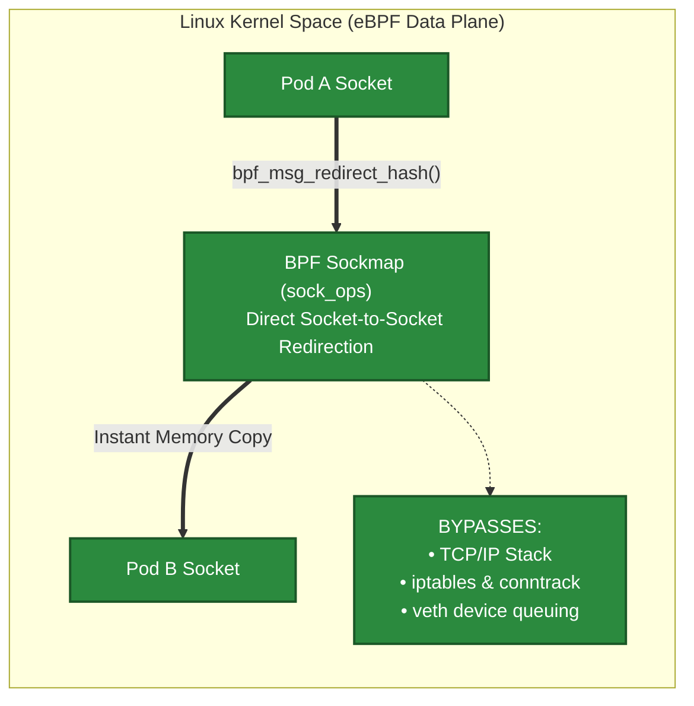
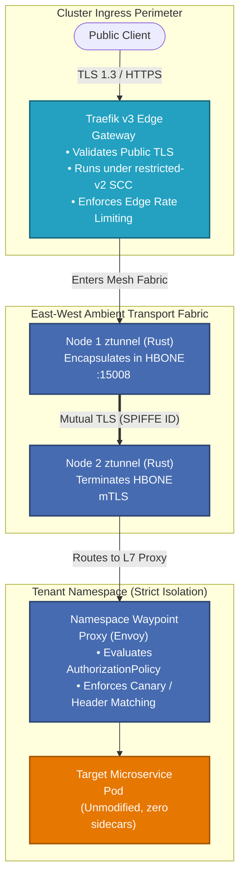
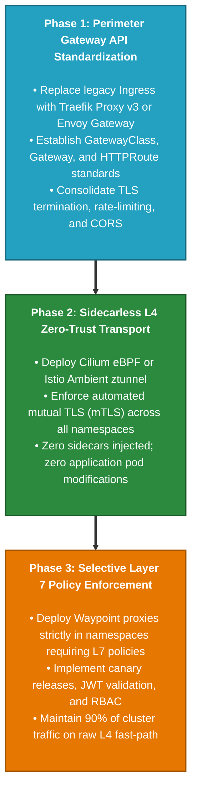

[🏠 Home / README](../README.md) | [Architecture](ARCHITECTURE.md) | [FQDN Routing](FQDN_ROUTING.md) | [Gateway API without Traefik](GATEWAY_API_WITHOUT_TRAEFIK.md) | [Gateway API with Traefik](GATEWAY_API_WITH_TRAEFIK.md) | [Extended Solutions](EXTENDED_SOLUTIONS.md) | **Scenarios & Recommendations** | [Lab 1: Cilium](LAB_CILIUM.md) | [Lab 2: Istio Ambient](LAB_ISTIO_AMBIENT.md) | [Lab 3: Traefik Edge](LAB_TRAEFIK_EDGE.md)

---

# Enterprise Scenarios, Decision Framework & Strategic Recommendations

Modern platform engineering teams face an overwhelming array of ingress controllers, Gateway API implementations, and service meshes. The marketing claims of "zero overhead" and "instant zero-trust" often obscure deep operational trade-offs, kernel compatibility traps, and licensing shifts.

This document delivers principal-level technical analysis, failure-mode modeling, total cost of ownership (TCO) benchmarks, and **definitive recommendations for the six core enterprise scenarios**.

---

## Table of Contents
- [1. Executive Architectural Synthesis](#1-executive-architectural-synthesis)
- [2. Deep-Dive Analysis of the 6 Enterprise Scenarios](#2-deep-dive-analysis-of-the-6-enterprise-scenarios)
  - [2.1 Scenario 1: Ultra-Low Latency & High-Throughput (Fintech / Telco / AI Inference)](#21-scenario-1-ultra-low-latency--high-throughput-fintech--telco--ai-inference)
  - [2.2 Scenario 2: Enterprise Multi-Tenant Zero-Trust on OpenShift & Bare-Metal](#22-scenario-2-enterprise-multi-tenant-zero-trust-on-openshift--bare-metal)
  - [2.3 Scenario 3: High-Velocity API Edge & Developer Platform](#23-scenario-3-high-velocity-api-edge--developer-platform)
  - [2.4 Scenario 4: Lightweight POSIX Micro-Proxy Hardening & Memory Sensitivity](#24-scenario-4-lightweight-posix-micro-proxy-hardening--memory-sensitivity)
  - [2.5 Scenario 5: CNCF Pure-Play Kubernetes Standardization](#25-scenario-5-cncf-pure-play-kubernetes-standardization)
  - [2.6 Scenario 6: Hybrid Multi-Zone / Multi-Cluster API Productization](#26-scenario-6-hybrid-multi-zone--multi-cluster-api-productization)
- [3. Definitive Scenario Recommendation Decision Matrix](#3-definitive-scenario-recommendation-decision-matrix)
- [4. Total Cost of Ownership (TCO) & Compute Overhead Modeling](#4-total-cost-of-ownership-tco--compute-overhead-modeling)
- [5. Failure Mode & Blast Radius Analysis Matrix](#5-failure-mode--blast-radius-analysis-matrix)
- [6. Production Migration & Adoption Playbooks](#6-production-migration--adoption-playbooks)
- [7. References & Authoritative Sources of Truth](#7-references--authoritative-sources-of-truth)

---

## 1. Executive Architectural Synthesis

In 2026, enterprise cloud-native fabrics have moved past the binary debate of *"Mesh vs. No Mesh"*. Architecture is now defined by two fundamental principles:

1. **Separation of Concerns between Ingress (Perimeter) and Mesh (Transit)**:
   - Trying to force a service mesh to handle public-facing Edge Ingress creates security anti-patterns (e.g., exposing mesh CAs to the internet, monolithic blast radius).
   - High-performance platforms use a dedicated, hardened Edge Gateway (such as **Traefik Proxy v3** or **Envoy Gateway**) at the boundary, handing off sanitized traffic to an internal zero-trust fabric.
2. **The Demise of Universal Sidecar Injection**:
   - Forcing an Envoy proxy into every pod replica wastes 10%–25% of total cluster RAM and tightly couples application lifecycles to proxy upgrades.
   - The modern standard is **Sidecarless L4 Transport** (via Cilium eBPF or Istio Ambient `ztunnel`), with Layer 7 proxies deployed strictly where advanced policies (JWT validation, header mutation, canary splitting) are needed.

---

## 2. Deep-Dive Analysis of the 6 Enterprise Scenarios

### 2.1 Scenario 1: Ultra-Low Latency & High-Throughput (Fintech / Telco / AI Inference)

<b>Diagram 2.1: Cilium eBPF In-Kernel Fast-Path Flow (Click to Expand / Collapse)</b>

* **The Problem**: Electronic trading, banking transactions, real-time gaming, and LLM token streaming cannot tolerate the 2–5ms latency tax or P99 tail latency spikes caused by multiple user-space proxy hops and iptables traversal.
* **The Solution**: **Cilium eBPF Service Mesh**.
* **Why It Wins**:
  - `sockops` short-circuiting copies buffers directly between Linux kernel sockets, achieving sub-0.15ms local latency.
  - In-kernel eBPF DNS proxy inspects port 53 packets and dynamically populates kernel ipsets (`toFQDNs`), stopping data exfiltration with zero proxy overhead.
* **Caveats & Trade-offs**: Requires modern Linux kernels (>= 5.10); requires elevated privileges (`CAP_SYS_ADMIN`, `CAP_BPF`) to load BPF bytecode; advanced L7 routing still delegates to an embedded Envoy instance.

---

### 2.2 Scenario 2: Enterprise Multi-Tenant Zero-Trust on OpenShift & Bare-Metal

<b>Diagram 2.2: Istio Ambient Mode + Traefik Edge Zero-Trust Fabric (Click to Expand / Collapse)</b>

* **The Problem**: Enterprises on Red Hat OpenShift (OCP 4.14 – 4.20+) require strict compliance (PCI-DSS 4.0, FedRAMP, HIPAA) mandating mutual TLS on every packet, but cannot afford the massive memory overhead of 500+ sidecars, nor can they replace the default OVN-Kubernetes CNI.
* **The Solution**: **Istio Ambient Mode paired with Traefik Proxy v3 at the Edge**.
* **Why It Wins**:
  - Istio Ambient is officially supported by Red Hat (as OpenShift Service Mesh 3.x / OSSM 3) operating directly over OVN-Kubernetes.
  - Node-level `ztunnel` enforces mTLS with cryptographic SPIFFE identities for ~150MB RAM *per node*, saving gigabytes of memory compared to sidecars.
  - Traefik Proxy v3 operates unprivileged under OpenShift's `restricted-v2` SCC, terminating edge TLS and enforcing rate limits before handing traffic to `ztunnel`.
* **Caveats & Trade-offs**: Requires running Istio Ambient CNI plugin to manage node-level geneve/redirect rules; multi-tenant Waypoint proxies must be budgeted per namespace.

---

### 2.3 Scenario 3: High-Velocity API Edge & Developer Platform

* **The Problem**: Engineering organizations need rapid feature delivery, canary releases, rate-limiting, and security header injection without the operational overhead, cognitive load, and upgrade friction of a service mesh.
* **The Solution**: **Traefik Proxy v3 (Edge Gateway & Hairpin Intermediary)**.
* **Why It Wins**:
  - Full native support for Kubernetes Gateway API v1 alongside battle-tested `IngressRoute` CRDs.
  - Middleware chaining (`Middleware`) allows modular rate-limiting, circuit-breaking, and header manipulation.
  - In-memory sub-second hot reload evaluates configuration updates without terminating existing TCP sockets or dropping connections.
  - Solves East-West internal communication via **Split-Horizon Ingress** (`traefik.svc.cluster.local` + `Host` header) with zero CoreDNS modifications on OpenShift.
* **Caveats & Trade-offs**: Does not provide pod-to-pod mutual TLS with automatic cryptographic identity; inter-service security relies on Traefik reverse-proxying.

---

### 2.4 Scenario 4: Lightweight POSIX Micro-Proxy Hardening & Memory Sensitivity

* **The Problem**: Environments with severe compute constraints (edge computing, IoT gateways, large-scale multi-tenant clusters with thousands of small microservices) where memory usage must be minimized, but strict pod-level POSIX isolation is mandatory.
* **The Solution**: **Linkerd (Buoyant)**.
* **Why It Wins**:
  - Purpose-built Rust micro-proxy (`linkerd2-proxy`) consumes only **15MB–30MB RAM per pod**, compared to 100MB+ for Envoy.
  - Memory-safe Rust eliminates C++ memory corruption vulnerabilities.
  - Pod-level sidecar ensures an exploited container cannot sniff or tamper with adjacent tenant traffic on the node.
* **Caveats & Trade-offs**: No native Ingress controller (must pair with Traefik or Envoy Gateway); commercial license required for official stable container images (v2.15+) in production environments over 50 pods.

---

### 2.5 Scenario 5: CNCF Pure-Play Kubernetes Standardization

* **The Problem**: Organizations with strict governance policies requiring 100% vendor-neutral, CNCF-governed open-source components, rejecting proprietary CRDs and single-vendor commercial models.
* **The Solution**: **Envoy Gateway**.
* **Why It Wins**:
  - The official CNCF reference implementation of the Kubernetes Gateway API.
  - Replaces fragmented legacy Envoy controllers (Contour, Emissary, Gloo) with a unified standard.
  - Native Policy Attachment resources (`BackendTrafficPolicy`, `SecurityPolicy`) avoid non-portable annotations.
  - Backed by a diverse multi-vendor coalition (Tetrate, VMware, Red Hat, Ambassador).
* **Caveats & Trade-offs**: Focused exclusively on North-South and internal Gateway patterns; does not provide service mesh features (distributed tracing, pod-to-pod mTLS) on its own.

---

### 2.6 Scenario 6: Hybrid Multi-Zone / Multi-Cluster API Productization

* **The Problem**: Large enterprises with legacy monolithic workloads on virtual machines (VMs), multiple cloud providers (AWS, Azure, GCP), and bare-metal Kubernetes clusters needing unified API monetization, developer portals, and multi-datacenter traffic routing.
* **The Solution**: **Kong Gateway (KIC) paired with Kuma (Kong Mesh)**.
* **Why It Wins**:
  - 200+ enterprise-grade plugins for API productization, OAuth2, monetization, and AI prompt caching.
  - Kuma's embedded DNS server (port 15053) resolves `*.mesh` domains natively across hybrid VM/container boundaries.
  - Seamless multi-zone routing across heterogeneous clouds and on-premises datacenters.
* **Caveats & Trade-offs**: High operational complexity; sidecar memory footprint (~150MB+ per pod); enterprise features (RBAC, advanced rate limiting, developer portal) require commercial Kong Enterprise licensing.

---

## 3. Definitive Scenario Recommendation Decision Matrix

| Archetype / Scenario | Primary Technical Requirement | Ranked #1 Recommendation | Ranked #2 Recommendation | Anti-Pattern / Not Recommended |
| :--- | :--- | :--- | :--- | :--- |
| **1. Ultra-Low Latency & High Throughput** | Sub-millisecond latency; high PPS; dynamic FQDN egress filtering | **Cilium eBPF Service Mesh** | Istio Ambient Mode (L4 fast path) | Heavy sidecar meshes (Istio 1.x / Kuma) due to 4x context switches |
| **2. Enterprise Multi-Tenant Zero-Trust (OpenShift)** | PCI-DSS/FedRAMP mTLS; restricted-v2 SCC; immutable CoreDNS; OVN-K8s CNI | **Istio Ambient Mode (OSSM 3) + Traefik v3 Edge** | Cilium eBPF (if CNI replacement approved) | Legacy sidecars; manual in-place CoreDNS hacking |
| **3. High-Velocity API Edge & Dev Platform** | Dynamic canary routing; rate limits; circuit breaking; no mesh complexity | **Traefik Proxy v3 (Gateway API / CRDs)** | Envoy Gateway | Full service mesh when only ingress L7 features are required |
| **4. Minimal Compute Overhead & Pod Isolation** | Ultra-low RAM; memory-safe codebase; POSIX cgroup namespace isolation | **Linkerd (Rust Micro-Proxy)** | Istio Ambient Mode | Java-based gateways or bloated C++ sidecars |
| **5. Pure-Play CNCF Standardization** | 100% vendor-neutral; strict Gateway API adherence; no proprietary CRDs | **Envoy Gateway** | Traefik Proxy v3 (Gateway API mode) | Proprietary API gateways with closed extension ecosystems |
| **6. Hybrid Multi-Zone API Productization** | Legacy VMs + K8s; API monetization; developer portal; global routing | **Kong Gateway + Kuma Mesh** | Istio Multi-Cluster Mesh | Ingress-only controllers lacking multi-zone mesh synchronization |

---

## 4. Total Cost of Ownership (TCO) & Compute Overhead Modeling

The table below calculates the memory overhead, idle CPU consumption, and network latency tax across typical enterprise cluster sizes:

```mermaid
gantt
    title Cluster Memory Overhead for 500 Pod Replicas (in Gigabytes RAM)
    dateFormat X
    axisFormat %s GB

    section Cilium eBPF (Kernel)
    Kernel Sockmap & Agent (0MB/pod + 2GB node plane) : 0, 2
    section Istio Ambient Mode
    Shared ztunnel DaemonSets (0MB/pod + 3GB node plane) : 0, 3
    section Traefik Edge (Hairpin)
    Centralized Gateway Pods (0MB/pod + 1.5GB gateway) : 0, 1.5
    section Linkerd (Rust Proxy)
    Sidecars @ 25MB per Pod (12.5GB + 1GB control plane) : 0, 13.5
    section Traditional Envoy Mesh
    Sidecars @ 150MB per Pod (75GB + 3GB control plane) : 0, 78
```

<b>Diagram 4.1: Memory Overhead Comparison Across 500 Pod Replicas (Click to Expand / Collapse)</b>

### Quantitative Overhead Matrix:

| Metric | Traditional Envoy Sidecars | Linkerd (Rust) | Istio Ambient Mode | Cilium eBPF | Traefik Proxy v3 (Edge) |
| :--- | :--- | :--- | :--- | :--- | :--- |
| **RAM per Pod Replica** | ~100MB – 200MB | **~15MB – 30MB** | **0 MB** | **0 MB** | **0 MB** |
| **Total RAM (100 Pods)** | ~15 GB | ~2.5 GB | ~1.5 GB (Node ztunnels) | **~1.2 GB (Cilium Agents)**| **~0.8 GB (Gateway Pods)**|
| **Total RAM (500 Pods)** | ~75 GB | ~13.5 GB | ~3.0 GB | **~2.0 GB** | **~1.5 GB** |
| **Total RAM (2,000 Pods)**| **~300 GB** | ~50 GB | ~8.0 GB | **~4.0 GB** | **~3.0 GB** |
| **Added Latency (P50)** | +1.8ms – 3.5ms | +0.8ms – 1.2ms | +0.4ms – 0.8ms | **+0.1ms – 0.2ms (Bypass)**| +0.5ms (Single Proxy Hop) |
| **Added Latency (P99)** | +12ms – 25ms | +4ms – 8ms | +2ms – 4ms | **+0.8ms – 1.5ms** | +2ms – 5ms |
| **Annual Cloud RAM Cost** | **$12,000 – $28,000** | $2,000 – $4,500 | **$400 – $1,200** | **$250 – $800** | **$200 – $600** |

---

## 5. Failure Mode & Blast Radius Analysis Matrix

Understanding how each architecture behaves during failure conditions is critical for production resilience:

| Failure Mode | Traditional Envoy Sidecar | Istio Ambient Mode | Cilium eBPF | Traefik Proxy v3 | Linkerd (Rust) |
| :--- | :--- | :--- | :--- | :--- | :--- |
| **Control Plane Disconnection** | Sidecars retain last known xDS state; traffic flows normally. | `ztunnel` retains node cache; Waypoints continue routing. | eBPF maps persist in kernel; zero packet disruption. | In-memory configuration persists; zero downtime. | Proxies retain discovery cache; mTLS continues. |
| **Proxy Crash / OOMKilled** | **Isolates single pod**; other pods unaffected. App container remains alive. | **Crashes Node ztunnel**: Affects all pods on that node until restarted (~1s). | **Crashes Cilium Agent**: In-kernel maps keep routing; no policy updates. | **Gateway Pod Restarts**: Redundant replicas prevent traffic loss. | **Isolates single pod**; memory safety makes OOM rare. |
| **CVE Vulnerability Impact** | Exploit confined to single container namespace. | Node ztunnel compromise impacts node; Waypoint impacts namespace. | Kernel-level eBPF compromise could impact host OS. | Edge perimeter gateway absorbs attack before cluster entry. | Rust memory safety mitigates memory-corruption CVEs. |
| **Certificate Expiration Blackout** | Every pod must receive updated cert; rolling restarts if cert-manager stalls. | Certificates rotated centrally at ztunnel/Waypoint. | Managed via SPIRE or node WireGuard key exchange. | Single TLS secret rotated at Gateway; instantaneous reload. | Automated cert rotation via `linkerd-identity` every 12h. |

---

## 6. Production Migration & Adoption Playbooks

To minimize operational risk, enterprise platforms should execute a **three-phase adoption roadmap**:

<b>Diagram 6.1: Enterprise Zero-Trust Migration Roadmap (Click to Expand / Collapse)</b>

* **Step 1: Standardize North-South First**: Adopt Traefik Proxy v3 or Envoy Gateway. Move away from vendor-specific ingress annotations to declarative Gateway API `HTTPRoute` resources.
* **Step 2: Enable Sidecarless L4 Transport**: Onboard worker nodes to Istio Ambient or Cilium eBPF. Validate that all East-West traffic is cryptographically encrypted via SPIFFE identities without touching application containers.
* **Step 3: Apply L7 Policies Selectively**: Deploy Envoy Waypoints or Traefik Middlewares only for namespaces that require advanced traffic shaping (canary releases, header rewrites, JWT authentication).

---

## 7. References & Authoritative Sources of Truth

- **NIST Special Publication 800-207: Zero Trust Architecture**: [https://csrc.nist.gov/publications/detail/sp/800-207/final](https://csrc.nist.gov/publications/detail/sp/800-207/final)  
  *The authoritative federal blueprint for continuous cryptographic verification and micro-segmentation.*
- **Cilium eBPF Performance Benchmarks**: [https://cilium.io/blog/2021/05/11/cbr-ebpf-performance/](https://cilium.io/blog/2021/05/11/cbr-ebpf-performance/)  
  *Detailed throughput and latency evaluations comparing eBPF sockops against iptables and Envoy sidecars.*
- **Istio Ambient Mode Architecture Specification**: [https://istio.io/latest/docs/ops/ambient/architecture/](https://istio.io/latest/docs/ops/ambient/architecture/)  
  *Official technical reference on the HBONE protocol, ztunnel daemonsets, and Waypoint proxies.*
- **Traefik Proxy v3 Performance & Architecture**: [https://traefik.io/blog/traefik-proxy-v3/](https://traefik.io/blog/traefik-proxy-v3/)  
  *Architectural overview of Go event-driven routing, memory management, and Gateway API conformance.*
- **Red Hat OpenShift Service Mesh 3.x (OSSM 3) Strategy**: [https://cloud.redhat.com/blog/red-hat-openshift-service-mesh-3-architecture](https://cloud.redhat.com/blog/red-hat-openshift-service-mesh-3-architecture)  
  *Red Hat's official enterprise validation of Istio Ambient on OpenShift Container Platform.*

---

⬅️ Previous: [Extended Solutions](EXTENDED_SOLUTIONS.md) | 🏠 [Home](../README.md) | ➡️ Next: [Lab 1: Cilium eBPF](LAB_CILIUM.md)
